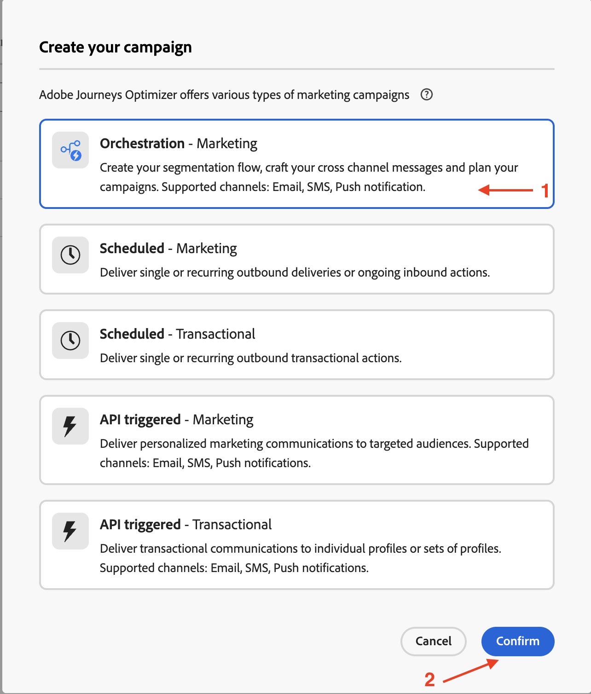
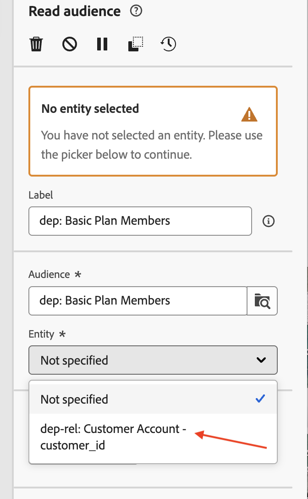
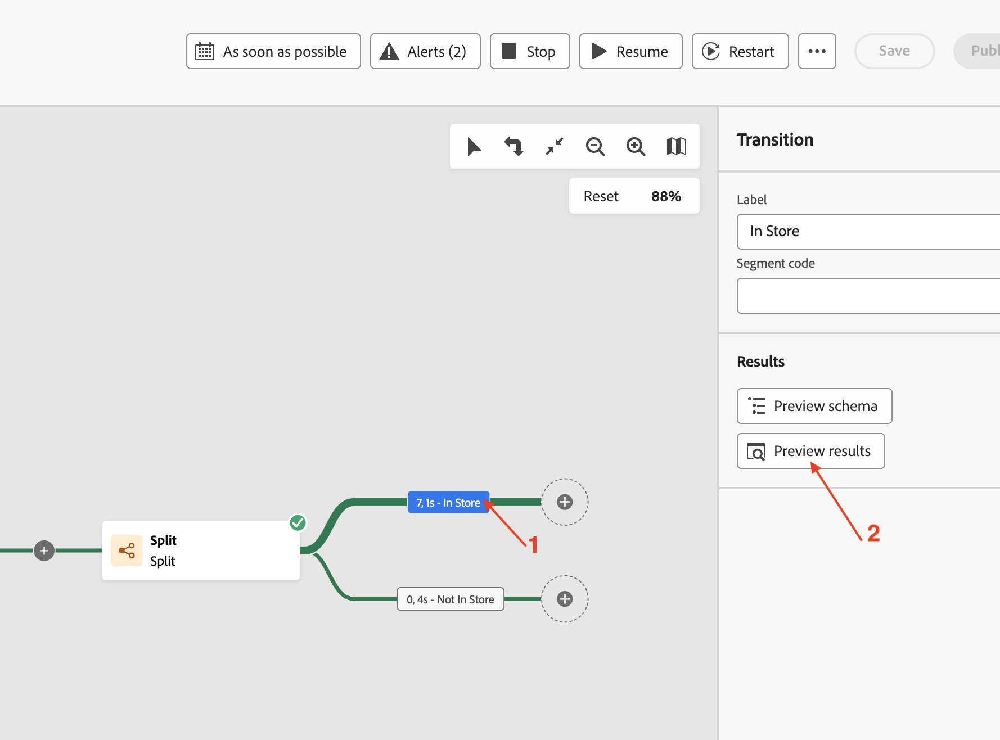

# Leggere un pubblico

## Obiettivo

Nei passaggi successivi creerai una campagna per leggere un pubblico da AEP e utilizzarlo insieme al profilo di Target Dimension creato in precedenza. Utilizza l’attività Dividi per dividere i dati in base a una condizione. Infine, testa la campagna per comprendere come funzionano questi tipi di pubblico quando vengono utilizzati con lo schema relazionale.

## Leggi pubblico

Questo laboratorio illustra come utilizzare l’attività Read audience in combinazione con lo schema relazionale per l’arricchimento.

Orchestrated Campaign utilizza lo schema relazionale per tutte le attività. Quando si utilizza l’attività Read audience, che legge il pubblico da AEP, è necessario configurare un’entità corrispondente (Target Dimension) per riconciliare il pubblico con Campaign Target Dimension.

## Creare una campagna

1. Nella barra laterale a sinistra, fai clic su **Campagne**

   

2. Fai clic su **Crea campagna**

   

3. Seleziona **Orchestrazione - Marketing** e fai clic su **Conferma**

   

4. Fornisci i dettagli della campagna come segue, quindi fai clic sul pulsante **Salva**
   - Nome: **OC-RSL-ReadAudience-Test**
   - Descrizione: **Test pubblico lettura RSL**

   

5. Attendi il messaggio di conferma

## Aggiungi attività Read audience

1. Fai clic su **+** nell&#39;area di lavoro per aprire il menu delle opzioni, quindi seleziona **Read audience** dalle **attività di targeting**

   

2. Nel riquadro dei dettagli **Read audience**, fai clic sull&#39;icona Cerca per **Audience**

   

3. Seleziona il pubblico **dep: Membri del piano di base** con conteggio profili di **9** e fai clic su **Aggiungi pubblico**

   

4. Fai clic sul menu a discesa per **Entità** e seleziona il Dimension di destinazione della campagna `dep-rel: Customer Account - customer_id`

>[!NOTE]
>
>È inoltre possibile estrarre altri attributi dal profilo AEP per utilizzarli nell&#39;area di lavoro utilizzando il pulsante **Aggiungi attributo**. Ma per questo laboratorio, non sono necessari attributi aggiuntivi, quindi il passaggio viene saltato.

## Testare la campagna

1. Sono state inserite le impostazioni per l&#39;attività **Read Audience**. Fai clic su **Avvia** per eseguire la campagna in **Modalità test**

   

   >[!NOTE]
   >
   >L&#39;esecuzione di questa operazione richiede alcuni minuti.
   >
   >La modalità di test consente l’esecuzione della campagna per verificarne e monitorarne il comportamento insieme ai risultati di ogni attività. Le attività vengono eseguite in sequenza fino alla fine dell’area di lavoro.

2. L’esecuzione del test viene avviata e i risultati vengono visualizzati al termine. Fai clic sul nodo **Risultato** e quindi su Anteprima risultati per visualizzare i risultati dell&#39;esecuzione

   

3. Tieni presente che **2** (su 9) profili di **Read audience** non hanno una dimensione **Target** corrispondente dallo schema relazionale (ovvero esistono nell&#39;archivio dei profili ma non nell&#39;archivio relazionale). E poiché Orchestrated Campaign non funziona secondo lo schema relazionale, i `customer_id` (**2**) senza corrispondenza del **Read audience** vengono eliminati e solo i *corrispondenti*, **7** in questo caso, sono utilizzabili nelle attività successive che sfruttano **dati relazionali** nella campagna

   

   >[!NOTE]
   >
   >Nei passaggi seguenti vengono utilizzati i dati relazionali per confermare l&#39;istruzione precedente che indica l&#39;eliminazione di `customer_id` senza corrispondenza.

4. Fai clic su **Interrompi** per interrompere la **modalità di test** della campagna

   

5. Fai clic su **+** alla fine del flusso e aggiungi **Dividi** dalle **attività di targeting**

   

6. Nel riquadro dei dettagli dell&#39;attività **Split**, espandere la prima suddivisione denominata **Subset**

   

7. Rinominalo in &quot;**Archivio**&quot; e fai clic su **Crea filtro** per impostare la condizione del filtro

   

8. Nel riquadro **Crea filtro** r fare clic su **Aggiungi condizione**

   

9. Poiché non sono stati estratti altri attributi dal profilo AEP, l&#39;unico attributo del profilo AEP disponibile qui è `Customer ID`. Tuttavia, per impostare la condizione del filtro sono disponibili le colonne dell’archivio relazionale corrispondenti alla dimensione di Target corrispondente. Espandere la **dimensione di targeting** facendo clic su **>**

   

10. Seleziona `Source` dall&#39;elenco e fai clic su **Conferma**

&#x200B;11. I valori distinti per la colonna Source sono disponibili nel menu a discesa. Per la **condizione personalizzata**, seleziona **&quot;In Store&quot;** dal menu a discesa e fai clic su **Conferma** per uscire

&#x200B;12. Nel riquadro dei dettagli dell&#39;attività **Divisione**, le impostazioni per la prima Divisione sono state completate. Fai clic su **Aggiungi segmento** alla seconda suddivisione

È stato creato un nuovo segmento denominato **Risultato**

&#x200B;13. Rinomina &quot;**Risultato**&quot; in &quot;**Non nell&#39;archivio**&quot; e fai clic su **Crea filtro** per impostare la condizione del filtro

&#x200B;14. Nel riquadro **Crea filtro**, fare clic su **Aggiungi condizione**. Segui lo stesso approccio di cui sopra, espandi la **dimensione di targeting** facendo clic su **>**, quindi seleziona `Source` dall&#39;elenco e fai clic su **Conferma**

&#x200B;15. Per la **condizione personalizzata**, selezionare **&quot;In store&quot;** dal menu a discesa e per l&#39;operatore selezionare &quot;**diverso da**&quot;. Fai clic su **Conferma** per uscire

&#x200B;16. Nel riquadro dei dettagli dell&#39;attività **Divisione**, le impostazioni per le due divisioni sono state completate. Fai clic su **Avvia** per eseguire la campagna in **Modalità test**

&#x200B;17. L’esecuzione del test inizia e i risultati vengono visualizzati al termine. Poiché nello schema relazionale sono state trovate solo **7** dimensioni di destinazione corrispondenti, lo stesso conteggio viene osservato anche dopo le operazioni di suddivisione (**7** e **0**)

&#x200B;18. Fai clic su ogni casella dei risultati e **Anteprima risultati** per visualizzare i risultati

&#x200B;19. Fai clic su **Interrompi** per interrompere la **modalità di test** della campagna

>[!NOTE]
>
>Mentre il pubblico Read mostrava **9** profili. Poiché abbiamo creato un filtro su Source e il campo Source esiste nello store relazionale, abbiamo dovuto unirci dallo store dei profili allo store relazionale per controllarlo. Quando è stato aggiunto allo schema relazionale tramite il Dimension di destinazione di Campaign, solo un totale di **7** profili ha restituito una corrispondenza. Questi **7** ID cliente corrispondenti sono disponibili per l&#39;utilizzo nelle seguenti attività che tentano di utilizzare dati relazionali. Tutti gli ID cliente **7** avevano `Source` impostati su **&quot;In Store&quot;**, come evidenziato dai flussi di suddivisione.
>
>Pertanto, mantenere la coerenza dei dati è fondamentale quando si utilizzano i profili AEP insieme alle relative controparti relazionali per l’arricchimento.

>[!TIP]
>
>Congratulazioni, questo completa il laboratorio sull’utilizzo dell’attività Read Audience con lo schema relazionale.

## Riassunto

Ora hai visto quanto è facile creare una campagna, eseguire un’attività Read Audience insieme al Dimension di destinazione del profilo per sfruttare lo schema relazionale. Hai utilizzato l’attività Dividi per dividere il pubblico in base a una condizione. Infine, la modalità di test ha aiutato a capire che è importante disporre della coerenza dei dati tra il profilo e lo schema relazionale.

Puoi trovare ulteriori [qui](https://experienceleague.adobe.com/it/docs/journey-optimizer/using/campaigns/orchestrated-campaigns/design-campaigns/read-audience) se sei interessato.
