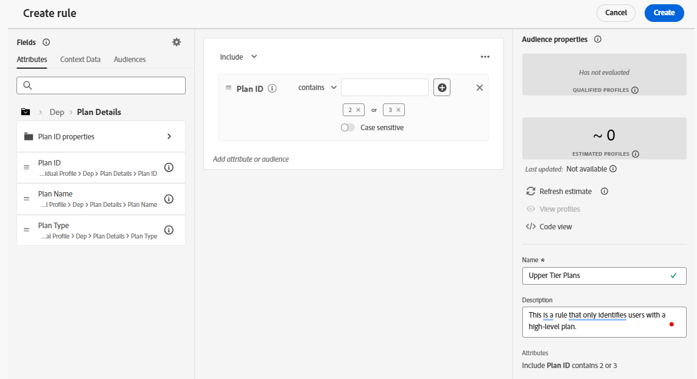

# Crea regola di decisione

## Obiettivo

Poiché l’idoneità è uno degli elementi costitutivi chiave di un’offerta, il primo passaggio consiste nel creare le entità necessarie a supportarla. In molti casi, l’appartenenza al pubblico è il fattore decisivo, ma in questo caso, utilizzeremo le Regole di decisione. Con Connection 5G, iPhone 17s di fascia superiore può essere attivato solo per gli utenti con un piano di livello superiore. Di conseguenza, utilizzeremo una regola decisionale per garantire che le offerte per telefoni di fascia più alta siano disponibili solo per coloro che dispongono di un piano sufficientemente alto.

## Creare la regola di decisione

1. Se necessario, accedi ad Adobe Experience Cloud e passa a **Adobe Journey Optimizer.**
2. Espandere la voce di menu **Decisioning** nella barra a sinistra, se necessario, e fare clic su **Imposta strategia.**

>[!WARNING]
>
>Accertati di essere nel menu Decisioning e NON nel menu Decision Management. Se il menu Gestione delle decisioni è espanso, comprimerlo per evitare confusione durante la navigazione in questa esercitazione.

3. Fai clic su **Regole di decisione** nel menu &#39;Idoneità&#39;, seguito dal pulsante **Crea regola** nell&#39;angolo superiore destro.

4. Viene visualizzata una schermata simile all’interfaccia utente del Generatore di segmenti. Aggiungere l&#39;attributo ID piano all&#39;area di lavoro delle regole facendo clic su **Profilo individuale XDM > Protezione esecuzione programmi > Dettagli piano**, quindi trascinare l&#39;attributo **ID piano** nell&#39;area di lavoro.
5. Modifica il menu a discesa da è uguale a **contiene.**
6. Immetti il testo **2** nella casella, premi il tasto **TAB** per accettare il valore 2, quindi immetti un valore **3,** premi di nuovo **TAB** in modo che la regola stia cercando qualsiasi ID piano che contiene un 2 o un 3
7. Utilizza la casella di testo **Nome** nella barra a destra per denominare la regola di decisione **Piani di livello superiore**. Se lo desideri, aggiungi una descrizione. Al termine, la regola di decisione sarà simile alla seguente:

8. Una volta corretta la regola, fai clic sul pulsante blu **Crea** nell&#39;angolo in alto a destra e vieni reindirizzato alla pagina Impostazione strategia, dove la regola di decisione appena creata è elencata come unica regola di decisione.

>[!NOTE]
>
>Perché utilizzare una regola di decisione invece di un pubblico? In pratica, il motivo principale era che avevi bisogno di criteri di idoneità specifici per il pacchetto decisionale o che avevi bisogno degli attributi delle offerte nei criteri. Gli attributi dell’offerta non sono campi disponibili nel generatore di tipi di pubblico.
>
>La Regola di decisione dei piani superiori utilizzata in questo laboratorio sarà probabilmente un pubblico effettivo in un’implementazione reale, data la sua probabile riutilizzabilità al di fuori di Decisioning. Tuttavia, in questo caso è stata utilizzata una Regola di decisione a scopo educativo, per illustrarne le funzionalità e i diversi modi in cui è possibile applicare l’idoneità.

## Riassunto

Ora hai creato una regola di decisione riutilizzabile, che utilizzerai per l’idoneità dell’offerta.
