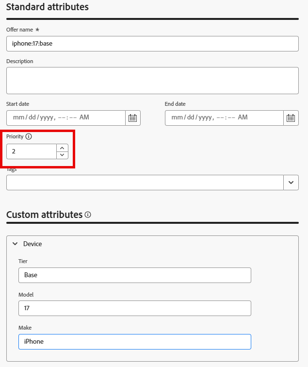
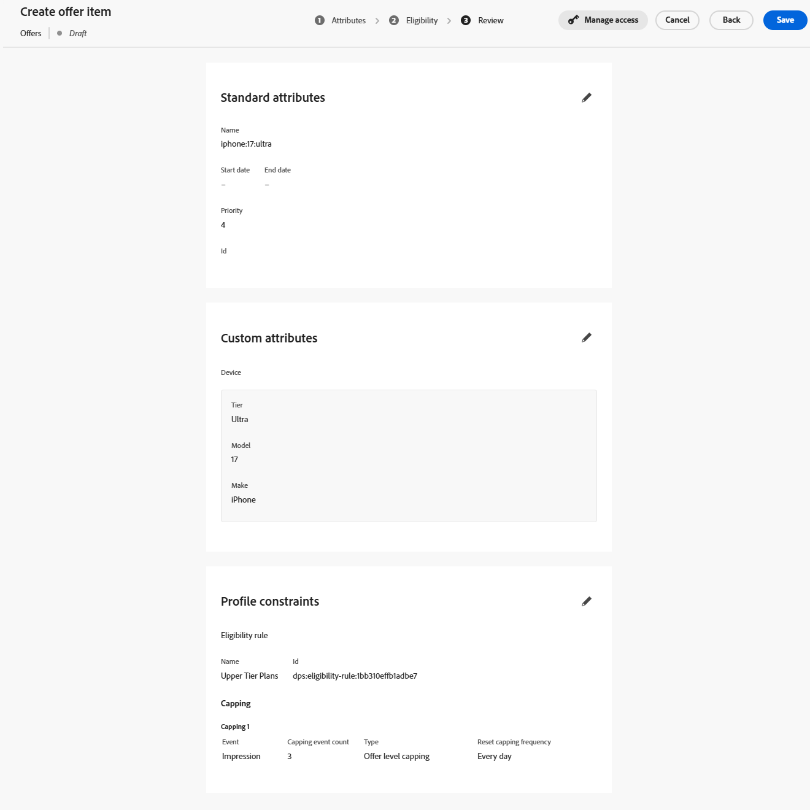

# Creare elementi di offerta

## Obiettivo

In questa sezione, creerai gli articoli dell’offerta effettiva che l’esperienza basata su codice (CBE) restituirà al client richiedente. Alcuni elementi dell’offerta avranno requisiti di idoneità e limiti di frequenza, mentre altri no.

## Panoramica dello scenario

Prima di creare gli elementi dell’offerta, tuttavia, ecco alcuni promemoria rapidi sul nostro scenario. In primo luogo, nel nostro scenario sono disponibili 3 livelli iPhone 17: Ultra, Pro e Base. Puoi creare 4 offerte totali, 1 per ogni livello, più un’offerta di fallback generica che il sistema ricevente può utilizzare per visualizzare informazioni generali su iPhone 17 in tutti i livelli.

In secondo luogo, solo i clienti con un ID piano di 2 o 3 sono idonei per i telefoni Ultra e Pro.

Successivamente, l&#39;azienda ha richiesto che ogni offerta venga visualizzata solo tre volte al giorno prima della presentazione del successivo telefono di livello inferiore.

Infine, a parità di condizioni, Connection 5G preferirebbe vendere il modello Ultra tier, seguito da Pro, e quindi il modello base. Di conseguenza, queste priorità vengono visualizzate quando si assegna un punteggio di priorità a ogni elemento dell’offerta.

## Crea elemento di offerta predefinito/di fallback

Il primo e più semplice elemento di offerta creato è l&#39;offerta di fallback, che chiunque può visualizzare per un periodo illimitato.

1. Se necessario, espandi **Decisioning** nella barra a sinistra e fai clic su **Cataloghi**
2. Viene visualizzata una pagina di offerte vuota:

   

3. Fai clic sul pulsante blu **Crea elemento**. Viene visualizzata la pagina &quot;Crea elemento offerta&quot;.
4. Nel campo &#39;Nome offerta&#39; immettere il testo **iphone:17\:generic**. Immettere una descrizione.

   >[!NOTE]
   >
   >La convenzione di denominazione in lettere minuscole e separate da due punti è solo uno dei nostri progetti che potrebbe servire come uno da seguire per un cliente reale. In pratica, puoi sviluppare una strategia di denominazione diversa per gli articoli dell’offerta. Assicurati che sia documentato e coerente prima di creare elementi di offerta. In questo modo gli elementi dell’offerta saranno facilmente reperibili e raggruppabili nelle raccolte. Ulteriori informazioni più avanti.

5. Poiché si tratta dell’articolo di offerta con priorità più bassa/predefinito, lascia Priorità predefinita su 1.

   >[!NOTE]
   >
   >In Decisioning, minore è il numero, minore è la priorità. Ad esempio, un articolo di offerta con priorità 100 viene visualizzato prima di un articolo di offerta con priorità 1

6. Espandere l&#39;elemento **Device** nell&#39;area &#39;Attributi personalizzati&#39;, quindi immettere le informazioni seguenti nelle caselle di testo:
   - Livello: **Generico**
   - Modello: **17**
   - Marca: **iPhone**

   Si tratta dei valori di testo effettivi che descrivono sia l’offerta che cosa può essere utilizzato per ordinare, classificare e criteri di idoneità. Sono anche i valori di testo che possono essere restituiti al dispositivo richiedente.

   

   >[!NOTE]
   >
   >L’area Dispositivo espansa è lo stesso oggetto principale &quot;Dispositivo&quot; creato quando lo schema &quot;Elementi offerta personalizzati - Experience Decisioning&quot; è stato aggiornato con attributi personalizzati nella sezione precedente. I campi Livello, Modello e Produzione sono i singoli attributi aggiunti:
   >
   >

   >[!WARNING]
   >
   >La sezione precedente menzionava la necessità di prestare particolare attenzione quando si aggiungono attributi personalizzati allo schema &quot;Elementi di offerta personalizzati - Experience Decisioning&quot; generato dal sistema. Ogni nodo personalizzato aggiuntivo verrà visualizzato come campo possibile per ogni elemento dell’offerta in futuro. La creazione di attributi non necessari o specifici per una campagna confonde l’interfaccia utente per la creazione degli elementi di offerta e può causare confusione.

7. Fai clic sul pulsante blu **Avanti** nell&#39;angolo superiore destro per passare al passaggio successivo.
8. Questa offerta deve essere disponibile per tutti i visitatori e non deve avere alcun limite di frequenza, pertanto non è necessario apportare modifiche alle sezioni &quot;Idoneità&quot; o &quot;Limite&quot;. Fai di nuovo clic sul pulsante blu **Avanti** per passare all&#39;ultimo passaggio.
9. Nel passaggio &quot;Revisione&quot;, verifica che tutti i dati siano corretti:

   

10. Apporta le modifiche necessarie. Al termine, fai clic sul pulsante blu **Salva**.
11. Una volta salvato, viene visualizzato un pulsante bianco &quot;Approva&quot; nel punto in cui si trovava il pulsante &quot;Salva&quot;. Fai clic sul pulsante bianco **Approva** per approvare questo elemento dell&#39;offerta. Sotto il titolo dell’articolo dell’offerta viene visualizzato un indicatore verde &quot;Approvato&quot;:

>[!NOTE]
>
>In pratica, e nel caso di offerte più complesse, è necessario attivare un processo di approvazione appropriato per garantire che gli elementi dell’offerta siano stati creati correttamente. Per risparmiare tempo in questo laboratorio, è sufficiente approvare ogni elemento di offerta che si crea.

&#x200B;12. Fai clic sulla **freccia sinistra** accanto al titolo dell&#39;elemento di offerta per tornare alla pagina &quot;Offerte&quot; e visualizzi la tua offerta iphone:17\:generica elencata.

## Crea articolo offerta modello base

Una volta creato l’articolo di offerta generico, puoi creare l’articolo di offerta con priorità successiva per il modello di base di iPhone 17.

1. Fai nuovamente clic sul pulsante blu **Crea elemento** e assegna all&#39;offerta il nome **iphone:17\:base**
2. Poiché si tratta dell&#39;elemento di offerta con priorità inferiore, aumenta il campo **Priorità** a **2**
3. Espandi l&#39;area **Dispositivo** e assegna ai campi i seguenti valori:
   - Livello: **Base**
   - Modello: **17**
   - Marca: **iPhone**

   Al termine, l’elemento dell’offerta si presenta così (viene aggiunta la casella rossa per garantire che la priorità sia corretta):

   

   Quando tutto è corretto, fai clic sul pulsante blu **Avanti** per procedere al passaggio successivo.

4. Questo elemento dell’offerta deve essere disponibile per tutti, quindi non esiste alcun requisito di idoneità; tuttavia, deve essere limitato a 3 impression al giorno. Fare clic sul pulsante &#39;**+ Crea limite&#39;**.
5. Nella nuova regola di limite, modifica **Scegli evento limite** in **Impression.**
6. Cambia il **conteggio eventi limite** in **3**. Al termine, la regola di limite si presenta così:

   

   Una volta effettuata la correzione, fare clic sul pulsante blu **Crea** per salvare la regola di limitazione.

   >[!NOTE]
   >
   >Nota come creare una regola di limite aggiuntiva. In pratica, potrebbe essere utile aggiungere più regole. In questo caso, avremmo potuto aggiungere una regola per limitare questo limite se fosse stato visto un evento specifico, ad esempio un evento di acquisto. Questo laboratorio lo semplifica con una singola regola di limite.
   >
   >

   >[!NOTE]
   >
   >I &quot;giorni&quot; menzionati nelle regole del limite di frequenza si riferiscono ai giorni nel fuso orario GMT.  Limitazione della frequenza con giorni nella logica ripristinata a mezzanotte, GMT.

7. Fai clic su **Avanti** per passare al passaggio di revisione.
8. Assicurati che tutto appaia come previsto e fai clic sul pulsante **Salva**. Una volta salvato, fai clic su **Approva.**
9. Una volta approvata, fai clic sulla freccia sinistra accanto al titolo e torna alla pagina delle offerte. Ora vengono visualizzate due offerte, ciascuna con la priorità appropriata.

## Creare elementi di offerta del modello di livello superiore

Ora che sono state create le offerte del modello generico e di base, potete passare agli elementi di offerta dei modelli pro e ultra. Questi articoli di offerta devono includere anche un elemento di idoneità, perché solo i membri con un determinato livello di piano devono vedere queste offerte.

1. Seguendo gli stessi passaggi e gli stessi pattern di denominazione descritti nelle sezioni precedenti, crea una nuova offerta denominata **iphone:17\:pro** e impostane la priorità su **3.**
2. Imposta l&#39;attributo **Livello** su **Pro** e gli altri attributi personalizzati come nelle altre offerte.
3. Nel passaggio &#39;Idoneità&#39; selezionare il pulsante di scelta **Per regola**.
4. La barra a sinistra mostra una sola regola di decisione, quella creata in precedenza denominata &quot;Piani di livello superiore&quot;. Fai clic sull&#39;icona **+** accanto a quella regola per aggiungerla all&#39;area di lavoro.
5. Come accennato in precedenza, l’azienda ha dichiarato che le offerte non di fallback dovrebbero avere un limite di frequenza di 3 display (o impression) al giorno. Segui i passaggi descritti nella sezione precedente per creare una regola di limite per 3 impression al giorno. Al termine, la pagina si presenta così:

   

6. Dopo aver verificato che tutto è corretto, fai clic su **Avanti**. La configurazione finale dell’articolo offerta è simile alla seguente:

   

7. Una volta che tutto sembra corretto, **Salva** e **Approva** l&#39;elemento dell&#39;offerta.
8. Torna alla pagina delle offerte e verifica che le 3 offerte siano presenti e che abbiano ciascuna la priorità corretta.
9. Crea l&#39;elemento di offerta finale e denominalo **iphone:17\:ultra,** assegnagli una priorità di **4,** e imposta gli altri attributi personalizzati con gli stessi valori delle altre offerte.
10. Come per l’ultimo elemento di offerta, imposta l’idoneità alla regola di decisione &quot;Piani di livello superiore&quot; e imposta un limite di frequenza di 3 impression al giorno. Al termine, l&#39;oggetto dell&#39;offerta avrà un aspetto simile al seguente:

&#x200B;11. Dopo aver verificato che tutte le impostazioni siano corrette, salva e approva l&#39;elemento dell&#39;offerta. Ora puoi vedere tutti e quattro gli elementi dell’offerta, ciascuno con una priorità univoca.

>[!NOTE]
>
>Le istruzioni per questo laboratorio sono incentrate sulla verifica che le priorità siano diverse per ogni elemento dell’offerta. In questo semplice caso d’uso, è importante, ma non c’è nulla nell’interfaccia utente che ti obblighi a dare a ogni elemento dell’offerta una priorità univoca. Nel tempo, probabilmente avrai a disposizione più articoli di offerta con la stessa priorità. Vedrai perché è importante comprenderlo nelle sezioni successive.

## Riassunto

Hai definito più offerte per i diversi livelli di iPhone 17, tra cui un’offerta di fallback generica e offerte specifiche per livello (base, pro e ultra). Hai inoltre approvato tutti e quattro gli elementi dell’offerta con le impostazioni corrette di priorità, idoneità e limiti di impression, affinché siano pronti per l’utilizzo nel tuo pacchetto Decisioning.
