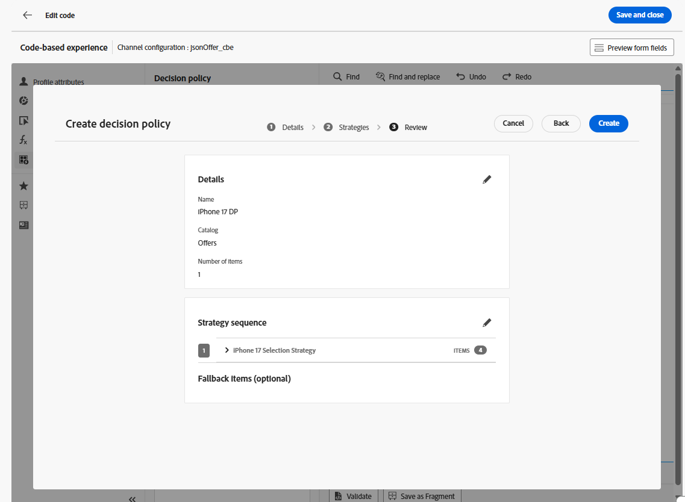
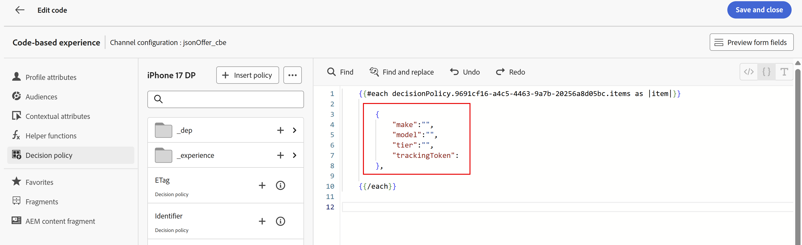
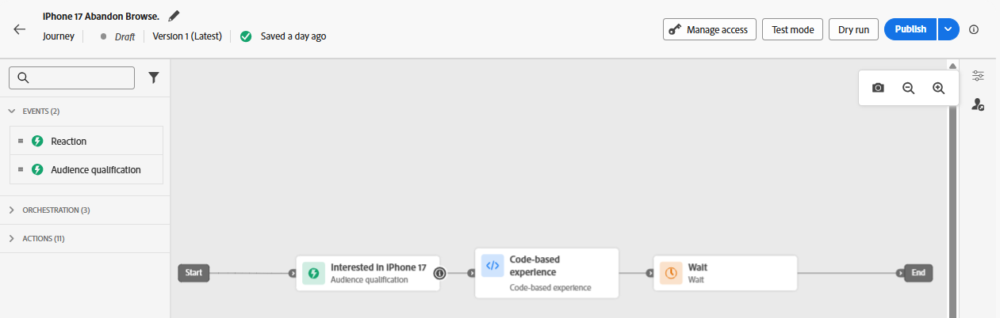
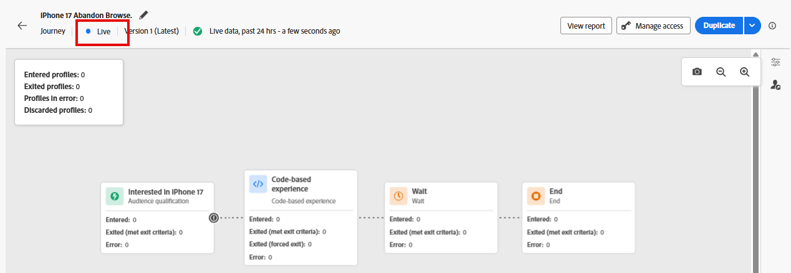

# Creazione del Percorso

## Denomina e definisci i criteri di ingresso

1. Se necessario, espandi la voce di menu **Gestione Percorsi** nella barra a sinistra e fai clic su **Percorsi**. Arrivi alla pagina &quot;Percorsi&quot;.
2. Fai clic sul pulsante blu **Crea Percorso**.
3. Quando viene visualizzata la sovrapposizione &#39;Crea Percorso&#39;, seleziona **Crea da zero** e fai clic su **Conferma**
4. Nella barra a destra, assegna al Percorso il nome **iPhone 17 Abbandona Sfoglia** e fai clic sul pulsante blu **Salva** per iniziare ad aggiungere azioni all&#39;area di lavoro del Percorso.
5. Trascina l&#39;evento **Qualificazione del pubblico** nell&#39;area di lavoro.
6. Nella barra a destra, fai clic sull&#39;icona **Matita** per selezionare il pubblico per questo evento.
7. Seleziona **dep: interessato al pubblico di iPhone 17**.
8. Verificare che l&#39;elenco a discesa **Namespace** sia impostato su **customerID.** A questo punto, il Percorso si presenta così:


9. Quando tutti avranno l&#39;aspetto corretto, fai clic sul pulsante blu **Salva** per salvare l&#39;avanzamento.

>[!NOTE]
>
>Il pubblico &quot;dep: interessato ad iPhone 17&quot; è un pubblico in streaming in cui i criteri di ingresso consentono di visualizzare la pagina di panoramica fittizia di Connection 5G iPhone 17 3 volte nello stesso giorno. Come molte pagine di panoramica del prodotto, la pagina di panoramica di iPhone 17 di Connection 5G è una pagina dinamica con più elementi che vengono aggiornati senza dover ricaricare la pagina. Puoi confrontare i diversi livelli di iPhone 17 e le loro funzioni in questa singola pagina. Di conseguenza, se qualcuno visualizza questa pagina 3 volte nello stesso giorno, probabilmente ha un interesse per iPhone 17. Tuttavia, poiché non tutti gli elementi della pagina sono taggati e misurati, Connection 5G utilizzerà l&#39;età degli utenti autenticati per determinare il livello di telefono da mostrare loro mentre interagiscono con diversi punti di contatto del marchio Connection 5G.


## Configurare il CBE e i criteri decisionali

1. Espandi il pannello a soffietto **Azioni** a sinistra dell&#39;area di lavoro, trascina l&#39;elemento **Azione** nell&#39;area di lavoro e collegalo al primo nodo.
2. Quando viene visualizzata la sovrapposizione &#39;Seleziona tipo di azione&#39;, seleziona l&#39;azione **Esperienza basata su codice** e fai clic sul pulsante blu **Aggiungi**.
3. Nelle proprietà &quot;Azione\:Esperienza basata su codice&quot; ora visibili, fai clic sul pulsante **Configura azione**.


4. Modifica il menu a discesa **Configurazione base codice** in **jsonOffer\_cbe** cbe creato nell&#39;ultima sezione.


5. Fare clic sul pulsante **Modifica contenuto** sopra il menu a discesa &#39;Configurazione basata su codice&#39;.
6. Nella schermata risultante dell&#39;editor di esperienze basato su codice, fare clic sul pulsante **Modifica codice**. Nella schermata risultante viene aggiunto il JSON restituito alle richieste Experience Event


7. Nell&#39;ultimo lato sinistro dell&#39;editor di codice fare clic sulla voce di menu **Criterio di decisione**, quindi fare clic sul pulsante **Aggiungi criterio di decisione** nel nuovo menu.


>[!NOTE]
>
>Se una strategia di selezione è quella in cui si associa una raccolta di offerte a un metodo di classificazione (e si applica l’idoneità a livello di strategia), allora per criterio di decisione si intende quella in cui si associa una strategia di selezione a una consegna specifica di un canale.

8. Denomina il criterio di decisione **iPhone 17 DP** e lascia il numero di elementi impostato su 1.

>[!NOTE]
>
>Fino a questo momento, hai configurato le offerte e come ordinarle, ma non hai configurato quante restituirle. In questa sezione puoi configurare quante offerte devono essere restituite.

9. Fai clic sul pulsante blu **Avanti**. In questo punto è possibile aggiungere la strategia di selezione. Fai clic sul pulsante **+Aggiungi** (potrebbe essere necessario scorrere verso il basso per visualizzarlo) e scegli **Strategia di selezione**.
10. Seleziona la casella accanto all&#39;unica strategia di selezione che dovresti avere (**iPhone 17 Selection Strategy**) e fai clic su **Salva**. Al termine, questo è ciò che viene visualizzato:


>[!NOTE]
>
>Nota come aggiungere più strategie di selezione o semplicemente aggiungere gli elementi decisionali stessi. Quando utilizzare le strategie di selezione multiple? Immagina di disporre di una griglia 4 x 4 di consigli su una delle tue proprietà digitali. Vuoi riempirli tutti con 16 offerte. È possibile che tali offerte siano distribuite su alcune raccolte, oppure che le prime due righe richiedano una strategia di selezione, mentre le ultime due righe necessitano di una strategia diversa. Nella schermata precedente, avresti scelto 16 e quindi hai utilizzato questa schermata per aggiungere tutte le strategie di selezione o le offerte necessarie per raggiungere 16.
>
>L’offerta di fallback è facoltativa perché si applicherebbe solo se gli utenti finali potessero essere (o diventare) non idonei per nessuna delle offerte. Nel nostro caso, la nostra strategia di selezione era per tutti i visitatori, e le uniche persone che avrebbero raggiunto il nodo CBE erano quelle che sono entrate nel Percorso. L’autenticazione è un requisito per l’entrata nel Percorso (lo spazio dei nomi impostato nel Percorso è uno che avrebbero solo se fossero stati autenticati). Abbiamo anche creato un’offerta di fallback nella formula di classificazione, quindi nel nostro caso non è necessario impostare questa offerta di fallback.

11. Fai clic sul pulsante blu **Avanti** per rivedere il criterio di decisione.



12. Una volta che tutto sembra corretto, fai clic sul pulsante blu **Crea**. Una volta creato, si ritorna alla pagina dell’editor di espressioni.
13. Dovresti visualizzare una schermata simile a quella seguente; in caso contrario, fai di nuovo clic su **Criterio di decisione** per visualizzare il criterio di decisione.


14. Fare clic sul pulsante **+ Inserisci criterio** per visualizzare un ciclo ForEach nell&#39;editor di codice:


>[!NOTE]
>
>Perché un ciclo per ogni ciclo? Nel nostro caso, stiamo solo restituendo una singola offerta. Tuttavia, considera i passaggi precedenti in cui potevamo restituire più offerte. Quando si considera la funzionalità, il meccanismo di ciclo qui ha senso.

15. Aggiungi un JSON valido entro i limiti del ciclo per restituire la marca, il modello e il livello del telefono che deve essere offerto all’utente finale. Poiché è attivo anche il limite di frequenza, è necessario aggiungere un trackingToken alla risposta. Per ulteriori informazioni, consulta le istruzioni più avanti. Per risparmiare tempo, copia e incolla queste righe di codice nell&#39;editor di codice all&#39;interno del ciclo For Each:

```javascript
   {
        "make":"",
        "model":"",
        "tier":"",
        "trackingToken":""
    },
```



>[!NOTE]
>
>Ricorda che hai aggiunto attributi allo schema XDM dell’offerta standard, in particolare la marca, il modello e il livello. Quindi, al momento della creazione delle offerte, hai popolato questi attributi. Ora puoi aggiungere tali attributi come variabili compilate con i valori dell’offerta selezionata. Il campo trackingToken è un valore generato dal sistema e utilizzato per tracciare clic e impression.

16. Posizionare il cursore tra **&quot;&quot;** del nodo &#39;make&#39;. Inserire la creazione dell&#39;offerta spostandosi nel menu del criterio di decisione sul nodo **\_dep > Dispositivo > Rendi**.  Fai clic sull&#39;icona **+** nell&#39;elemento **Make** per visualizzare l&#39;elemento nell&#39;editor.


17. Aggiungere gli attributi **model** e **tier** in modo simile.
18. Fai clic su **Criterio decisione** nella navigazione attributi per tornare al livello principale.
19. Popolare l&#39;attributo trackingToken passando al valore del token di tracciamento tramite **\_experience > decisioning > decisionitem > Tracking Token** path.
20. Infine, racchiudere l&#39;intero codice in un set di parentesi quadre (**\[]**). Il codice JSON finale deve essere simile al seguente:


>[!WARNING]
>
>Assicurarsi di includere le parentesi &quot;\[ ]&quot; intorno all&#39;intero elemento decisionale. Confuso? Vedere di nuovo il punto #20.


21. Una volta visualizzata la schermata precedente, fai clic su **Salva e chiudi** in alto a destra per salvare il codice. Viene quindi visualizzata di nuovo la pagina Esperienza basata su codice.
22. Fai clic sull&#39;icona freccia indietro **\&lt;** accanto al nome del Percorso e vieni reindirizzato all&#39;area di lavoro.


23. Fai clic sul pulsante blu **Salva** per salvare il nodo dell&#39;azione CBE. Il Percorso si presenta ora come segue:



24. Al termine del Percorso, fai clic sul pulsante blu **Pubblica** in alto a destra e di nuovo **Pubblica** quando viene visualizzata la casella di conferma. Dopo un momento o due, vedete che il vostro Percorso è ora live!



>[!TIP]
>
>Il Percorso è ora pronto per distribuire offerte JSON per questo pacchetto Decisioning.

>[!NOTE]
>
>Perché è stato creato automaticamente un nodo di attesa dopo l’inserimento del CBE nell’area di lavoro? Ricorda che un CBE è un canale in entrata. A differenza di un’e-mail o di una notifica push inviata in modo proattivo all’utente finale, un CBE viene inviato all’Edge, dove attende che l’utente finale arrivi alla proprietà digitale e richieda un’offerta. Il tempo di attesa è definito dal nodo di attesa. Per impostazione predefinita, è impostato per 3 giorni, ma è configurabile. Questo laboratorio lo lascia come 3 giorni, ma in uno scenario reale, probabilmente lo si vorrebbe estendere più a lungo perché, una volta trascorso il tempo di attesa, il Percorso dell’utente progredisce al nodo finale e il CBE viene rimosso dall’archivio profili di Edge per tale utente.
>
>Questo mette in evidenza anche un&#39;architettura importante e la considerazione dei tempi. Quando il CBE per tale utente viene inviato all’archivio dei profili di Edge? Quando l’utente passa a tale nodo, ovvero dopo che si è qualificato per il segmento. Ciò significa che sarà ovunque da pochi secondi a diversi minuti dopo che l’utente visualizzerà quella terza pagina prima che venga eseguita la segmentazione in streaming, l’utente verrà inserito in quel segmento, entrerà nel percorso e avanzerà fino al nodo CBE, e poi quel CBE verrà proiettato nell’Edge per quell’utente.  In un’organizzazione di test con pochissimi dati ed esigenze di elaborazione, l’intero processo richiede solo pochi secondi o minuti. Per un’organizzazione più grande con un throughput molto più elevato, pianifica almeno 15 minuti con un potenziale fino a 2 ore.


## Riassunto

In questa pagina hai configurato un canale di esperienza basata su codice (CBE) che consente ai sistemi esterni di richiedere decisioni sulle offerte tramite un canale in entrata in stile API. Questa configurazione includeva la specifica dei parametri di superficie/posizione che i sistemi client invieranno e la scelta del formato di output JSON.
