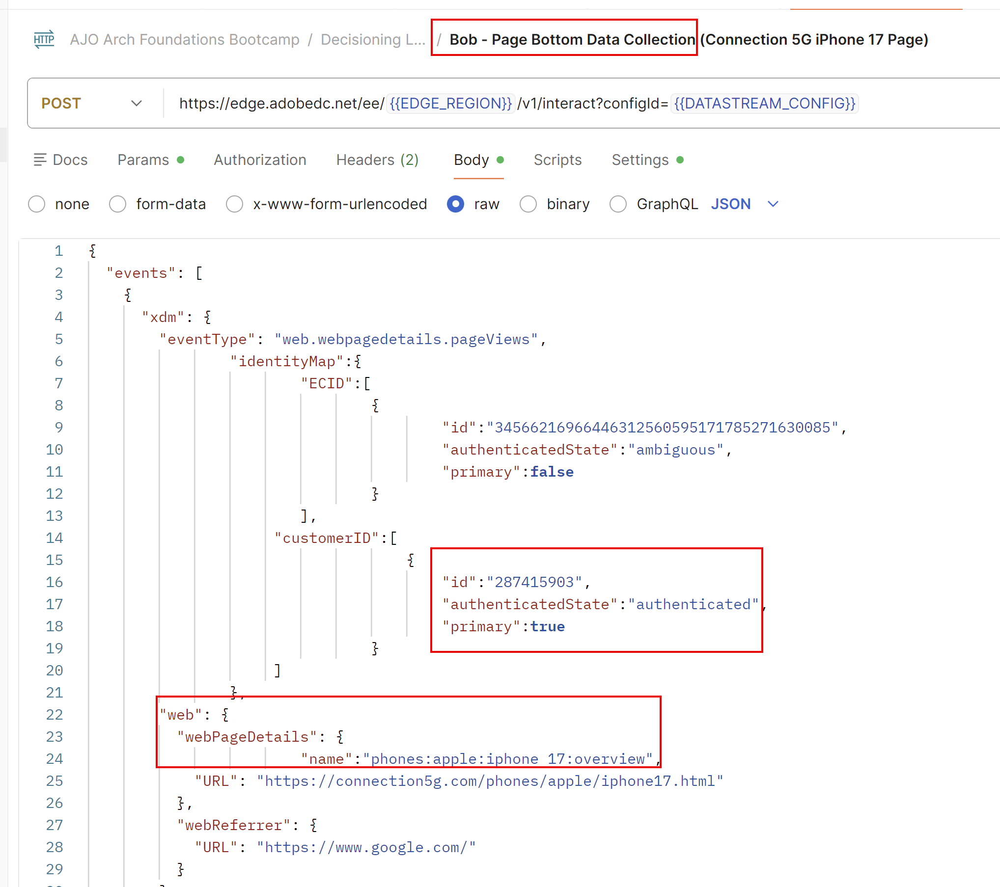
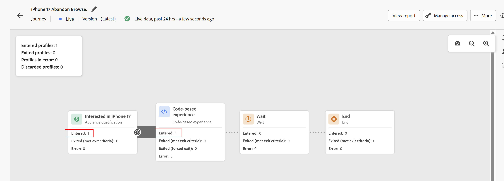

# Decisioning e CBE in azione

## Obiettivo

Ora che il Percorso è attivo, puoi iniziare a inviare in Eventi esperienza e visualizzare le offerte restituite. Poiché l’anno di nascita e gli ID del piano telefonico dei singoli profili influiscono su quale offerta viene restituita, dobbiamo inviare eventi esperienza per profili preconfigurati con anni di nascita specifici e ID del piano.

## Configurazione di Profili e Postman

I tre profili che utilizzerai sono già nella sandbox e sono descritti in questa tabella:

| Nome | Cognome | Anno di nascita | ID piano | customerID | ECID | E-mail |
| ---------- | ------------ | ---------- | ------- | ---------- | -------------------------------------- | --------------- |
| Bob | Base | 1974 | 1 | 287415903 | 34566216966446312560595171785271630085 | bob\@dep.com |
| Peter | Professionale | 1981 | 2 | 105946728 | 22344522145769262754334953788432801285 | pietro\@dep.com |
| Ursula | Ultimate | 2002 | 3 | 730682145 | 35615467908312308343036144243711275069 | ursula\@dep.com |

Individua questi profili in AEP

1. Se necessario, espandi l&#39;elemento **Cliente** nella barra a sinistra e fai clic su **Profili**
1. Fai clic sulla scheda **Sfoglia** e, tra tutti i profili già creati per te o quelli creati come parte dei laboratori precedenti, trovi questi tre profili.

Trova gli eventi esperienza corrispondenti per ciascun profilo nella raccolta Postman

1. Se necessario, apri Postman
1. Verificare che le variabili di ambiente **EDGE\_REGION** e **DATASTREAM\_CONFIG** siano ancora impostate. Se è necessario impostarle nuovamente, rivedere i passaggi nel laboratorio &#39;Ambiente di importazione e raccolta&#39;.
1. Espandere la cartella **Decisioning Lab**. Sono presenti 2 eventi esperienza per ciascun profilo:

## Invio in eventi esperienza

&#x200B;> [!IMPORTANT]
>
>Non saltare la spiegazione del testo di apertura di questa sezione!

Tenendo conto del tempo e delle risorse illimitati, possiamo creare e distribuire una libreria di tag con AEP Web SDK su un sito Web effettivo. Questo dimostrerebbe come recuperare e creare rapporti sulle offerte. Tuttavia, data l’ampiezza e la profondità dei contenuti trattati in questi laboratori, abbiamo scelto di precreare gli Eventi di esperienza necessari per accedere al Percorso, recuperare le offerte e creare rapporti su tali offerte all’interno di una raccolta Postman, invece di richiedere di assegnare tag a un sito web. Se utilizzata correttamente, questa raccolta simula come un sito con tag corretti (o qualsiasi canale digitale) utilizzerebbe il canale di consegna CBE in un Percorso.

L’approccio consigliato per le distribuzioni di AEP Web SDK consiste nell’utilizzare un approccio di due chiamate per pagina. In questo modello, il SDK web invia una chiamata &quot;fetch&quot; nella parte superiore della pagina ad Edge che richiede le personalizzazioni necessarie per l’utente. Tali personalizzazioni vengono restituite da Edge e quindi riprodotte dal Web SDK. Una seconda chiamata nella parte inferiore della pagina, in genere denominata chiamata di raccolta dati, viene quindi inviata ad Edge e segnala cosa è stato mostrato all’utente finale, insieme ad altri dati per Analytics, CJA e altre soluzioni. Quando si tratta di recuperare le proposte da Edge, ricorda un semplice mnemonico: FAR, che sta per Fetch, Apply e Report. Tutte le proposte devono essere recuperate, applicate o sottoposte a rendering (mostrate all’utente finale) e quindi riportate su. È fondamentale che queste offerte vengano riportate come viste in modo che le regole di quota limite funzionino.

Le attività di Adobe Target e il canale web AJO possono recuperare e applicare automaticamente le proprie risposte da AEP Web SDK. Il reporting di può essere inviato anche con la chiamata di raccolta dati nella parte inferiore della pagina. Tuttavia, i CBE sono diversi. AEP Web SDK può recuperare le proposte, ma spetta al cliente applicare (eseguire il rendering) tutto ciò che viene restituito e quindi utilizzare AEP Web SDK per generare rapporti su ciò che è stato mostrato. Un CBE in genere non utilizza le chiamate di raccolta dati per generare rapporti su ciò che è stato mostrato, pertanto devono essere trasmesse manualmente.

Nella raccolta Postman, vedrai che ogni profilo ha due chiamate Experience Event

Un evento esperienza di recupero pagina superiore

Un Evento Di Esperienza Di Raccolta Dati Page Bottom

L’evento esperienza nella parte superiore della pagina include il parametro &quot;jsonOfferContainer&quot; nella richiesta, che è la &quot;Posizione sulla pagina&quot; configurata per il CBE. Inoltre, questa chiamata utilizza la funzionalità di script di Postman per ricevere la risposta da Edge e inviare immediatamente una seconda chiamata ad Edge per segnalare che l’offerta è stata mostrata all’utente finale. Non esiste alcuna applicazione effettiva o rendering dell’offerta perché non esiste un sito web per questo laboratorio. Ma dal punto di vista di AJO, l’offerta è stata restituita e quindi riportata come vista.

La chiamata di raccolta dei dati nella parte inferiore della pagina serve solo per generare una visualizzazione di pagina per la pagina Panoramica di iPhone 17. Ricorda che il segmento per entrare nel Percorso stesso richiede 3 visualizzazioni di questa pagina. Una volta inviato l’evento esperienza in 3 volte, l’utente entrerà nel Percorso e sarà necessario solo l’evento Page Top Fetch Experience per ottenere l’offerta e segnalare che è stata vista.

Inizia con il profilo di Bob.

1. Fai clic sulla richiesta **Bob - Page Bottom Data Collection**.
2. Fai clic sulla scheda **Body** e osserva i parametri passati, come lo spazio dei nomi customerID in IdentityMap, che indica che è autenticato, nonché il parametro &#39;web.webPageDetails.name&#39; che passa nel nome pagina di &#39;phones\:apple\:iphone 17\:overview&#39;.

&#x200B;3. Fai clic su **Invia** nell&#39;angolo superiore destro per inviare una visualizzazione di pagina. Ottieni una risposta simile a questa

&#x200B;4. Dopo aver ricevuto una risposta corretta, fai di nuovo clic su **Invia** per inviare nuovamente lo stesso evento Page bottom una seconda volta. Attendi alcuni secondi, quindi invia una terza chiamata di raccolta dati per il profilo Bob. Hai inviato un totale di 3 chiamate dal basso della pagina.

A questo punto, il sistema elabora gli hit e aggiunge Bob al segmento di streaming &quot;dep: Interested in iPhone 17&quot;. Una volta fatto, Bob viene inserito nel Percorso. Una volta al Percorso, bastano pochi minuti perché l’ingresso di Bob nel Percorso e nel segmento venga proiettato nell’archivio profili di Edge per Bob.

&#x200B;5. Torna all&#39;interfaccia utente di AJO e fai clic su **Profili** nella barra a sinistra, seguito dalla scheda **Sfoglia**.
&#x200B;6. Cerca il profilo di Bob utilizzando lo spazio dei nomi **customerID** con il valore di **287415903**.

&#x200B;7. Fai clic su **Visualizza** per aprire il profilo di Bob (il colore del profilo di Bob potrebbe essere diverso da quello mostrato nella schermata).

&#x200B;8. Una volta aperto il profilo di Bob, fai clic sulla scheda **Appartenenza al pubblico** e vedrai che Bob è ora membro del segmento &quot;dep: Interested in iPhone 17&quot;, almeno dal punto di vista di AEP Hub.
&#x200B;9. Fai clic su **Attributi,** quindi seleziona il pulsante di scelta **Edge** per passare alla visualizzazione Edge.

>[!WARNING]
>
>Si è verificato un bug sfortunato nell’interfaccia utente che richiede di fare clic sulla scheda degli attributi per passare dal pulsante di opzione ad Edge.

&#x200B;10. Fai di nuovo clic su **Appartenenza al pubblico,** e se hai eseguito questi passaggi abbastanza rapidamente, vedrai che Edge è selezionato e mostra che Bob non è iscritto al pubblico

&#x200B;11. In una nuova scheda del browser, individua il Percorso creato e fai clic su di esso. Vedrai che un profilo è entrato nel Percorso ed è ora nel nodo CBE.

A questo punto, Bob è entrato nel Percorso e la proiezione Edge sta attualmente assemblando una proiezione che aggiorna il profilo di Bob sull&#39;Edge.

&#x200B;12. Torna a Postman e fai clic sulla seconda chiamata Experience Event di Bob, **Bob - Page Top Fetch.**
&#x200B;13. Fai clic su **Invia**. Cosa dovrebbe succedere?
    - Se il profilo Edge di Bob non è ancora stato aggiornato, la risposta ottenuta dalla chiamata di raccolta dati è molto simile. In questo caso, attendi qualche minuto e prova a inviare di nuovo la chiamata Page Top Fetch di Bob.
    - Se il profilo Edge di Bob è stato aggiornato, ottieni una risposta con il JSON configurato in precedenza, insieme alle informazioni aggiuntive utilizzate per il reporting. Ma prima di proseguire, quale offerta iPhone 17 dovrebbe essere offerta a Bob?

      Bob è nato nel 1974, che è maggiore del 1966, quindi si sarebbe qualificato per il secondo criterio di formula di classifica, e i suoi punteggi di priorità di offerta Generica, Base e Pro sarebbero stati moltiplicati per 100, dando a quelle offerte punteggi di 100, 200 e 300, rispettivamente. Tuttavia, Bob Basic ha un ID piano 1, quindi non è idoneo per le offerte Ultra o Pro tier grazie alla regola di decisione. Pertanto, verrebbe visualizzata l’offerta di livello base, che ha un punteggio di 200. Puoi vedere che nella risposta di (probabilmente dovrai scorrere verso il basso):

&#x200B;14. Ricorda che questa richiesta di Postman invia automaticamente una notifica di visualizzazione per questa offerta, pertanto AJO ha già registrato almeno un’impression per questa offerta. Fai di nuovo clic su **Invia** per inviare una seconda impression. Verifica che l’offerta di base sia stata nuovamente restituita.
&#x200B;15. Ricorda che un limite di frequenza di 3 impression si applica ai modelli Base, Pro e Ultra tier. Fai clic su **Invia** una terza volta per ottenere una terza risposta con il livello base e registrare un&#39;altra impression.
&#x200B;16. Fai clic su **Invia** una quarta volta e cosa dovrebbe accadere? Viene raggiunto il limite di frequenza per l’offerta del livello base e nella risposta riceverai l’offerta generica:

&#x200B;17. Fai di nuovo clic su **Invia** per visualizzare l&#39;offerta livello generico. Puoi fare clic su Invia altre 100 volte e ottenere nuovamente la stessa offerta fino al giorno successivo in cui il limite di frequenza viene reimpostato.

>[!WARNING]
>
>Ricorda che in AJO, la giornata si ripristina a mezzanotte GMT. Se inviassi un’altra chiamata Fetch dopo Midnight GMT, visualizzeresti invece il ritorno dell’offerta del livello base.

&#x200B;18. Torna all&#39;interfaccia utente di Journey Orchestration e fai clic sul Percorso **Sfoglia abbandonata di iPhone 17** creato. Poiché il Percorso è live e pubblicato, puoi iniziare a visualizzare le statistiche. Vedrai che 1 profilo è entrato nel Percorso ed è attualmente nel nodo CBE.

>[!NOTE]
>
>A questo punto, potresti chiederti perché il profilo non si trova nel nodo di attesa. Una volta che ha colpito il nodo CBE e proiettato gli aggiornamenti al profilo Edge di Bob, dovrebbe trovarsi al nodo di attesa? La risposta breve è che potrebbe essere, ma... si potrebbe anche sostenere che, dal momento che il CBE viene attivamente restituito, allora è dove Bob è in questo Percorso. Ma dopo 3 giorni, il Percorso mostrerà che il profilo ha completato il Percorso senza mai essere realmente nel nodo di attesa.

## Inviare eventi esperienza per altri profili

Ora che hai visto il Percorso funzionare per il profilo di Bob, ci sono altri due profili da testare.

1. Torna a Postman e individua gli eventi Experience per Peter e Ursula.
2. Esegui l’evento &quot;Page Bottom Data Collection&quot; 3 volte per ogni profilo, ricordandosi di dare 1-3 secondi tra ogni richiesta di invio/raccolta dati.
3. Attendi alcuni minuti affinché i tre profili possano qualificarsi per il segmento Streaming, inserisci il Percorso e quindi proietta il CBE nei loro profili Edge.
4. Invia nella chiamata Page Top Fetch il numero di volte necessario per verificare che le regole di Decisioning e le formule di Classificazione funzionino come previsto.

**Profili decisionali: comportamento previsto**

| Nome | Cognome | Prima offerta | 2a offerta | 3a offerta | 4a offerta |
| ---------- | ------------ | --------- | --------- | --------- | --------- |
| Bob | Base | Base | Generico | Generico | Generico |
| Peter | Professionale | Pro | Base | Generico | Generico |
| Ursula | Ultimate | Ultra | Pro | Base | Generico |

&#x200B;5. Al termine, torna al Percorso. Vedi che tutti e 3 i profili sono entrati nel Percorso e si trovano nel nodo CBE.

>[!NOTE]
>
>Se attendessi 3 giorni e inviassi di nuovo il Recupero dall’inizio della pagina, scoprirai che non è stata restituita alcuna offerta e che tutti e tre i profili hanno terminato il Percorso

## Riassunto

In questa pagina finale del laboratorio, sei passato alla fase di esecuzione, in cui hai testato la configurazione decisionale utilizzando gli eventi di esperienza e un canale di esperienza basata su codice (CBE). Hai utilizzato Postman per inviare eventi di esperienza simulati a Adobe Journey Optimizer in modo che:

- I profili sono entrati nel percorso creato perché soddisfacevano i criteri del segmento di streaming.
- Il canale CBE è stato richiamato con eventi di recupero per ottenere decisioni sulle offerte basate sui dati di profilo (anno di nascita, piano telefonico, ecc.).
- Le offerte sono state restituite e conteggiate in base ai limiti di frequenza configurati, mostrando come diverse regole e logiche di classificazione influenzavano l’offerta consegnata.
- Hai verificato che il limite di frequenza e l’idoneità funzionassero come previsto inviando ripetutamente chiamate di recupero delle offerte.

Hai eseguito chiamate di decisioning effettive e hai verificato che le regole di idoneità, la formula di classificazione e la configurazione delle offerte si comportino correttamente quando i profili interagiscono con il motore decisionale.
