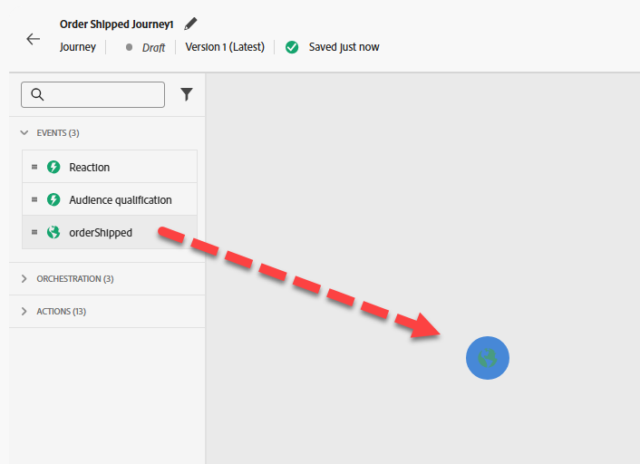
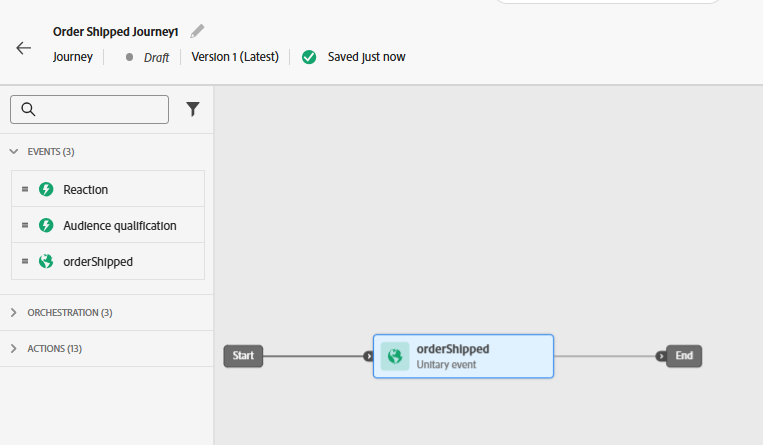
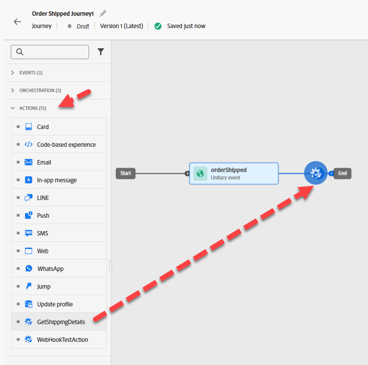
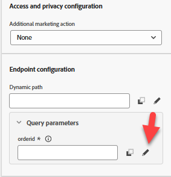

# Genera percorso

## Finalità di apprendimento

Crea un percorso unitario che inizia con l’evento configurato Order Shipped, ottiene l’ETA da un servizio esterno e invia un’e-mail.

## Crea percorso

Vai a **Percorsi** e fai clic su **Crea Percorso - Crea da zero**


## Proprietà del percorso

1. Aggiorna le Proprietà Percorso nella barra a destra con quanto segue:
   - **Nome**: `Order Shipped Journey`
   - **Descrizione**: `Notify customer that order has shipped. Include shipping details.`
   - **Tag**: `Default`
   - **metriche Percorsi**: *lascia vuoto*

     >[!NOTE]
     >
     >**Elenco a discesa vuoto?**
     >
     >Non preoccuparti e vai avanti. Il primo percorso creato in una sandbox deve &quot;caricare la pompa&quot;.  Una volta pubblicato il percorso, questo menu a discesa presenta alcune opzioni tra cui scegliere.

   - **Consenti rientro**: `checked`

   - **Periodo di attesa rientro:** `5 minutes`

   - **Etichette di accesso**: *lascia vuoto*

   - **Fuso orario**: `Your Local timezone`

   - **Usa il fuso orario del profilo in attese e condizioni**: `NOT checked`

   - **Data inizio/fine**: *lascia vuoto*

   - **Timeout o errore**: `30`

   - **Regole di limitazione:** *lascia vuoto*

   - **Priorità**: `0`


2. Se tutto sembra corretto, fai clic sul pulsante **Salva**


## Area di lavoro percorso

### Aggiungere un evento unitario

Dal riquadro di sinistra sotto il menu **Eventi** trascina &#39;n rilasciare l&#39;evento **orderShipped** nell&#39;area di lavoro come mostrato di seguito







### Aggiungere un’azione personalizzata

1. Se il riquadro di sinistra espande il menu **Azioni** e quindi trascina &#39;n&#39; nell&#39;area di lavoro, l&#39;azione generata denominata **GetShippingDetails** dopo l&#39;evento orderShipped

   

2. Nella barra a destra, sotto Configurazione di accesso e privacy —> Menu a discesa Azione di marketing, verifica che il valore sia impostato su **Nessuno**

   

3. Nel menu Configurazione endpoint —> Parametri query, fai clic sull&#39;icona **Matita** accanto a orderid

   

4. Nel modale visualizzato espandere **Contesto** -> **ordineSpedito** -> **Ordine**, quindi selezionare **ID ordine (orderID)** e fare clic su **OK**

   

5. Nella barra a destra, verifica che l&#39;opzione per Timeout o errore sia **deselezionata**, quindi fai clic sul **pulsante Salva**


### Aggiungi azione e-mail

1. Nel menu Azioni, trascina &#39;n rilascia l&#39;azione **Azione** nell&#39;area di lavoro dopo l&#39;azione GetShippingDetails

   

2. Seleziona **Email** per l&#39;azione di marketing, quindi **Aggiungi**.

   

3. Nella barra a destra, fai clic su **Configura azione**

   

4. imposta **Configurazione canale e-mail** su `Profile-Email`, quindi fai clic su **Modifica contenuto**


### Aggiungi contenuto corpo dell’e-mail

Per quanto riguarda i contenuti, dovrai mantenere le cose semplici. Come stupidi semplici.

1. Aggiorna l&#39;oggetto in `Order Shipped` e fai clic sul pulsante **Modifica corpo dell&#39;e-mail**

   

2. Nella barra superiore fai clic sul blocco di contenuto **Struttura da zero**

   

3. Dalla barra sinistra sotto il contenitore Struttura trascinare &#39;n rilasciare la **Colonna 1:1** nell&#39;area di lavoro

   

4. Quindi trascina il componente **Testo** nella **Colonna:1:1** sotto il contenitore Sommario

   

5. Fai clic sul componente Testo e **elimina il testo corrente**, quindi fai clic sull&#39;icona **Aggiungi Personalization**

   

6. Nella barra a sinistra, fai clic sulla cartella **Attributi contestuali**, quindi passa a **Journey Orchestration** -> **Azioni** e seleziona **GetShippingDetails**

   

7. Nel corpo principale dell&#39;e-mail ora **copia e incolla** il JSON seguente nel **editor** di Personalization

   ```json
   {{profile.person.name.firstName}}, your order has shipped
   ETA: 
   Tracking Number: 
   ```

8. Aggiungi i campi di personalizzazione come segue (**fai clic sul segno più &#39;+&#39; accanto al campo nella barra a sinistra**):
   - **ETA:** `eta`
   - **Numero di tracciamento:** `tracking_number`

   

   >[!NOTE]
   >
   >Fare clic sul simbolo **+** per aggiungere attributi di personalizzazione dalla barra all&#39;area di lavoro.  Le posizionerà dove si trova il cursore in modo da garantire che l&#39;utente sia &quot;allineato&quot; in modo appropriato

   >[!NOTE]
   >
   >L’e-mail utilizzerà una combinazione di attributi di contesto (ETA e numero di tracciamento) e attributi di profilo (nome). Se desideri aggiungere altri attributi di profilo, fai clic sulla scheda Attributi profilo e seleziona tutto quello che vedi.
   >
   >

9. Nella parte inferiore della schermata, fai clic sul pulsante **Convalida** per verificare che non siano presenti errori

   

10. Se tutto è a posto, fai clic sul pulsante **Salva** in alto a destra
11. Fai di nuovo clic sul pulsante **Salva** in alto a destra e quindi sulla freccia **\&lt;- sinistra** in alto a sinistra


&#x200B;12. Infine, fai clic sull&#39;icona **\&lt; Indietro** in alto a sinistra per tornare all&#39;area di lavoro del Percorso


>[!TIP]
>
>Quindi fare di nuovo clic sul pulsante **Indietro**... Sto scherzando! Questo è l&#39;ultimo pulsante indietro...in questa sezione 😜


### Sostituisci parametri e-mail

Tornando all&#39;area di lavoro principale del Percorso, nel nodo E-mail, accertati di poter visualizzare i campi di sola lettura (potrebbe essere necessario fare clic sull&#39;icona **Mostra campi di sola lettura**)


1. Scorri fino a **Parametri e-mail** e fai clic sull&#39;icona **Abilita sostituzione parametro**

   

2. Fai clic nella casella di testo vuota, quindi nella barra a sinistra approfondisci in **Contesto** -> **ordineSpedito** -> **\_dep** e fai clic sul campo **personalEmail**.  Quindi fare clic sul pulsante **OK**

   

   >[!WARNING]
   >
   >Questa è una cosa pericolosa da fare, evita di utilizzarla a meno che non sia necessario in un ambiente di produzione.  Questo sovrascriverà la posizione predefinita cercata dai Percorsi sul profilo per eseguire i messaggi.


3. Fai clic sul pulsante **Salva** in alto a destra, quindi fai clic sulla **freccia indietro** \&lt;- in alto a sinistra per **chiudere** il Percorso


## Riassunto

Un percorso pubblicato in grado di rispondere all&#39;attivazione dell&#39;evento Ordine spedito, ottenere l&#39;ETA da un servizio esterno e inviare un messaggio e-mail.
