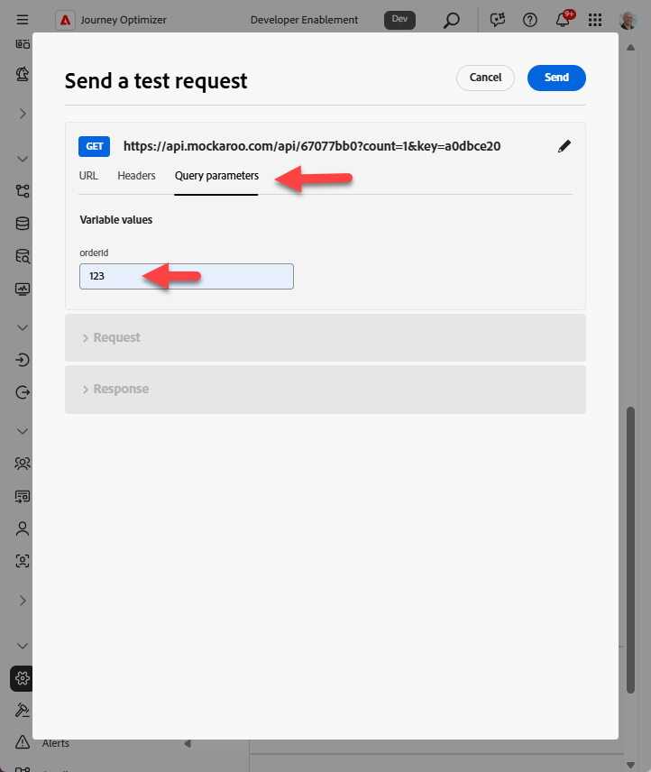

# Configura azione personalizzata

## Finalità di apprendimento

Creazione di un&#39;azione personalizzata che definisce il modo in cui il percorso comunicherà con un endpoint o un servizio esterno per ottenere un&#39;ETA per l&#39;arrivo del pacchetto.

## Passa alle azioni

Nella barra a sinistra del menu Amministrazione, fai clic su **Configurazioni**, quindi sul riquadro Azioni fai clic sul pulsante **Gestisci**


## Configurare l’azione

### Nome azione e dettagli

1. In alto a destra, fai clic sul pulsante **Crea azione**


&#x200B;2. Nel pannello di configurazione visualizzato, aggiorna i seguenti valori di base come mostrato di seguito:
   - **Nome**: `GetShippingDetails`
   - **Descrizione**: `Call third party to get Shipping ETA and Tracking Number`
   - **Tipo azione**: `Custom`
   - **Canale**: `Email`
   - **Azione di marketing richiesta**: `Email Targeting`


### Dettagli endpoint

Nell’area di configurazione dell’endpoint fornisci i seguenti dettagli:

- **URL endpoint**: `https://api.mockaroo.com/api/67077bb0?count=1&key=a0dbce20`
- **Metodo**: `GET`
- **Intestazioni:** *lascia invariato*
- **Parametri query:**
  - **Nome**: `orderid`
  - **Tipo**: `variable`

>[!NOTE]
>
>Una variabile consente di trasmettere un valore durante un percorso rispetto a un valore statico per tutti i percorsi

- **Tipo di autenticazione**: `No Authentication`


### Dettagli del payload di risposta

Ora devi fornire un payload di esempio in modo che l’azione sappia come dovrebbe essere il payload di risposta.

1. Nell&#39;area Payload fare clic sull&#39;icona **Matita** per aprire la schermata Configurazione campo


&#x200B;2. **Copia e incolla** il payload seguente nella casella Payload

```json
{
    "eta": "11/19/2025",
    "tracking_number": "072000326"
}
```

>[!NOTE]
>
>Si tratta della stessa struttura JSON che l’endpoint Mockaroo di cui sopra deve restituire:


&#x200B;3. Viene visualizzato il payload di risposta. Fai clic sul pulsante **Salva**.


>[!NOTE]
>
>Puoi lasciare tutto come una stringa, ma in uno scenario reale probabilmente vorrai aggiornarlo per farlo corrispondere al tipo di dati


### Verifica l’azione

1. Fai clic sul pulsante **Invia richiesta di test** nella barra in basso a destra per verificare che non sia stato incasinato nulla 😀


&#x200B;2. Fai clic sulla scheda **Parametri query** e aggiorna il valore per `orderId` a **123**




&#x200B;3. Fai clic sul pulsante **Invia** e se tutto funziona correttamente, dovresti visualizzare un codice di risposta pari a 200 e un&#39;anteprima del payload, come illustrato di seguito...


Anteprima

```json
{
  "eta": "12/26/2025",
  "tracking_number": "063112249"
}
```

>[!WARNING]
>
>Se non visualizzi una risposta 200 o un’anteprima, non continuare. Alza il tuo ✋ per ottenere aiuto.


&#x200B;4. Fai clic sul pulsante **Annulla** per tornare alla schermata Azione, quindi scorri di nuovo nella barra in alto a destra e fai clic sul pulsante **Salva**

>[!TIP]
>
>Congratulazioni! La tua azione personalizzata è live, grazie alle tue abilità a livello di esperti Ctrl+C, Ctrl+V.

## Riassunto

Azione personalizzata riutilizzabile configurata in Adobe Journey Optimizer che accetta un ID ordine e restituisce l’ETA e il numero di tracciamento.
