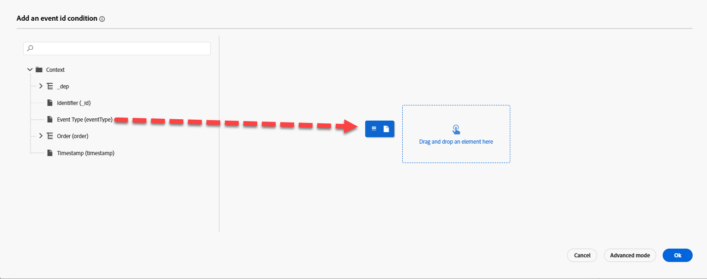

# Configura evento

## Finalità di apprendimento

Crea e configura un evento che attiverà un percorso del cliente quando si verifica l’azione post-acquisto (ordine spedito).

## Passa a Journey Optimizer

Nell&#39;angolo superiore destro del browser fare clic sul **Cubo** e quindi selezionare **Journey Optimizer**

## Configura evento ordine spedito

Per creare un Percorso che utilizza un evento unitario, è necessario innanzitutto configurare l’evento.

1. Nella barra a sinistra del menu Amministrazione, fai clic su **Configurazioni**, quindi nella sezione Eventi fai clic sul pulsante **Gestisci**

&#x200B;2. In alto a destra, fai clic sul pulsante **Crea evento**

&#x200B;3. Aggiorna le impostazioni dell’evento come segue:
   - **Nome** = `orderShipped`
   - **Tipo** = `Unitary`
   - **Tipo ID evento** = `Rule based`
   - **Schema** = `dep: Orders v.1`

&#x200B;4. Nella casella di input `Fields` fare clic sull&#39;icona **Matita**

&#x200B;5. Selezionare i campi seguenti da aggiungere all&#39;evento e al termine fare clic sul pulsante **OK**
   - `Event Type (eventType)`
   - `Order ID (orderID)`

>[!NOTE]
>
>Assicurarsi di selezionare solo il campo ID ordine e non tutti i campi nell&#39;ordine 😁

&#x200B;6. In `Event Id condition input`, fai clic sull&#39;icona **Matita**

&#x200B;7. **Trascina** il campo `Event Type` nell&#39;area di lavoro

&#x200B;8. Nella casella di selezione visualizzata cercare e controllare il valore con titolo **orders.shipped.** Quindi fare clic sul pulsante **OK**.

&#x200B;9. Avanti aggiorna gli ultimi due valori di Spazio dei nomi e Identificatore profilo con i valori mostrati di seguito:
   - **Spazio dei nomi** —> `Email`
   - **Identificatore profilo** —> `personalEmail`

>[!NOTE]
>
>**Per che cosa si utilizzano lo spazio dei nomi e l&#39;identificatore del profilo?**
>
>Per qualsiasi percorso che utilizza un evento è necessario specificare per tale evento lo spazio dei nomi dell’identità e l’identificatore del profilo associato da utilizzare per ricercare il profilo. È importante capire che scegliere un&#39;identità piuttosto che un&#39;altra può influire sul funzionamento del percorso.
>
>*Esempio rapido:*
>
>Il payload dell’evento è una visualizzazione di pagina contenente identità del tipo: ECID (identità primaria) e ID cliente (facoltativo)
>
>- ECID scelto —> è probabile che questa sia la prima volta che il servizio Identity vede questa relazione, quindi quando un percorso riceve questo evento tenta di cercare il profilo utilizzando ECID e non riesce a trovare un profilo.  Perché? La relazione tra ECID e ID cliente non esiste ancora e le caratteristiche del profilo probabilmente sono memorizzate in base all’identificatore noto ID cliente
>- ID cliente scelto —> questa identità non deve essere compilata ed è probabile che nella maggior parte delle visualizzazioni di pagina sia vuota.  Pertanto, se questa identità è stata scelta l’unica volta che un Percorso si attiverebbe è quando è presente una visualizzazione di pagina autenticata in cui è impostato l’ID cliente.
>
>Risposta breve: non esiste una risposta corretta, è sufficiente effettuare dei compromessi in base al caso d&#39;uso 😃

## Configurazione finale evento orderShipped

Verifica che la configurazione dell’evento finale corrisponda a quella riportata di seguito.  Se tutto sembra corretto, fai clic sul pulsante **Salva**

>[!TIP]
>
>Hai configurato il tuo primo evento AJO. Sei tu il migliore!

## Riassunto

Evento di spedizione dell&#39;ordine configurato in Adobe Journey Optimizer che può essere utilizzato come punto di ingresso per un percorso
