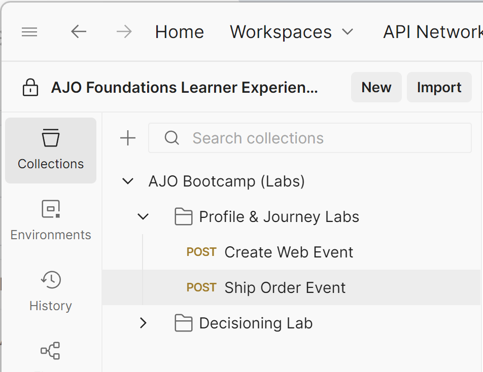

# Inviare un evento

## Finalità di apprendimento

Invia un evento Ordini spediti simulato per attivare il percorso tramite Postman

## Streaming su Hub e Edge

In precedenza, abbiamo inviato un evento ad Edge.  In alcuni casi d’uso potrebbe essere presente un sistema di back-end che desidera eseguire il streaming in un evento, ma non deve inviarlo all’Edge.  In questa esercitazione viene illustrato come eseguire questa operazione tramite **streaming in un evento Ordine spedito all&#39;hub** (ovvero server a server, ad esempio da Commerce Server ad AEP per segnalare che un ordine è stato spedito).

## L’evento di convalida non è nel profilo

1. Vai ai **Profili** e cerca il profilo.
   - **Spazio dei nomi identità** -> `email`
   - **Valore identità** -> `henry.creel@emailsim.io`
1. Fai clic sulla scheda **Eventi**.
   - Devono essere presenti **no** `orders.shipped` eventi

## Modifica richiesta API

Per creare la richiesta API, devi compilare i seguenti elementi nel corpo della richiesta API.

Inizia raccogliendo i seguenti valori:

### Trova endpoint di streaming dell’account

1. Passa a **Origini** nella barra a sinistra, quindi fai clic su **Account** nel menu di navigazione in alto
1. Cerca **dep: API HTTP \[raw]**, evidenzia la riga, copia e salva il valore dell&#39;**endpoint di streaming** da qualche parte a cui potrai fare riferimento in seguito

![dep: API HTTP [raw] riga account evidenziata con valore endpoint di streaming](assets/send-an-event-streaming-endpoint-account-row.png "dep: API HTTP \[raw]")

### Trova ID flusso di dati

1. Fai clic su **dep: API HTTP \[raw]**
1. Trova il record per **dep: Orders (stream)** fai clic sul collegamento dei flussi di dati
1. Nella barra a destra copia e salva i valori **ID flusso di dati** da qualche parte a cui puoi fare riferimento in seguito

&#x200B;> [!WARNING]
>
>Fare clic in uno spazio vuoto sulla riga.  NON fare clic sui collegamenti blu.

### Apri Postman

Avvia Postman sul computer e passa alla seguente chiamata API:

- **Barra laterale sinistra Postman** —> `Collections`
- **Raccolta** —> `AJO Bootcamp (Labs)`
- **Cartella** —> `Profile & Journey Labs`
- **Richiesta API** —> `Ship Order Event`

### Crea richiesta API finale

1. Copia i valori salvati nei passaggi precedenti nelle posizioni evidenziate di seguito.
1. Fai clic su **Intestazioni** e incolla questi valori (rimuovi eventuali spazi finali):
   - **Rosso** —> `Streaming Endpoint URL`
   - **Verde** —> `Dataflow ID`
     - Il valore ha l&#39;aspetto di un GUID (non inizia con http)

&#x200B;> [!CAUTION]
>
>NON ESEGUIRE ANCORA!

## Eseguire l’API

1. Salva la chiamata API facendo clic sul pulsante **Salva**
1. Esegui la richiesta facendo clic sul pulsante **Invia**

In caso di esito positivo, la chiamata dovrebbe dare la seguente risposta...

## Riassunto

Un evento ordine di spedizione è stato inviato correttamente alla piattaforma
