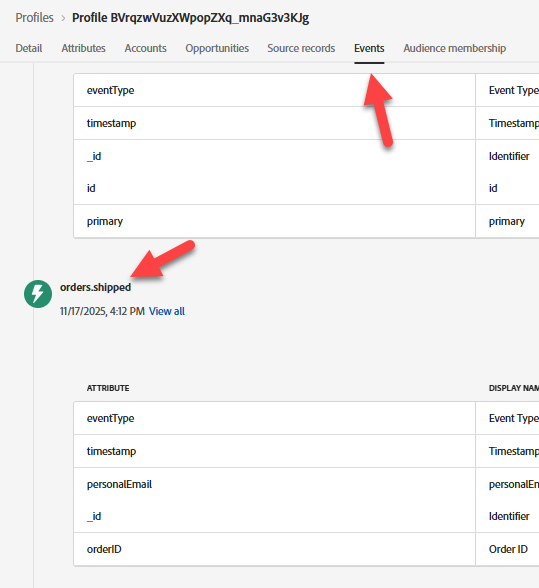

# Convalida evento acquisito

## Finalità di apprendimento

Verifica che l’evento sia stato correttamente acquisito in Adobe Experience Platform.

## Convalida evento nel profilo

1. Vai a **Profili** e controlla il tuo profilo per vedere che l&#39;evento è stato acquisito nel profilo.  Viene visualizzato in secondi.
   - **Spazio dei nomi identità** -> `email`
   - **Valore identità** -> `henry.creel@emailsim.io`
2. Fai clic sulla scheda **Eventi**. Cerca l&#39;evento `orders.shipped`.

   

   >[!WARNING]
   >
   >Hai ricevuto **message.feedback** eventi.  Questi provengono dai Percorsi e in genere indicano un errore o un’esclusione.  Fai clic su di essi e osserva `reason`.
   >
   >Alcuni esempi che potresti incontrare in produzione potrebbero essere:
   >
   >- EmailNoAddressFoundInProfile (si è tentato di inviare un messaggio e-mail a un profilo privo di indirizzo e-mail)
   >- EmailNoConsent (hai tentato di inviare un’e-mail a un profilo il cui consenso era impostato su no.

3. Convalida che il profilo è qualificato per le **audience** (potrebbero essere necessari alcuni minuti).
   - Qualsiasi evento Edge (entro 15 minuti)
   - Qualsiasi streaming di eventi (entro 15 minuti)

## Prova con la tua e-mail

Dopo aver convalidato il profilo ricevuto, invia alcuni eventi con spedizione ordine tramite la tua e-mail.

1. Torna a Postman, trova il **evento ordine di spedizione**
2. fai clic sul **Corpo** e modifica il **indirizzo e-mail** nel tuo.

   

3. **Salva** e premi **Invia**.
4. Torna ai passaggi 1-3 e convalida utilizzando il tuo indirizzo e-mail.

## Riassunto

L’evento viene visualizzato nell’archivio Profilo e il Profilo fa ora parte del Pubblico che stava cercando l’evento.
