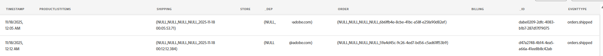

# Convalida percorso

## Finalità di apprendimento

Verifica che il percorso sia stato attivato ed eseguito come previsto.  I rapporti di verifica mostrano metriche aggiornate come previsto.

## Controllo del percorso

1. Vai al Percorso Spedizione ordine e aprilo se lo hai chiuso
2. Sono stati immessi almeno 2 profili

   

3. Fai clic su **Visualizza rapporto** -> **Ultime 24 ore** in alto a destra.
4. Per impostazione predefinita, ti trovi nella scheda **Percorso** (nella barra a sinistra)
   - Vedrai alcune entrate e uscite (il conteggio dipenderà dal numero di eventi inviati, da eventuali test, da eventuali errori, ecc.)


Se tutto è passato attraverso pulito hai (scorri verso il basso per verificare):

Statistiche di **Percorso**

3 Profili immessi (Henry, tu e il test che abbiamo fatto)

Se lo desideri, puoi fare clic sull&#39;interruttore in alto per **escludere eventi di test** e vedere questi numeri cambiare

3 Profili in uscita (Henry, tu e il test che abbiamo eseguito)

**Azioni eseguite ed errori**

6 azioni (3 e-mail, 3 GetShippingDetails)

**Motivi di errore azioni**

0 errori (si spera)

**Eventi**

3 eventi (orderShipped)

3 Eventi esterni

&#x200B;5. Fai clic sulla scheda **E-mail** (nella barra a sinistra)
   - **E-mail - Prestazioni invio**
     - Sono presenti alcuni valori per **Delivered** e **Sent** (il conteggio dipenderà dal numero di eventi inviati, da eventuali errori e così via)
     - Speriamo di non avere errori (a meno che non si siano verificati alcuni problemi in precedenza)
   - **E-mail - Statistiche**
     - E-mail - 3 mirate, inviate, consegnate

   

&#x200B;6. Controlla la tua **casella in entrata** e verifica di aver ricevuto l&#39;e-mail (è simile a quella riportata di seguito)
   - *,* il tuo ordine ha spedito l&#39;ETA: *10/17/2026* Numero di registrazione: *051009364*

   >[!NOTE]
   >
   >Controlla la cartella Spam per AJO Campaigns [ajo-campaigns@email.dep-labs.com](mailto:ajo-campaigns@email.dep-labs.com)

   >[!NOTE]
   >
   >**Perché manca il nome?**
   >
   >Abbiamo modificato il nodo E-mail per controllare il contesto dell’evento per l’indirizzo e-mail.  Tuttavia, il nome nella personalizzazione si sta estraendo da \{\{profile.person.name.firstName\}\}.
   >
   >Quando cerchi il tuo profilo per la tua e-mail, hai un firstName?


&#x200B;7. *Dopo 30-60 minuti*, puoi anche controllare il set di dati nel data lake con: **Query** -> **Crea query** -> **Copia/Incolla SQL** -> **Esegui**

>[!NOTE]
>
>L’evento di spedizione dell’ordine è stato inviato in streaming in, quindi, pur aggiornando il profilo rapidamente, ci vuole un po’ di tempo prima che il data lake venga aggiornato.

```sql
SELECT * FROM dep_orders
WHERE timestamp >= CURRENT_DATE
LIMIT 10
```



## Bonus (controlla gli eventi dei passaggi)

>[!NOTE]
>
>Eventi passaggio registra ogni volta che un profilo avvia un percorso e ogni passaggio del percorso. Nota: la registrazione di questi eventi nel set di dati potrebbe richiedere alcuni minuti.


1. In Query Service, eseguendo questa istruzione SQL, è possibile visualizzare il set di dati degli eventi del passaggio che acquisisce. Copia l’istruzione SQL seguente e incollala in una query.

```sql
select timestamp,
  identityMap,
  _experience.journeyOrchestration.stepevents.journeyVersionName,
  _experience.journeyOrchestration.stepevents.NodeName,
  _experience.journeyOrchestration.stepevents.*
  from journey_step_events
limit 50
```

I risultati hanno più di 100 colonne e ti danno un’idea dei record degli eventi di passaggio.

>[!NOTE]
>
>Curioso del significato di ogni campo, consulta il dizionario degli schemi di AJO e modifica l&#39;elenco a discesa con lo schema Eventi passaggio di Percorso: [https://experienceleague.adobe.com/tools/ajo-schemas/schema-dictionary.html?lang=en](https://experienceleague.adobe.com/tools/ajo-schemas/schema-dictionary.html?lang=en)


## Riassunto

L’istanza del percorso viene visualizzata nei rapporti o nei registri del percorso e l’azione configurata viene eseguita
