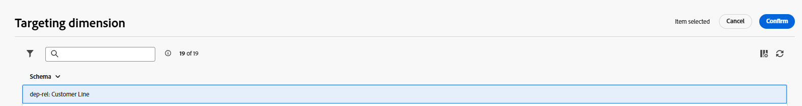
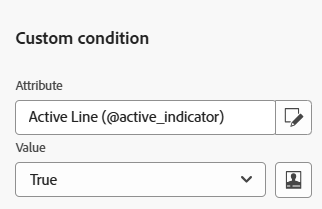
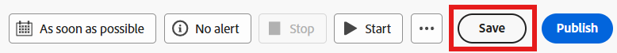

# Creare un pubblico

## Obiettivo

Nei passaggi successivi creerai il pubblico di destinazione per la campagna, ovvero tutti i titolari di linea attivi con una marca che corrisponde al telefono di punta che viene avviato.  L’obiettivo è il gruppo di destinazione con un messaggio SMS che spinge i clienti ad aggiornare il telefono.

## Aggiungi attività Genera pubblico

1. Nell&#39;area di lavoro fare clic sul simbolo **+** e quindi selezionare l&#39;attività **Genera pubblico** per aggiungerla al flusso di lavoro

2. Nella barra a destra trovi le proprietà Genera pubblico. Aggiornare l&#39;etichetta per indicare quanto segue: `Active Lines with Apple`

## Seleziona dimensione di targeting

Il passaggio successivo consiste nel selezionare la **dimensione di targeting** (ovvero la tabella su cui si desidera eseguire la query). Effettua le seguenti operazioni:

1. Fai clic sull&#39;**icona di ricerca** nella casella Dimensione targeting

2. Nella finestra a comparsa, cercare e selezionare la tabella denominata **dep-rel: Customer Line**, quindi fare clic sul pulsante **Confirm**.

>[!NOTE]
>
>Ricorda sempre la **dimensione di targeting** di ogni pubblico creato. Scoprirai il suo significato nei passaggi successivi.

>[!NOTE]
>
>se selezioni uno schema creato da Adobe, noti che lo schema inizia con -> *(caas)*. Questo è solo uno spazio dei nomi applicato alle tabelle all’interno dell’archivio relazionale e sta per Campaign as a Service :)

## Creare un pubblico

Ora che hai selezionato la dimensione di targeting (lo schema relazionale su cui stai eseguendo la query) puoi iniziare a creare la definizione.

1. Nella barra a destra, fai clic sul pulsante **Crea pubblico**

2. Fai clic sul pulsante **Aggiungi condizione**

## Crea condizioni

Ora è il momento di scrivere la logica del pubblico utilizzando gli attributi presenti nello schema. L’obiettivo è quello di trovare tutte le linee di clienti attive e che utilizzano una marca di Apple.

### Crea #1 condizione

1. Impostare la condizione utilizzando le seguenti informazioni:
   - **Attributo**: `Active Line`
   - **Valore**: `true`

2. Fai clic sull&#39;icona **Aggiorna** per visualizzare i conteggi validi per la condizione.

>[!TIP]
>
>Se la condizione è stata generata correttamente, viene visualizzato il risultato di 241

### Crea #2 condizione

1. Fai clic sul pulsante **Aggiungi condizione** e seleziona lo schema **dep-rel:** **Prodotto \[Ricerca]** facendo clic sull&#39;icona **>**

![Selezionare lo schema dep-rel: prodotto [Ricerca] facendo clic sull&#39;icona >](assets/build-an-audience-select-product-lookup-schema.png)

2. Cerca il campo denominato **Make**, fai clic sui tre punti e seleziona **Distribuzione dei valori**

3. Prendi nota dei vari valori. Vuoi solo `Apple` e per fortuna non ha 100 ortografie diverse. Fai clic sul **campo Apple** per selezionarlo, quindi fai clic sul **pulsante Seleziona attributo e valore** in alto a destra.

>[!NOTE]
>
>Questo è un esempio emblematico di dove l’architetto dei dati avrebbe dovuto progettare lo schema con le enumerazioni.  In questo modo, un addetto marketing non deve selezionare/digitare manualmente il valore.  Vergogna all&#39;architetto dei dati!

4. Il campo `Make` viene aggiunto automaticamente insieme alle condizioni mostrate di seguito.
   - **Operatore:** `Equal to`
   - **Valore:** `Apple`
   - **Distinzione maiuscole/minuscole:** `Enabled`

5. Fai clic sull&#39;icona **calcola** e visualizzerai 85 come risultato.

>[!NOTE]
>
>Si noti l&#39;utilizzo dell&#39;operatore AND nel gruppo. Sia che lo si crei in un singolo gruppo come mostrato, sia che lo si crei in più gruppi, l’operatore AND è importante perché indica a Orchestrated Campaigns che entrambe le condizioni devono essere vere.

## Verifica i conteggi

1. Fai clic sull&#39;icona **Calcola** trovata nella barra a destra sotto l&#39;intestazione Profili interessati per ottenere una stima esatta della dimensione del pubblico. **65** come **conteggio finale**.

>[!NOTE]
>
>Nota come ogni singola condizione ha restituito un numero diverso (condizione #1 —> 241 e condizione #2 —> 85), ma la dimensione finale del pubblico era la minore tra le due condizioni.  Ciò è dovuto a tale operatore AND.

2. Se visualizzi il conteggio finale di **65**, fai clic sul pulsante **Conferma** in alto a destra dello schermo, quindi fai clic sul pulsante **Salva** in alto a destra per salvare i tuoi dati.

## Sfida

Si supponga per un momento di aver digitato nell&#39;ultima condizione in modo che `Make` fosse uguale a `apple` (in minuscolo) e di aver lasciato l&#39;opzione di configurazione per `Case sensitive` attivata `on`.  In questo modo il conteggio dei record delle condizioni diventerebbe uguale a 0.  Avreste 241 linee attive e 0 dove la marca è mela.

**Quale sarebbe la dimensione finale del pubblico in questo caso?**

## Risposta

È zero. Sapete il perché?

## Riassunto

Hai creato correttamente il primo pubblico e ora dovresti vedere quanto è facile sviluppare e convalidare i conteggi nell’attività Genera pubblico.

