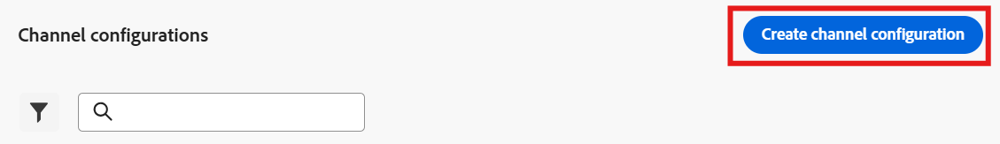
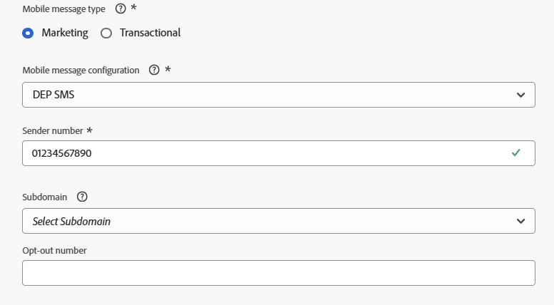

# Configurare il canale SMS

## Obiettivo

Nei passaggi successivi configurerai il canale SMS. Questa opzione è necessaria per poter inviare messaggi ai singoli titolari di linea in un secondo momento durante la creazione della campagna.

## Accedi ai canali

1. In Adobe Journey Optimizer, vai al menu **Amministrazione** -> **Canali**.
1. Selezionare **Impostazioni SMS** → **Credenziali API**.
1. Fare clic su **Crea credenziali API**.

## Definire le credenziali API SMS

Per iniziare, creerai il connettore API che AJO utilizzerà per inviare richieste SMS in uscita.

1. In Fornitore SMS scegli **Twilio**.
1. Immetti i dettagli delle credenziali API seguenti utilizzando il tuo account di prova [Twilio](https://www.twilio.com/try-twilio):
   - **Nome:** `DEP SMS`
   - **SID account:** trovato nel dashboard di Twilio Console
   - **Token di autenticazione:** trovato nel dashboard della console Twilio (fai clic su **Visualizza** per visualizzarlo)
1. Fai clic su **Invia** per registrare le credenziali API

>[!NOTE]
>
>Prima di iniziare questo passaggio, avrai bisogno di un account di prova Twilio gratuito con un numero di telefono verificato. Registrati all&#39;indirizzo [twilio.com/try-twilio](https://www.twilio.com/try-twilio), quindi individua il SID dell&#39;account e il token di autenticazione nel dashboard di Twilio Console.

## Creare la configurazione del canale SMS

Ora mapperai queste credenziali API a una configurazione di canale utilizzabile da percorsi e campagne.

1. Passa a **Canali** → **Impostazioni generali** → **Configurazioni canale**.

   

2. Fai clic su **Crea configurazione canale**.

   

3. Inserisci le impostazioni di configurazione del canale SMS con i seguenti valori:
   - **Nome:** `Relational-SMS-Multi-Entity`
   - **Canale:** `Mobile Message`
   - **Azione di marketing:** `SMS Targeting`

>[!NOTE]
>
>Se ricevi un errore che indica che l’utente non dispone delle autorizzazioni necessarie, ignoralo e continua.

## Impostazioni SMS

Quando selezioni Canale come messaggio mobile, viene visualizzata una nuova sezione denominata Impostazioni SMS. Compila il modulo con i seguenti dettagli:

- **Tipo di messaggio mobile:** `Marketing`
- **Configurazione messaggio mobile:** `DEP SMS`
- **Numero mittente:** `01234567890`
- **Sottodominio:** `leave blank`
- **Numero rinuncia:** `leave blank`

## Dettagli di esecuzione

1. In Dettagli di esecuzione, fare clic sulla scheda **Campagna orchestrata**

   

2. Verifica che la casella di controllo **Abilitato** sia selezionata

   

3. Avanti nella sottosezione **Dimensione di esecuzione** assicurati che le seguenti impostazioni siano configurate come segue:
   - **Consegna su messaggio per:** `Target + Secondary Dimension`
   - **Dimension di destinazione profilo:** `dep-rel: Customer Account - customer_id`
   - **Dimension secondario:** `Customer Line`

   

   

   >[!NOTE]
   >
   >In questo modo si comunica alle campagne orchestrate che quando inviano messaggi, devono consegnare un messaggio per record che corrisponde al profilo di Target Dimension.

4. Nell&#39;intestazione Indirizzo di esecuzione assicurarsi di selezionare il pulsante di opzione per **Dimension secondario** e quindi fare clic sul pulsante Modifica nel **Campo di esecuzione SMS**

   

5. Nel popup, fare clic nello schema **dep-rel: Customer Line** e selezionare **Mobile Phone**.

   

   

6. Conferma le corrispondenze della sezione dei dettagli di esecuzione finale di seguito

## Invia e rivedi

1. Puoi fare clic sul pulsante **Invia** per completare la configurazione e visualizzare un messaggio di successo

   

2. Nella pagina di inventario delle configurazioni del canale, verifica che lo stato sia **Attivo** prima di procedere

   

   >[!CAUTION]
   >
   >Attendi che lo stato diventi **Attivo** altrimenti i futuri passaggi del laboratorio non avranno esito positivo

3. Quando lo stato diventa Attivo, l’operazione è completata.

>[!TIP]
>
>🚀 Booyah! Il tuo canale SMS è ora attivo e pronto per l’azione.

## Riassunto

Ora hai visto come configurare correttamente un canale SMS.  Tieni presente che si tratta di un SMS basato su API, pertanto a seconda del provider possono utilizzare metodi alternativi per l’autenticazione.

Puoi trovare ulteriori [qui](https://experienceleague.adobe.com/en/docs/journey-optimizer/using/channels/sms/configure-sms/sms-configuration) se sei interessato.
