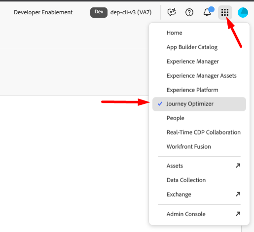

# Creare una campagna orchestrata

## Obiettivo

Nei passaggi successivi crei la shell di una campagna orchestrata (nessuna attività), che è il punto di partenza per qualsiasi campagna.

## Passare alle campagne

1. Per prima cosa accertati di essere nell’applicazione Adobe Journey Optimizer selezionando l’app dal cassetto delle app in alto a destra del browser

   

2. Nella barra di navigazione a sinistra, seleziona **Campagne**
3. Quindi fai clic sul pulsante **Crea campagna** in alto a destra

   

4. Nel modale che visualizza, seleziona **Orchestrazione - Marketing** e fai clic su **Conferma**

## Impostazioni campagna

1. Compila i metadati della campagna richiesti con le seguenti informazioni:
   - **Nome** —> `Flagship Phone Launch`
   - **Descrizione** —> *lascia vuoto*
   - **Criterio di unione** —> `Default Timebased`
   - **Tag** —> *lascia vuoto*

   Al termine, lo schermo dovrebbe essere simile al seguente.

   

2. Fai clic sul pulsante **Salva** per continuare.

## Informazioni sulla pianificazione

Dopo aver creato la campagna, dovresti passare immediatamente all’area di lavoro del flusso di lavoro.  In alto a destra è presente un’opzione di pianificazione che indica la frequenza con cui deve essere eseguito il flusso di lavoro per la campagna.

Il valore predefinito è sempre impostato su **Appena possibile**. Per questo esercizio utilizzeremo l’impostazione predefinita, ma sono disponibili molte altre opzioni.

## Riassunto

Ora hai visto come creare una campagna orchestrata e le opzioni generali disponibili per la pianificazione.
