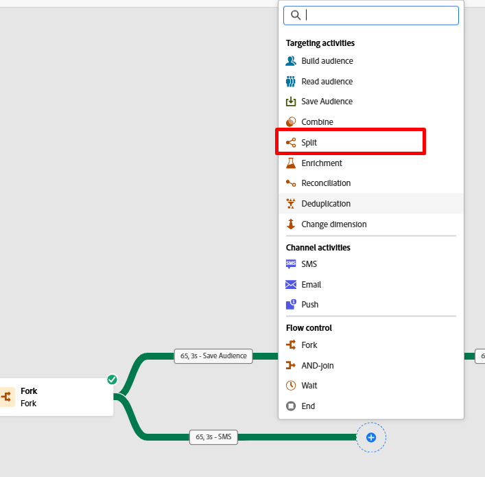
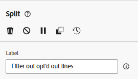
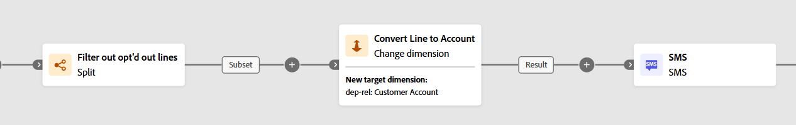

# Filtra le righe

## Obiettivo

Nei passaggi successivi escluderai tutte le righe di cui non è consentito il targeting con un messaggio SMS a causa della rinuncia a livello di riga.  In questo caso non puoi fare affidamento sul consenso al profilo, perché si tratta di un target a livello di linea.

## Configurare l’attività di suddivisione

1. Fai clic sull&#39;icona **+** nella transizione inferiore dell&#39;attività Fork e seleziona l&#39;attività **Dividi** nel popup.

2. Nella barra a destra, aggiorna l&#39;etichetta in modo che indichi quanto segue: `Filter out opt'd out lines`

3. Nella barra a destra espandi la sezione **Sottoinsieme** del segmento predefinito e fai clic sul pulsante **Crea filtro**

4. Aggiungi una condizione per assicurarti di rimuovere tutte le righe cliente che hanno rinunciato alla messaggistica SMS, quindi fai clic su **Conferma**.

>[!NOTE]
>
>Devi capire come creare la condizione, ma il risultato finale corrisponde alla schermata precedente.  Ce l&#39;hai!

5. Fare clic sul pulsante Salva in alto a destra per salvare i dati.  L&#39;area di lavoro è simile ora\...

## Aggiungere l’attività SMS

1. Nell&#39;area di lavoro del flusso di lavoro, fai clic sull&#39;icona **+** dopo la condizione di suddivisione aggiunta e seleziona l&#39;**attività SMS**

2. Nella barra a destra, fai clic sul pulsante Modifica SMS per avviare la configurazione del messaggio SMS

3. Nella barra di navigazione in alto, fai clic sulla voce di menu Azioni, quindi seleziona il canale creato in precedenza dal menu a discesa Configurazione SMS.

>[!CAUTION]
>
>Oh no 🫨!  Perché non ottieni alcun risultato?  Non hai già configurato il tuo canale SMS?  Il prodotto è rotto?
>
>VAFFANCULO!!!!!!!!!

## Momento di abbandono

La transizione del fork ha attualmente una dimensione di targeting di Linea cliente (cioè, a quale tabella si riferisce il risultato corrente nell’archivio relazionale).  Ciò che è unico con le campagne orchestrate, tuttavia, è che ti iscrivi sempre al Profilo cliente in tempo reale al momento dell’invio, in modo che le informazioni di consegna e tracciamento dai messaggi vengano attribuite a un profilo.  Questo join è stato creato in precedenza dalla tabella Account cliente.

La configurazione del canale per SMS era già configurata in precedenza e al momento è così...

**Di seguito è riportato il testo:**

- Consegna un messaggio per dimensione di destinazione (ad esempio Conto cliente) sul numero di record correlati trovati nella dimensione secondaria (ad esempio Linea cliente)
- Esegui ogni consegna SMS utilizzando il numero di telefono cellulare presente nella dimensione secondaria (ad esempio, Linea cliente)

Questa capacità unica di inviare molti messaggi a un profilo è una delle caratteristiche principali delle Campagne orchestrate, che lo rende diverso dai Percorsi.

Come si fa a far funzionare tutto questo?  Aggiungi una dimensione di modifica 😀

## Aggiungi dimensione di modifica

1. Fai clic sul pulsante Indietro nella schermata di modifica SMS

2. Nell&#39;area di lavoro del flusso di lavoro fare clic sull&#39;icona **+** **icon** tra le attività Filter e SMS e selezionare **Change Dimension**.

3. A destra, aggiorna la dimensione di modifica con le seguenti informazioni:
   - **Etichetta:** `Convert Line to Account`
   - **Nuova dimensione di destinazione:**`dep-rel: Customer Account`

4. Fai clic sul pulsante **Salva** in alto a destra dell&#39;area di lavoro per salvare i tuoi dati. Al termine, il flusso di lavoro si presenterà così...

## Configurazione del messaggio SMS

Ora che hai corretto il flusso di lavoro, riconfigura l’SMS.

1. Fai clic sull&#39;attività SMS nell&#39;area di lavoro del flusso di lavoro, quindi nella barra a sinistra fai clic sul pulsante **Modifica SMS**

>[!NOTE]
>
>Il caricamento di questa schermata richiede un po&#39; di tempo.  Lo so che è fastidioso, fidati che si sta aggiustando

2. Nella barra di navigazione in alto, fai clic sulla voce di menu **Azioni**, quindi seleziona il canale creato in precedenza dal menu a discesa della configurazione SMS.

>[!TIP]
>
>Si sente bene, vero 😮‍💨

## Riassunto

Ce l&#39;avete fatta a fare questa e, si spera, avete imparato due cose molto importanti:

1. La dimensione di targeting dei risultati finali deve corrispondere alla configurazione del canale che desideri utilizzare
1. È probabile che l’attività di modifica della dimensione diventi il tuo migliore amico per assicurarti che ciò accada
