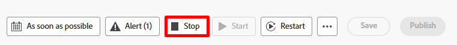
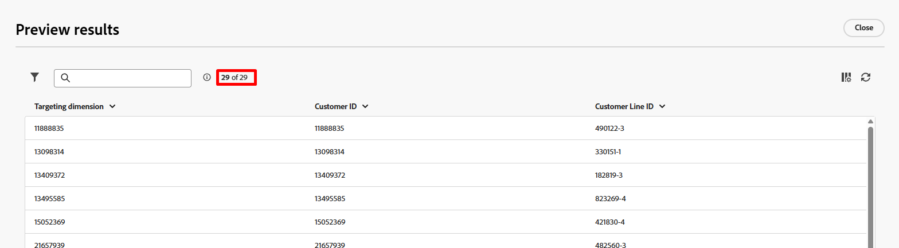

# Eseguire il flusso di lavoro

## Obiettivo

Nei passaggi successivi scopri come testare il flusso di lavoro e, soprattutto, l’attività SMS utilizzando la modalità di test.

## Verifica flusso di lavoro

1. Al termine, il flusso di lavoro finale si presenterà simile al seguente. Ricontrolla che tutto sia a posto. Vedi:

   

2. Se non hai già interrotto il flusso di lavoro, fai clic sul pulsante **Interrompi** in alto a destra.

   

   >[!NOTE]
   >
   >Se necessario, prova a fare clic sul pulsante Riavvia, ma è probabile che venga visualizzato un errore perché dopo la creazione del flusso di lavoro hai aggiunto delle attività e la cache non è più valida.

3. Fai clic sul pulsante **Inizio** per eseguire e verificare il flusso di lavoro end-to-end

   

4. Controlla i risultati in arrivo nell&#39;attività SMS facendo clic su **Risultato** (sono presenti due risultati, quindi utilizza quello a sinistra come mostrato di seguito) e quindi nella barra a sinistra facendo clic sul pulsante **Anteprima risultati**.

   

   

5. Sono presenti **33 record** e la dimensione di targeting corrisponde all&#39;ID cliente (la chiave di join al profilo)

## Testare l’attività SMS

1. Chiudi la finestra precedente e fai clic sull&#39;**attività SMS**, quindi sul pulsante **Esegui test** nella barra a destra

   

2. Quasi immediatamente viene visualizzato un nuovo pulsante con l&#39;etichetta **Visualizza report**.  Fare clic sul pulsante **Visualizza report** per passare alla schermata del report.

   

   >[!NOTE]
   >
   >Inizialmente questa schermata non viene compilata perché l’esecuzione dei test richiede un po’ di tempo. Potrebbe essere necessario aggiornare alcune volte prima di visualizzare i risultati.

3. Quando ottieni risultati, vedi che il target era al 100%!

   

   *Attendi, un minuto...il risultato in arrivo era di 33 record, quindi dove è andato il 4?*

4. Torna all&#39;area di lavoro del flusso di lavoro e fai clic sulla transizione **Risultato** che entra nell&#39;attività SMS, quindi fai clic su **Anteprima risultati** nella barra a destra.

   

5. Nella schermata Risultati anteprima scorri fino alla fine della tabella e noterai che **4 record** hanno una **dimensione di targeting vuota**.

## Spiegazione

Ecco cosa è successo.

- Avevi 33 righe cliente a cui inviare un messaggio SMS
- Dopo la modifica dell&#39;attività dimensione 4 di quelle linee cliente non aveva un conto cliente associato
- L’unione a Real-Time Customer Profile richiede di disporre di un ID cliente e, poiché nessuno di questi 4 record consente di cercare un profilo o crearne immediatamente uno nuovo

Risultato —> Campagne orchestrate elimina questi 4 record durante l’esecuzione del messaggio

>[!NOTE]
>
>È in arrivo un miglioramento per affrontare questo problema in due modi:
>
>1. Assicurati che venga creato un registro di esclusione per i record a cui manca una dimensione di targeting al momento dell’invio
>2. Aggiornare l’attività di modifica della dimensione per eseguire un inner join anziché un join esterno che rimuoverebbe questi 4 record in primo piano

>[!SUCCESS]
>
>Congratulazioni! Ora sei ufficialmente certificato per lanciare le tue Orchestrated Campaigns e trasmettere messaggi al mondo in modo responsabile. Ora è possibile commercializzare con fiducia!

## Pubblicazione del flusso di lavoro

Non lo farete in laboratorio, ma per il contesto ecco cosa succede al momento della pubblicazione:

1. Il modulo di pianificazione entra se per la campagna è impostata una pianificazione
1. Le attività Save Audience creano la shell del pubblico all’interno del Portale dell’audience e i profili qualificati iniziano a acquisire
1. Viene avviata l’esecuzione del messaggio per la prima attività messaggio nel flusso di lavoro
   - Le ricerche di profilo vengono eseguite sullo snapshot del profilo
     - I profili corrispondenti rispettano il consenso trovato sul profilo
     - I profili non corrispondenti vengono creati al volo
   - I registri di consegna vengono creati in `AJO Message Feedback Event Dataset`
