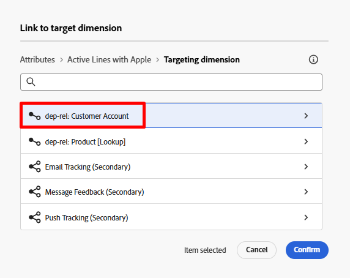
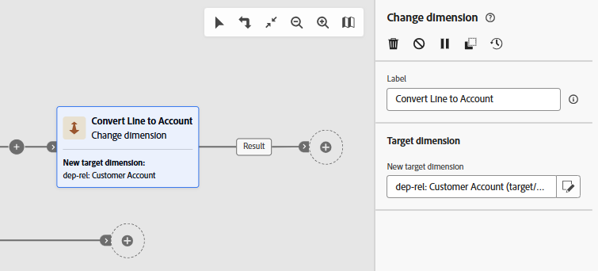
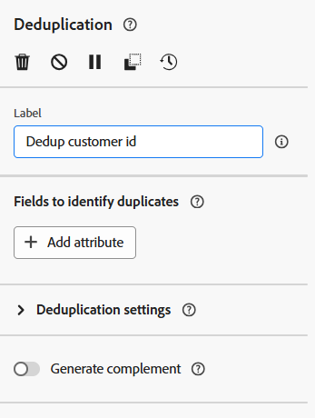
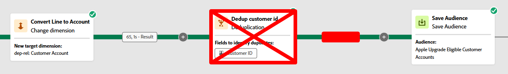

# Salvare il pubblico

## Obiettivo

Nei passaggi successivi salverai il pubblico creato su Audience Portal in modo che altre soluzioni in Adobe Experience Platform e nelle sue applicazioni possano sfruttarlo per i propri casi d’uso.

## Modificare la dimensione

1. Nell&#39;area di lavoro del flusso di lavoro fare clic sull&#39;icona **&#x200B;**+**&#x200B;** nel ramo **Salva pubblico** e dall&#39;elenco delle attività selezionare l&#39;attività **Cambia dimensione**

&#x200B;2. Aggiornate le proprietà della quota di modifica come descritto di seguito:
   - **Etichetta:** `Convert Line to Account`
   - **Nuova dimensione di destinazione:** `dep-rel: Customer Account`

>[!NOTE]
>
>**Perché lo fai?**  Per partecipare a Real-Time Customer Profile (il profilo cliente in cui vengono salvati i tipi di pubblico) devi utilizzare la mappatura di destinazione profilo configurata, che si aggiunge solo dallo schema dep-rel: Customer Account.

&#x200B;3. Al termine dell’operazione, l’area di lavoro si presenterà così.  Salva il tuo lavoro.

## Deduplica il risultato

1. Fai clic sull&#39;icona **+** **dopo l&#39;attività Modifica dimensione e seleziona l&#39;attività** Deduplicazione **dall&#39;elenco delle attività**

&#x200B;2. Aggiorna l&#39;etichetta dell&#39;attività Deduplication in `Dedup customer id`

&#x200B;3. Ora fai clic sul pulsante **+ Aggiungi attributo** e seleziona il campo dallo schema con titolo **ID cliente**

&#x200B;4. Nelle impostazioni di deduplicazione, assicurati di disporre del seguente set:
   - **Duplicati da mantenere:** `1`
   - **Metodo di deduplicazione:** `Random selection`

>[!NOTE]
>
>Le altre opzioni di deduplicazione consentono di specificare una logica personalizzata.  Nella maggior parte dei casi, se devi deduplicare, lo farai utilizzando la chiave primaria della tabella.

&#x200B;5. Al termine dell’operazione, l’area di lavoro si presenta così. Fai clic sul pulsante **Salva** in alto a destra prima di proseguire.

## Aggiungi attività Save Audience

1. Fai clic sull&#39;icona **+** dopo l&#39;attività Deduplicazione e seleziona l&#39;attività **Salva pubblico**

&#x200B;2. Nella barra a destra, imposta le proprietà dell’attività sui seguenti elementi:
   - **Etichetta pubblico**: `Apple Upgrade Eligible Customer Accounts`
   - **Campo di mappatura profilo**: `dep-rel: Customer Account - customer id`

>[!NOTE]
>
>Il &quot;campo di mappatura profilo&quot; è ciò che hai impostato in precedenza in modo che l’archivio relazionale possa unirsi al Profilo cliente in tempo reale.  Il profilo è stato modellato come livello di account cliente in modo da salvare il pubblico nello stesso.  Da qui la necessità della dimensione di modifica e della deduplicazione.

## Mappature campi pubblico

Per impostazione predefinita, la chiave primaria della dimensione di targeting (ovvero l’ID cliente) viene aggiunta al pubblico come campo. Puoi visualizzarlo guardando a destra ed espandendo il campo.  Due cose da notare:

- **Campo pubblico Source** —> fa riferimento al campo proveniente dallo schema relazionale
- **Campo pubblico di destinazione** —> il nome del campo che verrà creato durante il salvataggio del pubblico

>[!NOTE]
>
>Il campo del pubblico di destinazione si chiama `Dep_rel_customer_account_Customer_id`.  Dovresti sempre sostituirlo con qualcosa di più leggibile per un addetto marketing, senza scuse.

## Correggi campo pubblico predefinito

1. Rinomina il campo del pubblico predefinito di Target in **Cliente\_ID** come mostrato di seguito:

>[!TIP]
>
>Ora hai un nome di campo leggibile 🎉

&#x200B;2. Fai clic sul pulsante **Avvia** per eseguire il flusso di lavoro. Il flusso di lavoro è ora simile al seguente e i conteggi sono visualizzati come segue:
   - Genera pubblico: `65`
   - Converti riga in account: `65`
   - ID cliente deduplicazione: `46`

>[!NOTE]
>
>L’attività Save audience creerà il pubblico solo quando il flusso di lavoro viene pubblicato, non quando viene semplicemente avviato. Al momento della creazione, il pubblico includerà tutti gli attributi aggiunti e si unirà al profilo cliente in tempo reale durante la successiva esecuzione giornaliera pianificata del processo del servizio di segmentazione.

>[!CAUTION]
>
>NON PUBBLICARE IL FLUSSO DI LAVORO.

## Sfida

Cosa succede se non esegui la deduplicazione prima di salvare il pubblico?  Il pubblico memorizzerà tutti i 65 record o solo i 46?

## Risposta

Il pubblico memorizzerà tutti i 65 record, ma un&#39;attività di lettura del pubblico li deduplicherà durante l&#39;importazione in base alla condizione di unione 😁

## Riassunto

Ora dovresti conoscere bene il funzionamento di Save Audience e i motivi per cui la deduplicazione è importante.  Ricorda che devi sempre definire la mappatura di destinazione profilo, in quanto i dati dell’archivio relazionale devono sapere come unirsi al profilo cliente in tempo reale.  La mappatura di destinazione profilo è la condizione di unione 🙂
