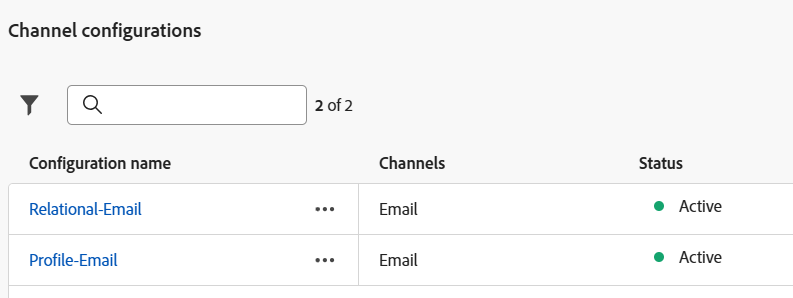
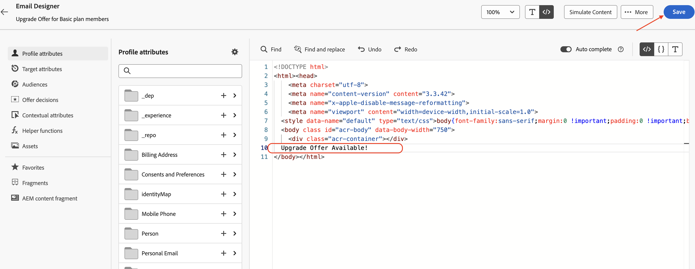
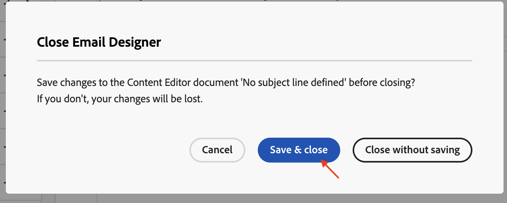

# Aggiungere attività e-mail

## Obiettivo

Nei passaggi successivi, sfrutterai la campagna per aggiungere due attività E-mail ai due rami dell’attività Fork. Configurerai le due attività E-mail per l’utilizzo dei canali E-mail, creati in precedenza. Infine, a ciascuna di queste attività e-mail verrà aggiunta anche la configurazione di base dell’e-mail (oggetto e corpo).

>[!CAUTION]
>
>Prima di continuare, è necessario assicurarsi che entrambe le configurazioni del canale e-mail siano attive nel loro stato.
>
>

## Aggiungi attività e-mail del ramo principale

1. Fai clic su **+** del flusso principale e seleziona **E-mail** dalle **attività canale**

Viene aperto il riquadro dei dettagli **E-mail**

&#x200B;2. Rinomina l&#39;etichetta in **E-mail utilizzando l&#39;attributo di profilo** per l&#39;attività **E-mail** e fai clic su **Modifica e-mail**. La creazione del corpo dell’e-mail è solo a scopo di test

&#x200B;3. Seleziona la scheda **Azioni** e dal menu a discesa seleziona **Configurazione del canale profilo-e-mail**

&#x200B;4. Quindi, fai clic su **Modifica contenuto** per aggiungere del contenuto di prova

&#x200B;5. Fornisci una **riga oggetto** (&quot;Aggiorna offerta per i membri del piano di base&quot;) e fai clic sul pulsante **Modifica corpo dell&#39;e-mail**

&#x200B;6. Ci sono molte opzioni, per questo test, scegli **Crea il codice tuo** opzione HTML

&#x200B;7. In **E-mail Designer**, inserisci una riga di test &quot;Offerta di aggiornamento disponibile!&quot; subito prima dei tag `</body></html>` come mostrato e fai clic su **Salva**

&#x200B;8. Attendi che il messaggio di conferma venga visualizzato nell’angolo in basso a destra

&#x200B;9. Fai clic sulla **freccia a sinistra** accanto a **Invia e-mail a Designer** per uscire

&#x200B;10. Viene visualizzata una finestra di dialogo di conferma, fai clic sul pulsante **Salva e chiudi**

&#x200B;11. Controlla le proprietà e le azioni Email, incluso il testo aggiunto al corpo dell’Email. Fai clic sulla **freccia a sinistra** per tornare all&#39;area di lavoro della campagna

## Aggiungi attività e-mail ramo inferiore

Torna nell&#39;area di lavoro della campagna, fai clic su **+** del flusso inferiore e seleziona **E-mail** dalle **Attività canale**. Seguire gli stessi passaggi indicati sopra (passaggi da 2 a 11) ad eccezione dei seguenti:

- Rinomina l&#39;etichetta in **E-mail utilizzando Target Dimension** per l&#39;attività **E-mail**
- Nelle impostazioni Email, scegli la configurazione del canale Email **Relational-Email**

## Riassunto

Ora hai visto come configurare le attività e-mail con i canali e-mail. Ogni attività è stata quindi configurata con un oggetto e un corpo di E-mail di base. L&#39;intera campagna verrà testata successivamente.
