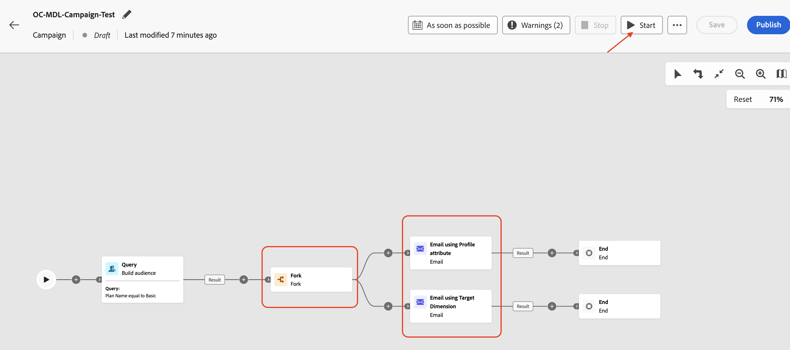
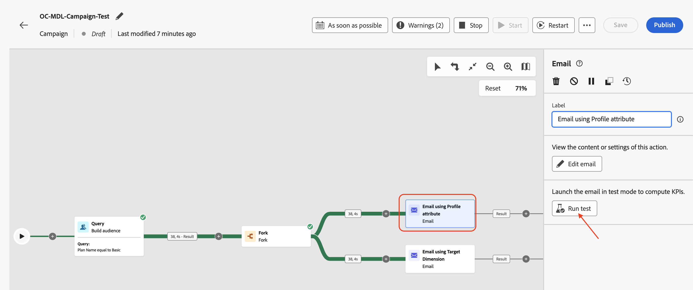

# Testare la campagna

## Obiettivo

Nei passaggi successivi eseguirai la campagna in modalità di test per confermare le funzioni previste per la campagna prima di pubblicarla. In questo caso, la modalità di test non invia effettivamente le e-mail, ma aiuta a verificare l’intero flusso e identificare tempestivamente i problemi.

## Avvia il flusso di lavoro

1. Una volta configurati i due flussi e-mail, la campagna si presenta come segue. Fai clic sul pulsante **Avvia** per eseguire la campagna in **Modalità test**

>[!NOTE]
>
>Come accennato nel laboratorio precedente, la modalità di test ti consente di convalidare l’esecuzione della campagna e i risultati delle varie attività. Ogni attività viene eseguita in sequenza fino al raggiungimento della fine del flusso.

&#x200B;2. Viene avviata l’esecuzione di test di tutte le attività della campagna, verifica i risultati

## #1 report e-mail

1. Per verificare la consegna di e-mail, fai clic sull&#39;attività **Invia e-mail utilizzando l&#39;attributo di profilo** e nel riquadro a destra fai clic su **Esegui test**

&#x200B;2. Attendi il messaggio di conferma, quindi fai clic su **Visualizza report** per visualizzare i dettagli del test e-mail

&#x200B;3. La pagina del rapporto e-mail presenta le statistiche della campagna e lo stato di esecuzione. Il test E-mail è una verifica dell’attività per garantire che non vi siano errori e non invii e-mail. In genere il completamento richiede circa \~**5** minuti.

>[!NOTE]
>
>Potrebbe essere necessario aggiornare la pagina alcune volte per visualizzare il risultato del test finale.

&#x200B;4. Una volta completato il test e-mail, vengono presentati i risultati. Percentuale di errori. Fare clic su **Visualizza altro** per conoscerne il motivo.

&#x200B;5. Il motivo indica `Email address not found in profile`

>[!NOTE]
>
>Poiché l&#39;**indirizzo di consegna** configurato per l&#39;attività E-mail, **Indirizzo e-mail utilizzando l&#39;attributo Profilo**, è stato configurato per l&#39;utilizzo dell&#39;attributo Profilo `personalEmail.address`, è stata creata una dipendenza dal **Profilo AEP**.
>
>Dei **38** ID cliente qualificati dallo schema relazionale, il sistema ha trovato solo **7** profili AEP corrispondenti. Per i restanti **31** profili AEP non esistevano, causando il messaggio di errore `Email address not found in profile`.
>
>È importante ricordare che i dati nel datalake e nell&#39;archivio relazionale vengono mantenuti **coerenti** quando si utilizzano gli attributi del profilo AEP nelle campagne orchestrate.

## #2 report e-mail

1. Ripeti lo stesso processo per l&#39;attività **E-mail utilizzando Target Dimension**

&#x200B;2. Attendi il messaggio di conferma, quindi fai clic su **Visualizza report** per visualizzare i dettagli del test e-mail

&#x200B;3. Una volta completato il test e-mail, vengono presentati i risultati. In questo caso, non ci saranno errori

>[!NOTE]
>
>Poiché l&#39;**indirizzo di consegna** per l&#39;attività E-mail **E-mail tramite Target Dimension** è stato configurato per l&#39;utilizzo di `dep_rel_customer_account.email`, dallo schema Relazionale, non vi è alcuna dipendenza dai profili AEP o dai relativi attributi.
>
>Tutti gli ID cliente qualificati **38** hanno e-mail corrispondenti nell&#39;archivio relazionale e potrebbero essere indirizzati correttamente senza errori.

## Interrompere il flusso di lavoro

Fai clic sul pulsante **Interrompi** per interrompere la **modalità di test** per la campagna

>[!TIP]
>
>Entrambe le configurazioni del canale e-mail sono state testate all’interno della stessa campagna e sono state osservate differenze tra l’utilizzo di un attributo di profilo AEP e l’utilizzo di Target Dimension nella configurazione del canale e-mail.
>
>Congratulazioni, questo conclude il laboratorio di consegna dei messaggi.

## Riassunto

Ora hai visto come testare la campagna creata per comprenderne il flusso e il comportamento. In questo caso, le sfumature dell’utilizzo delle diverse impostazioni per la configurazione del canale e-mail sono state ben comprese durante l’esecuzione del flusso di test.

Ulteriori informazioni sulla modalità di test della campagna [qui](https://experienceleague.adobe.com/it/docs/journey-optimizer/using/campaigns/orchestrated-campaigns/launch/start-monitor-campaigns), se sei interessato.
