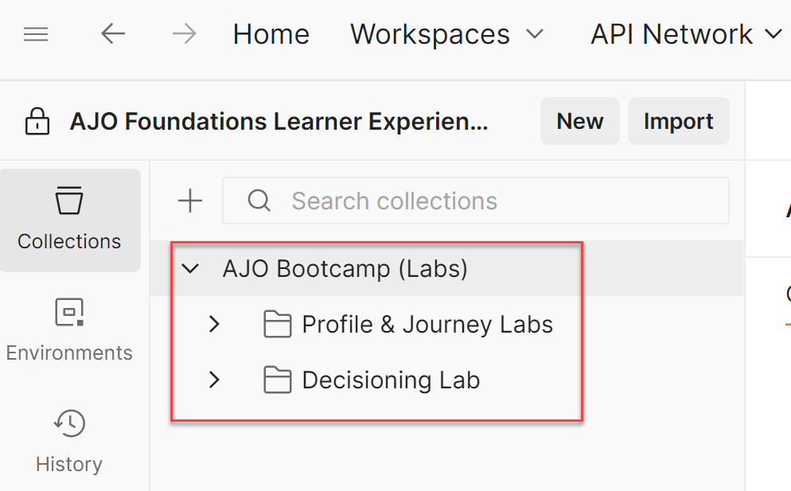
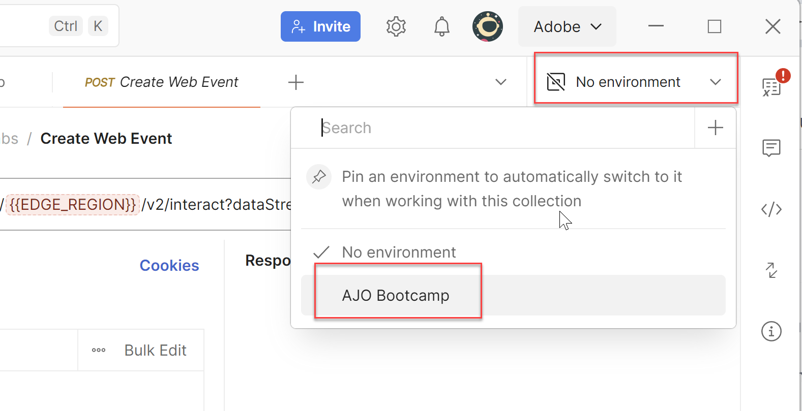

# Importa raccolta API

## Obiettivo

In questo passaggio verrà importata la raccolta API che contiene tutte le varie richieste da effettuare durante il bootcamp.  Queste richieste API dipendono dal file di ambiente appena importato.

## Importa raccolta di richieste

1. Scarica il file **AJO Bootcamp (Labs).postman\_collection.json**:

Scarica il file — [AJO Bootcamp (Labs).postman_collection.json](assets/ajo-bootcamp-labs.postman_collection.json)

&#x200B;2. Come prima, fai clic sul pulsante **Importa**.
&#x200B;3. Incolla l&#39;URL locale del file **AJO Bootcamp (Labs).postman\_collection.json** nella casella di testo modale di importazione oppure rilascialo nella finestra di dialogo di importazione.  Questo attiva un’importazione automatica.
&#x200B;4. Al termine dell&#39;importazione, fare clic su **Raccolte** nella barra di navigazione a sinistra, espandere la cartella **AJO Bootcamp (Labs)** e visualizzare la raccolta appena importata

>[!TIP]
>
>Congratulazioni!  Importazione della raccolta Postman del campo di avvio completata

## Convalidare le variabili di ambiente

La raccolta importata contiene tutte le chiamate API necessarie per i laboratori in tutto il campo di avvio.  Ogni lab è organizzato in una cartella specifica con il proprio set di richieste.

I dettagli di ciascuna cartella sono disponibili qui sotto:

- **Labs profilo e Percorso** - Contiene un set di richieste per l&#39;invio di un evento Web e un evento che simula una conferma di spedizione.
- **Labs decisioning** - Contiene richieste per 3 visitatori che imitano le chiamate all&#39;inizio e alla fine della pagina che in genere si troverebbero in un sito con tag AEP Web SDK.

Per garantire che l’ambiente e la raccolta funzionino correttamente insieme, segui la procedura riportata di seguito.

1. Se necessario, fai clic su **Raccolte** nella barra a sinistra, quindi espandi la cartella **Labs profilo e Percorso**.
2. Fai clic sulla richiesta **Crea evento Web** e noterai che le variabili di ambiente sono **rosse**

&#x200B;3. Fai clic sul menu a discesa **Ambiente** in alto a destra e scegli l&#39;ambiente **AJO Bootcamp**.

&#x200B;4. Selezionando l&#39;ambiente appropriato, la variabile EDGE\_REGION diventa di colore blu più chiaro. Questo indica che la variabile ora ha un valore per l’ambiente selezionato. La variabile DATASTREAM\_CONFIG rimane rossa perché non hai ancora creato lo stream di dati, pertanto non disponi ancora di un valore per tale variabile di ambiente. Passando il puntatore del mouse su EDGE\_REGION viene visualizzato il valore dell&#39;ambiente.

## Riassunto

Ora hai importato i file di ambiente e raccolta e sai come utilizzarli.
