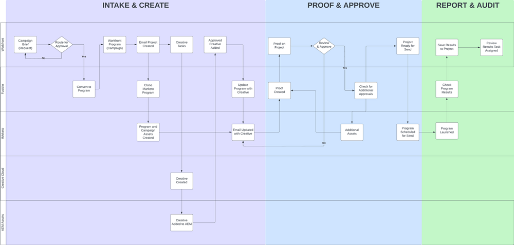

# Panoramica {#overview}

## Time-to-market più rapido con la catena di fornitura di Campaign ottimizzata {#achieving-faster-time-to-market-with-optimized-campaign-supply-chain}

Il lavoro del marketing continua a crescere con nuovi canali e con nuovi modi per personalizzare le comunicazioni quotidianamente. I team di marketing hanno bisogno di modi per continuare ad automatizzare ed evolvere per supportare la modifica delle esigenze di marketing in tutto il mondo.

**&quot;Il ROI è sempre stato il vero obiettivo. I ricavi sono ottimi, ma non ad ogni costo - specialmente oggi.&quot; - OCM, settore dei servizi alle imprese**

Le organizzazioni che stanno ottenendo un ROI più elevato mentre aumentano i loro ricavi lo stanno facendo razionalizzando il loro processo di sviluppo delle campagne, ottimizzando la loro velocità di esecuzione delle campagne e migliorando la supervisione sull&#39;intera funzione di marketing.

Se la tua organizzazione cerca di raggiungere gli obiettivi simili descritti di seguito, questo documento ti sarà utile:

* Scala delle operazioni delle campagne per supportare team di marketing cross-functional
* Tempi di commercializzazione più rapidi grazie a un processo di richiesta delle campagne più semplice
* Creare un sistema di record per aumentare la visibilità tra i soggetti interessati della campagna
* Rivedere e approvare le risorse della campagna (immagini, copia e-mail)

I team operativi delle campagne devono disporre di sistemi che consentano loro di pianificare ed eseguire campagne di marketing in modo efficiente ed efficace. Sia che si tratti di e-mail, webinar, evento, media a pagamento, formazione o sindacazione dei contenuti, i team di marketing hanno bisogno di una soluzione centrale per organizzare i collaboratori delle campagne, i risultati finali e l’esecuzione.

Integrando il sistema di attivazione marketing multicanale (Marketo Engage) con la pianificazione del marketing e il sistema di registrazione (Workfront), puoi aumentare la velocità della campagna e fornire una migliore visibilità alle parti interessate.

Con Workfront Fusion, i team operativi di marketing possono eliminare in larga misura i passaggi manuali ed errori necessari per la traduzione di una descrizione di marketing in una campagna. Workfront Fusion offre un livello di integrazione preconfigurato tra Workfront e il Marketo Engage che consente flessibilità ed efficienza nello sviluppo di flussi di lavoro tra sistemi. Ulteriori informazioni su come impostare l’integrazione e sulle azioni da intraprendere per automatizzare i flussi di lavoro [qui](https://experienceleague.adobe.com/docs/workfront/using/adobe-workfront-fusion/fusion-apps-and-modules/marketo-modules.html){target=&quot;_blank&quot;}.

## Pianificazione delle campagne all’esecuzione - Casi di utilizzo dell’automazione {#campaign-planning-to-execution-automation-use-cases}

* Supporta i team di marketing automatizzando la creazione di campagne nel Marketo Engage tramite richieste di assunzione in Workfront
* Condividi bozze di e-mail e pagine di destinazione create in Marketo Engage con Workfront per ottenere la revisione finale e l’approvazione da parte delle parti interessate interfunzionali
* Condividere i risultati delle campagne da Marketo Engage a Workfront per democratizzare l’accesso alle metriche delle campagne

Di seguito è riportato un diagramma del flusso di lavoro del processo di sviluppo della campagna nel caso di una richiesta di esplosione di un’e-mail. Inoltre, puoi vedere come Workfront Fusion può svolgere un ruolo tra Workfront e il Marketo Engage per promuovere l&#39;automazione del flusso di lavoro e dei processi nell&#39;intero ciclo di sviluppo della campagna.

prendere atto delle diverse fasi del processo di sviluppo della campagna.

1. Acquisizione e creazione: la richiesta di campagna viene effettuata e le risorse della campagna vengono assemblate in modo programmatico.

1. Prova e approvazione: una volta assemblata la campagna, è il momento per gli azionisti di rivedere e firmare le risorse della campagna, come e-mail e pagine di destinazione.

1. Rapporto e audit: condividi i risultati delle campagne in Workfront per offrire una maggiore visibilità alle parti interessate interfunzionali.

>[!NOTE]
>
>Nell&#39;esempio precedente, Workfront gestisce e pianifica le attività durante l&#39;intero ciclo di vita del programma di Marketo Engage. Detto questo, la flessibilità di Workfront può estendersi alla gestione di tutti gli sforzi del team di marketing. Ciò include il marketing basato su account, le catene di fornitura dei contenuti di marketing, la gestione delle agenzie, la gestione delle campagne digitali e sociali e i programmi di abilitazione delle vendite.

## Informazioni sulla rappresentazione delle iniziative di marketing in Workfront {#understanding-how-marketing-initiatives-are-represented-in-workfront}

Adobe Workfront consente alle organizzazioni di gestire il lavoro per favorire un’esecuzione più efficiente. All’interno di Workfront esiste una gerarchia di oggetti che fornisce un framework per la pianificazione, la gestione delle risorse e la collaborazione tra i vari team.

Per comprendere il rapporto tra Workfront e il Marketo Engage, è importante comprendere come eseguire il mapping del processo aziendale a questi oggetti.

### Gerarchia di Portfolio definita {#portfolio-hierarchy-defined}

<table> 
  <tr> 
   <td><b>Oggetto</b></td>
   <td><b>Definizione</b></td>
  </tr>
  <tr> 
   <td>Portfolio</td>
   <td>È possibile utilizzare Portfoli e programmi in Workfront per organizzare i progetti. Organizzando i progetti, puoi confrontare progetti simili e determinare dove verranno meglio spese le risorse.  
   (ad esempio, viene creato un Portfolio per una business unit all'interno di un'azienda incentrata sulla vendita di servizi e/o prodotti.)</td>
  </tr>
  <tr>
   <td>Programma</td>
   <td>È possibile utilizzare i programmi Workfront per organizzare i progetti. Organizzando i progetti, puoi confrontare progetti simili e determinare dove verranno meglio spese le risorse.  
   (ad esempio, una strategia di marketing con un obiettivo di alto livello, ad esempio aumentare la consapevolezza e stimolare la domanda di un nuovo lancio di prodotti).</td>
  </tr>
  <tr>
   <td>Progetto</td>
   <td>Workfront Projects è una raccolta di elementi di lavoro che devono essere completati per raggiungere un obiettivo specifico, un risultato finale, un prodotto, ecc.  
   (ad esempio, una tattica di marketing come un'esplosione di una e-mail, una campagna di nutrizione, un webinar o un evento di persona. Un singolo progetto può anche essere più complesso, includendo tattiche multiple come un’e-mail, un annuncio visualizzato, una pagina di destinazione e un white paper scaricabile che sono tutti destinati a determinare lo stesso risultato.)</td>
  </tr>
  <tr>
   <td>Attività</td>
   <td>Le attività di Workfront sono elementi di lavoro pianificati che possono far parte di un progetto o di un'iniziativa. Le attività vengono assegnate a utenti o team da completare.  
   (ad esempio, un’attività per creare segmenti di pubblico o bozza di e-mail potrebbe essere un’attività associata a un progetto per sviluppare un programma e-mail di Marketo Engage.)</td>
  </tr>
  <tr>
   <td>Problema</td>
   <td>I problemi sono elementi di lavoro non pianificati in Workfront. Possono essere problemi che si verificano durante un progetto o richieste inviate tramite una coda di richieste.  
   (ad esempio, viene archiviato un problema perché l'immagine del banner e-mail ha dimensioni errate.)</td>
  </tr>
  <tr>
   <td>Documento</td>
   <td>I documenti possono essere documenti tradizionali, come documenti o presentazioni. Possono anche essere file di immagine. Workfront consente di effettuare la correzione delle risorse tramite commenti e annotazioni su documenti e immagini, per consentire la collaborazione tra i team.  
   (ad esempio, un’immagine di intestazione e-mail che deve essere rivista.)</td>
  </tr>
  <tr>
   <td>Aggiorna</td>
   <td>Include commenti e registri di controllo per tenere traccia del lavoro e facilitare la collaborazione in Workfront.  
   (ad esempio, Registro di controllo della nuova versione dell’immagine.)</td>
  </tr>
  </tbody>
</table>

## Esempio di gestione del lavoro dell&#39;iniziativa di marketing {#marketing-initiative-work-management-example}

Diamo un&#39;occhiata al comportamento della gerarchia dei portfolio Workfront in un esempio reale.

La Zeplin Company sta rilasciando una versione aggiornata di uno dei loro accessori compatti per trattori d&#39;utilità chiamati Z11, che supera il precedente modello Z10 offrendo maggiore durabilità e personalizzazione. Con questo devono pianificare, sviluppare ed eseguire la loro strategia di marketing per stimolare la domanda e aumentare la consapevolezza del loro nuovo rilascio dalla divisione trattori della loro attività. Questa strategia di marketing deve includere diverse tattiche di marketing per aumentare la consapevolezza dei nuovi clienti e l&#39;attuale consapevolezza dei clienti sulla Z10.

La gerarchia seguente mostra come la strategia, le tattiche, le attività e le risorse vengono mappate su Workfront per questa campagna di marketing.

## Mappatura di Workfront su Marketo {#mapping-workfront-to-marketo}

Con Workfront come sistema a monte per la pianificazione del marketing e l’organizzazione dei progetti, è importante comprendere in che modo le informazioni possono essere condivise tra Marketi Engage e Workfront.

Affinché questi sistemi funzionino in parallelo con lo sviluppo di nuove iniziative di marketing, è importante comprendere in che modo i diversi tipi di record in Workfront mappano i tipi di record nel Marketo Engage.

### Mappatura di progetti Workfront su programmi Marketi Engage {#mapping-workfront-projects-to-marketo-engage-programs}

Utilizzando Workfront Fusion come livello di integrazione, puoi mappare i tuoi progetti in Workfront a un programma in un Marketo Engage. Per esempio, nel caso di cui sopra, Zeplin vuole aumentare la consapevolezza del nuovo modello Zeplin. Con questo crea un nuovo programma in Workfront che ospita più tattiche di marketing rappresentate come progetti. Una tattica è quella di informare i clienti del modello Z10 sul nuovo modello Z11. In Workfront ci sarebbe un Progetto creato per rappresentare questa tattica e-mail con una serie di attività associate ad essa per creare il pubblico, ottenere creativo per le immagini e-mail e assemblare l’e-mail in Marketo Engage. Il progetto in Workfront può essere mappato su un programma e-mail nel Marketo Engage in modo che le informazioni possano essere sincronizzate tra i sistemi.

Di seguito è riportato un esempio di come un programma può includere più progetti e di come tali progetti Workfront possono essere mappati a programmi in Marketo Engage.

Potresti voler avviare una grande iniziativa di marketing che richiede la presenza di più progetti Workfront in un programma Workfront oppure una richiesta una tantum per un webinar o un messaggio e-mail che richiede solo la creazione di un singolo progetto Workfront. Qualunque siano le tue esigenze, con Workfront, Workfront Fusion e il Marketo Engage, il tuo team ha la flessibilità di integrare il processo di sviluppo delle campagne senza soluzione di continuità, dalla pianificazione all&#39;esecuzione.

### Mappatura di attività Workfront su risorse Marketi Engage {#mapping-workfront-tasks-to-marketo-engage-assets}

Quando si inizia a mappare il processo di sviluppo della campagna in Workfront, è possibile anche pensare a quali attività si mappano per lavorare nel Marketo Engage e come acquisire informazioni in Workfront, contribuire a incrementare coerenza, efficienza e precisione nella catena di fornitura dello sviluppo della campagna.

I progetti Workfront possono essere modellati in modo che il processo possa essere definito chiaramente ogni volta che esegui una tattica di marketing specifica. Ad esempio, quando esegui una campagna e-mail, sarà necessario completare un set standard di attività per la tua organizzazione. Queste attività possono coinvolgere una riunione iniziale con le parti interessate, ottenere risorse creative, approvare i contenuti creativi, creare il pubblico di destinazione, creare l’e-mail, tradurre le e-mail, approvare l’e-mail e condividere i risultati delle campagne e-mail con le parti interessate.

Alcune di queste attività possono essere mappate direttamente sul lavoro da eseguire in Marketo Engage. Ad esempio, l’attività di creazione e-mail in Workfront può essere personalizzata per includere campi che trasmetteranno informazioni al Marketo Engage per automatizzare l’assemblaggio dell’e-mail. Possono includere elementi come l’oggetto, la copia e le immagini nell’e-mail.

## Passaggi successivi {#next-steps}

Ora che hai una conoscenza fondamentale di come Workfront e Marketo Engage possono sbloccare nuove efficienze nella catena di fornitura dello sviluppo delle campagne, consulta i documenti e le risorse seguenti su come automatizzare i flussi di lavoro e i processi tra Marketo Engage e Workfront utilizzando Workfront Fusion.

### Guida introduttiva all&#39;integrazione di Workfront Fusion, Workfront e Marketo Engage {#getting-started-with-workfront-fusion}

* [Acquisizione e creazione](/help/blueprints/optimize-campaign-supply-chain-with-marketo-and-workfront/intake-and-create.md){target=&quot;_blank&quot;} - Automazione dello sviluppo della campagna con Marketo Engage e Workfront

* Prove e approvazione (disponibile a breve)

* Rapporto e audit (disponibile a breve)

### Gestione dei nomi delle campagne dei Marketi Engage e dei relativi URL associati {#managing-marketo-engage-campaign-names}

La standardizzazione delle convenzioni di denominazione per campagne e URL è una base chiave per una gestione accurata dei programmi in Marketo Engage e contribuisce a promuovere un processo più coerente all&#39;interno della catena di fornitura della campagna. Se cerchi strumenti per aiutarti, ti consigliamo di estrarre alcuni strumenti open source gratuiti da [Adobe servizi di successo](https://main--marketo-campaign-tools--dr-adobe.hlx.live/){target=&quot;_blank&quot;} che consente di creare un approccio coerente alla creazione e alla gestione delle campagne di Marketo Engage e dei relativi URL associati.

### Risorse {#resources}

* [Workfront Fusion per Marketo Engage](https://experienceleague.adobe.com/docs/workfront/using/adobe-workfront-fusion/fusion-apps-and-modules/marketo-modules.html){target=&quot;_blank&quot;}

* [Workfront Fusion per Workfront](https://experienceleague.adobe.com/docs/workfront/using/adobe-workfront-fusion/fusion-apps-and-modules/workfront-modules.html){target=&quot;_blank&quot;}
