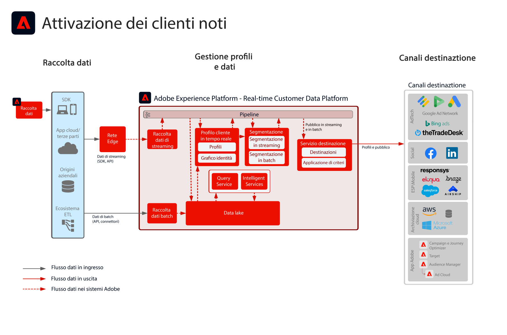
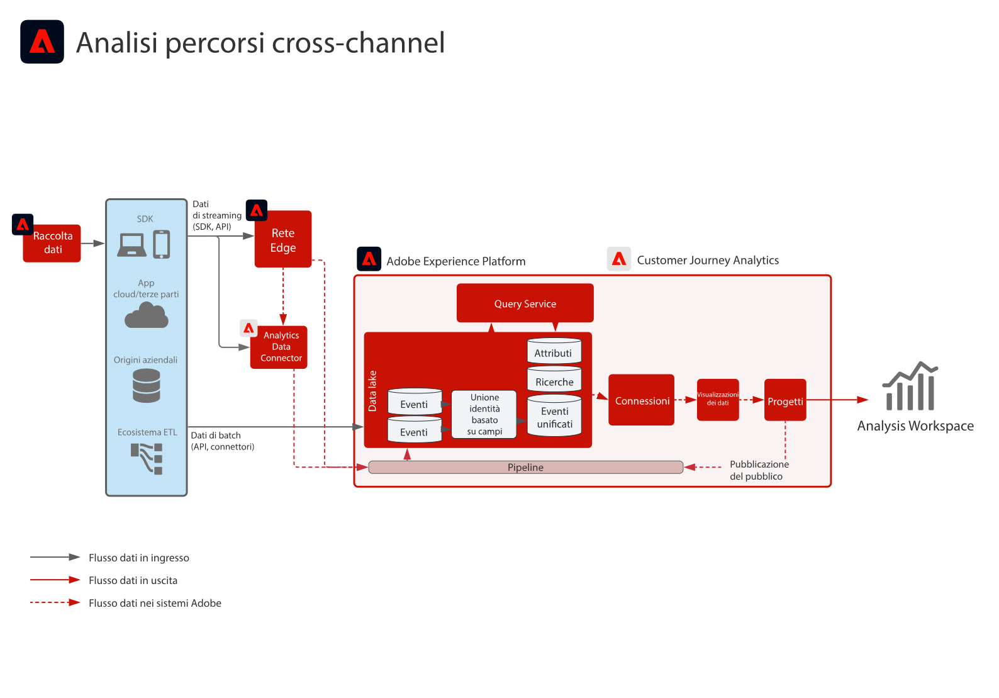

# Blueprint per esperienze digitali

I blueprint per esperienze digitali sono implementazioni ripetibili che permettono di risolvere rapidamente questioni di strategia e problemi di business noti. Ogni blueprint offre una serie di elementi che descrivono il problema di business generale, le architetture, le fasi di implementazione e le considerazioni tecniche, e fornisce i collegamenti alla relativa documentazione.

## Novità

* **[Blueprint per attivazione in base a pubblico e profili nelle destinazioni aziendali](/help/blueprints/audience-activation/enterprise-destinations.md)**

   *Mantieni i profili cliente aggiornati su tutti i sistemi, per renderli accessibili ai team di vendita e supporto.*
* **[Blueprint per hub delle attività dei clienti](/help/blueprints/audience-activation/customer-activity.md)**

   *Fornire un contesto per il supporto e le vendite assistiti dagli agenti.*
* **[Blueprint per analisi e intelligence dei dati](/help/blueprints/data-insights/analysis.md)**

   *Eseguire query esplorative e analisi dei dati nel data lake.*

## Blueprint in primo piano

<table style="table-layout:fixed">
<tr>
  <td>
    
    
<a href="https://experienceleague.adobe.com/docs/blueprints-learn/architecture/customer-journeys/journey-optimizer.html?lang=it"><strong>Orchestrazione tra canali diversi</strong></a>

    
<em>Invia messaggi e influenza le esperienze dei clienti in tempo reale utilizzando [!UICONTROL Platform] come hub centrale.</em>

  </td>
  <td>
    
    
<a href="/help/blueprints/audience-activation/known.md"><strong>Attivazione del pubblico con dati online/offline</strong></a>

    
<em>Offri pubblicità multicanale attivata in base al pubblico.</em>

  </td>
  <td>
    
    
<a href="https://experienceleague.adobe.com/docs/analytics-platform/using/cja-usecases/cross-channel.html?lang=it"><strong>Analisi dei percorsi cross-channel</strong></a>

    
<em>Vista unica e consolidata del comportamento del cliente tra i vari canali.</em>

  </td>
</tr>
</table>

## Articoli di blog

* [[!DNL Introducing Adobe Experience Platform’s New Digital Experience Blueprints]](https://medium.com/adobetech/introducing-adobe-experience-platforms-new-digital-experience-blueprints-93a6b5f5da7c)
* [[!DNL Blueprint for Audience Activation in Adobe Experience Platform]](https://medium.com/adobetech/a-blueprint-for-audience-activation-in-adobe-experience-platform-b2b30fae90fd)
* [[!DNL Blueprint for Web/Mobile Personalization using Adobe Experience Platform Real-Time Customer Profile]](https://medium.com/adobetech/blueprint-for-web-personalization-using-adobe-experience-platform-real-time-customer-profile-fef2ce7a4b2f)
* [[!DNL Blueprint for Cross-Channel Orchestration in Adobe Experience Platform]](https://medium.com/adobetech/blueprint-for-multi-channel-orchestration-in-adobe-experience-platform-c68317e94184)
