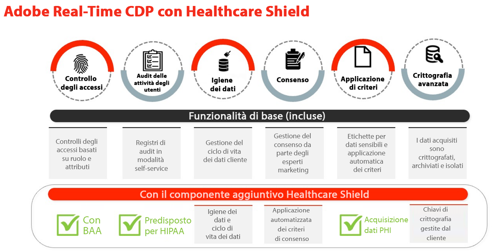
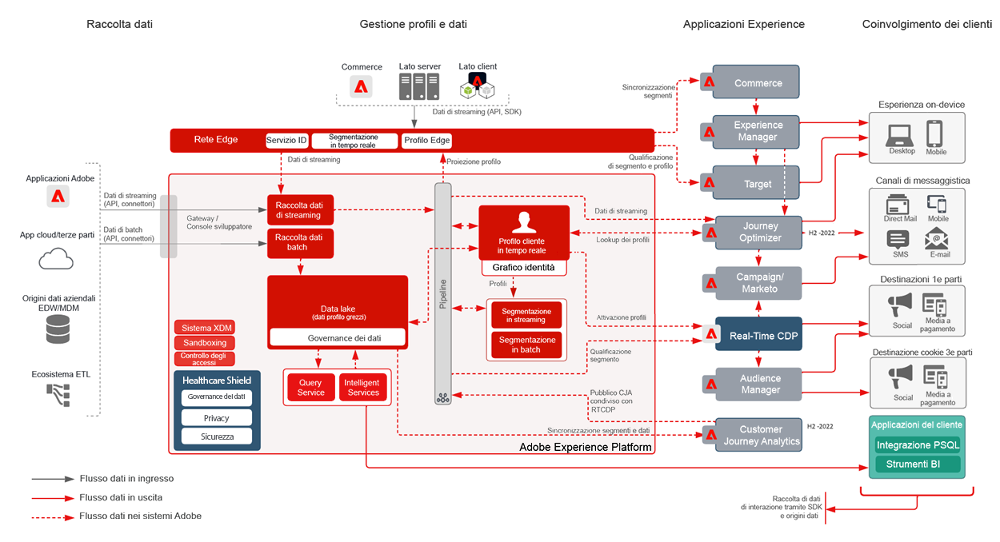
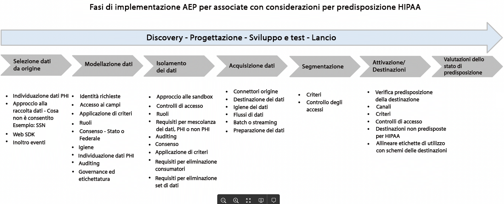
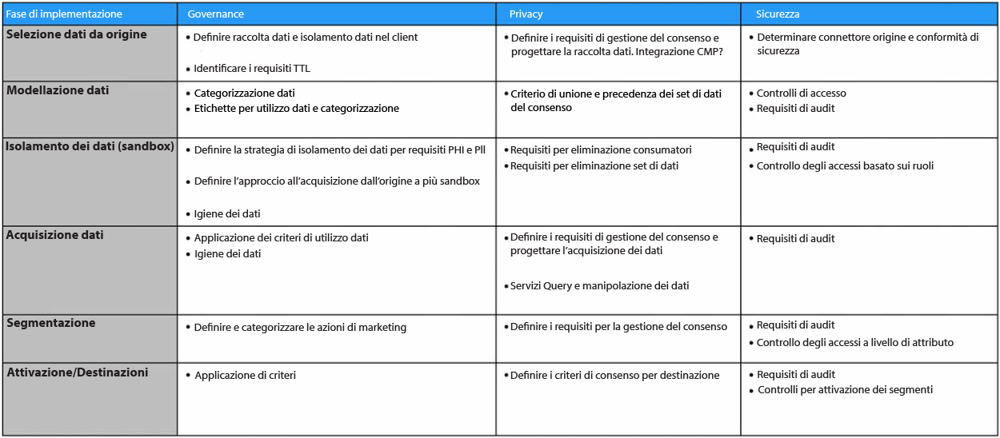

# Scudo sanitario

Healthcare Shield è un componente aggiuntivo di Adobe Experience Platform per applicazioni basate su Adobe Experience Platform come Real-time Customer Data Platform, Customer Journey Analytics e Adobe Journey Optimizer. È stato progettato per rendere queste applicazioni pronte per l&#39;HIPAA e soddisfare i requisiti relativi all&#39;elaborazione e all&#39;utilizzo di Protected Health Information (PHI).

## Domande frequenti sullo scudo sanitario

Le seguenti domande frequenti forniscono risposte alle domande comuni su Healthcare Shield.

### Cos&#39;è HIPAA?

HIPAA è il Health Insurance Portability and Accountability Act. È un regolamento americano che stabilisce importanti protezioni per le imprese. Tali tutele limitano l&#39;uso e la divulgazione di informazioni sulla salute protette (PHI) quando create, ricevute, mantenute o trasmesse da un&#39;entità o un&#39;associazione commerciale coperti da HIPAA (ad esempio clienti di Adobe) a un&#39;associazione commerciale (partner tecnologici come ad Adobe).

L’Adobe è pronto per l’utilizzo di HIPAA come collaboratore aziendale per quanto riguarda le specifiche soluzioni di Adobe pronte per l’HIPAA e la conformità alle regole di sicurezza, privacy e notifica di violazione dell’HIPAA.

### Cos&#39;è un accordo di associazione commerciale (BAA) e perché è importante?

Quando un&#39;entità o un&#39;associazione commerciale coperta (un cliente Adobe) utilizza i servizi di un&#39;associazione commerciale (ad esempio l&#39;Adobe) per creare, ricevere, mantenere o trasmettere determinati tipi di dati di consumo che sono dati sanitari protetti (PHI) o ePHI (versione elettronica di PHI), l&#39;entità coperta e l&#39;associato commerciale sono tenuti a stipulare un accordo commerciale associato (BAA).

La BAA richiede contrattualmente un Adobe, in quanto Business Associate, per salvaguardare adeguatamente il PHI rispettando i requisiti delle regole HIPAA sulla privacy, la sicurezza e le notifiche di violazione.

Con il componente aggiuntivo Healthcare Shield per Real-Time CDP, Adobe è ora in grado di eseguire un BAA con i clienti che rilasciano questa funzionalità insieme ad Adobe Real-Time CDP B2C e i flussi di consumo di Adobe Real-Time CDP B2P Edition.

### Perché Healthcare Shield per Real-Time CDP (e le future applicazioni basate su piattaforma) è disponibile solo negli Stati Uniti?

Poiché HIPAA è una legge statunitense, stiamo limitando la disponibilità di Healthcare Shield agli Stati Uniti e alle aziende soggette all&#39;HIPAA. L&#39;Adobe intende estendere la copertura ad altre giurisdizioni in quanto si applicano i requisiti locali e siamo fiduciosi di poterli soddisfare.

### Cos&#39;è lo Healthcare Shield di Real-Time CDP?

Healthcare Shield per Real-Time CDP è per i clienti che sono un&#39;entità coperta o un&#39;azienda associata e intendono utilizzare PHI in Real-Time CDP per l&#39;inserimento dei dati, la creazione di audience e l&#39;attivazione cross-channel, nonché richiedere l&#39;Adobe per eseguire un BAA. Lo scudo sanitario è richiesto per le entità coperte con HIPAA casi d&#39;uso richiesti per Real-Time CDP.

### Perché le prospettive sanitarie di Real-Time CDP dovrebbero acquistare Healthcare Shield?

Come componente aggiuntivo di Real-Time CDP, Healthcare Shield aggiorna l&#39;applicazione a uno stato &quot;HIPAA-ready&quot;. Ciò significa che l&#39;applicazione dispone delle garanzie necessarie per utilizzare i PHI in conformità dei requisiti HIPAA. Inoltre, con Healthcare Shield, l&#39;Adobe è disposto e in grado di autorizzare il cliente ad inserire alcuni tipi di Dati Personali Sensibili Permessi alle applicazioni HIPAA-ready. L&#39;Adobe firma gli accordi di Business Associate Agreement (BAA) con i clienti che autorizzano Healthcare Shield per un&#39;applicazione compatibile basata su piattaforma.

### Quali tipi di dati sono autorizzati per Real-Time CDP con Healthcare Shield (e quali no)?

Con Healthcare Shield, i marchi possono portare il seguente PHI in applicazioni basate su piattaforma come Real-Time CDP (Permise Sensitive Personal Data):

* Informazioni finanziarie individuali
* Medicale
* Informazioni sulla salute

Ma stiamo escludendo in modo specifico i dati che identificano l&#39;abuso di sostanze, la salute mentale, le cartelle cliniche genetiche o le cartelle cliniche di minori, il numero completo di conto, i numeri completi delle carte di credito, gli identificatori governativi (come SSN) e le informazioni personali dei bambini. I bambini sono protetti da qualsiasi legge sulla protezione dei minori (come le informazioni personali definite dal Children&#39;s Online Privacy Act (COPPA) degli Stati Uniti).

### Con Healthcare Shield, i clienti Real-Time CDP possono utilizzare qualsiasi tipo di PHI per creare un pubblico e attivarlo?

Anche quando un cliente può inserire dati personali sensibili consentiti nelle applicazioni native per la piattaforma, i clienti devono comprendere di essere l’unico responsabile del rispetto di tutte le normative applicabili e dell’ottenimento di autorizzazioni, consensi, autorizzazioni e autorizzazioni appropriate da parte dei consumatori per l’utilizzo dei dati nei modi previsti.

### Quali sono le sfumature dell’acquisizione e dell’attivazione dei dati dei clienti con applicazioni di Adobe non predisposte per HIPAA?

Una licenza per i clienti Healthcare Shield non può utilizzare, acquisire, raccogliere, condividere o integrare Dati Personali sensibili consentiti con applicazioni e servizi di Adobe non predisposti per HIPAA.

Ad esempio, un cliente non deve attivare segmenti che contengono dati PHI in applicazioni quali Audience Manager, Adobe Target e Adobe Analytics. I clienti che rilasciano licenze a Healthcare Shield possono inserire dati personali sensibili consentiti o PHI autorizzati in applicazioni di Adobe pronte per l&#39;HIPAA, indipendentemente dal fatto che l&#39;origine dati sia considerata pronta o meno per l&#39;HIPAA.

### Quali sono le sfumature dell’acquisizione e dell’attivazione dei dati dei clienti con applicazioni non Adobe pronte per l’HIPAA?

Una licenza per i clienti Healthcare Shield dovrebbe usare buon senso per determinare dove attivare i segmenti che contengono PHI al di fuori delle applicazioni di Adobe. Adobe non controlla (e non è responsabile) i provider di terze parti e i dati inviati da un cliente a un provider di terze parti che potrebbero non supportare il trattamento dei dati in conformità alle etichette di utilizzo dei dati di Adobe nello schema dei clienti. Inoltre, Adobe non può fornire consulenza legale ai nostri clienti.

## Casi d&#39;uso principali dello scudo sanitario

| Casi d’uso standard per RTCDP B2C | Descrizione |
|-----|-----|
| Raccolta dati in streaming | <ul><li>Modelli di dati normalizzati e flessibili utilizzabili tra connessioni di Adobe e non di Adobe<li>Schemi di dati basati su persona e account progettati per il marketing B2C.<li>Gestione dei tag e inoltro degli eventi per raccogliere e distribuire in tempo reale i dati a livello di evento.<li> Profili ottimizzati per accelerare la distribuzione delle esperienze.</li></ul> |
| Gestione profilo attendibile | <ul><li>Profili unificati che contengono dati di attributi del consumatore, comportamenti e preferenze.<li> Il quadro di governance dei dati è flessibile, trasparente e applicato ai profili unificati con creazione di criteri e applicazione automatica per evitare l’uso improprio dei dati. </li></ul> |
| Attivazione in tempo reale | <ul><li>Segmentazione drag-and-drop progettata per gli esperti di marketing B2C.<li>Risoluzione delle identità a livello di persona e account e arricchimento del profilo per l’attivazione cross-channel.<li> Esperienze cliente coerenti tramite orchestrazione del pubblico e attivazione in tempo reale su canali e ambienti diversi (Adobe e non Adobe).</li></ul> |
| Acquisizione da parte del cliente | <ul><li>Informazioni sulla conversione di utenti non autenticati in utenti riconosciuti/autenticati.<li>Incoraggiare gli utenti non registrati a registrarsi.<li> Incrementa e/o vinci gli abbonamenti.<li> Analizza i profili dei clienti per comprendere la propensione (ad esempio . confronta segmenti dal valore elevato con segmenti con prestazioni inferiori e ottimizza l’acquisizione).</li></ul> |
| Coinvolgimento del cliente | <ul><li>Offerte Target basate sul comportamento del consumatore, aggiornamento e frequenza delle offerte (online e offline).<li>Unificare le proprietà digitali per un’esperienza connessa (ad esempio incoraggiare i download delle app mobili e utilizzare l’attivazione dei segmenti tra i canali per collegare le esperienze).</li></ul> |
| Personalizzazione su scala | <ul><li> Valutare i segmenti sul bordo per la personalizzazione in tempo reale della stessa pagina e della pagina successiva.<li>Incrementa il coinvolgimento fornendo esperienze uniche e mirate ai visitatori che abbandonano una sessione su più percorsi (ad esempio, abbandonano il carrello, ripetono i visitatori che non riescono a convertire).<li> Unificare e collegare comportamenti offline e online per ottimizzare e coinvolgere gli utenti.</li></ul> |
| Vendita incrociata / Upselling | <ul><li>Mantenere i clienti in crescita e mantenere le relazioni esistenti con gli utenti.<li>Nuovi flussi di entrate con unità/marchio/offerta cross-business per aumentare il valore del ciclo di vita del cliente.<li>Acquisire informazioni approfondite sui AOV tra prodotti e SKU (ad esempio, bundle frequenti, sensibilità al prezzo).</li></ul> |
| Fidelizzazione/fidelizzazione dei clienti | <ul><li> Riattiva i consumatori per promuovere la fidelizzazione ed evitare il customer churn&lt;.li>Cura consigli di prodotti personalizzati per clienti di alto valore in base a preferenze e propensione.<li>Crea una cadenza standard per l&#39;impegno e le offerte speciali per i consumatori fedeli.<li> Collega le preferenze online e offline per ottimizzare le offerte su tutti i canali.</li></ul> |
| Collaborazione dati | <ul><li> Crea handshake all’interno di un’interfaccia utente per creare flussi di lavoro di collaborazione dei dati.<li>(sfrutta le sovrapposizioni di dati di prime parti tra i settori per informare le decisioni e le campagne aziendali strategiche.<li>Analisi dei silos di dati e comprensione dei percorsi dei clienti olistici.<li> Rispetta le preferenze e il consenso per caso d’uso.</li></ul> |
| Efficienza e ottimizzazione di media/marketing | <ul><li> Ottieni efficienza organizzativa centralizzando e mantenendo i dati dei clienti e i canali di attivazione in un unico sistema di registrazione.<li>Supporta le campagne di soppressione per una spesa/efficienza efficace dei media.<li> Allinea con i criteri IT tramite governance e applicazione dei criteri.<li>Fornisci l’accesso ai dati in tempo reale per supportare campagne tempestive.</li></ul> |

## Capacità tecniche pertinenti

### Differenze

| Tipo | Fuori dal box | Scudo sanitario |
|-----|-----|-----|
| Crittografia | [Crittografia dei dati in AEP](https://experienceleague.adobe.com/docs/experience-platform/landing/governance-privacy-security/encryption.html?lang=en) | [Crittografia dei dati in AEP](https://experienceleague.adobe.com/docs/experience-platform/landing/governance-privacy-security/encryption.html?lang=en) + Chiavi gestite dal cliente |
| Igiene dei dati | **Fondataria:** Strumento self-service per consentire ai clienti di gestire il ciclo di vita dei dati. Ciò include l&#39;eliminazione dei dati dei clienti, gli aggiornamenti a livello di campo e l&#39;impostazione della scadenza dei dati sui set di dati per rimuovere i dati una volta scaduti.<ul><li>Limite di **10.000 richieste di cancellazione** al mese<li>Limite di 2 TTL del set di dati</li></ul> | **Premium**: Estendi la capacità/soglia giornaliera della funzionalità di igiene dati per curare set di dati più grandi in meno tempo.<ul><li>Limite di **2.000.000 richieste di cancellazione** al mese come parte dello scudo sanitario<li>Limite di 20 TTL del set di dati</li></ul> |
| Consenso | **Fondativo**: Concedi il consenso e le preferenze aggiungendo manualmente gli attributi relativi al consenso e alle preferenze alla segmentazione del pubblico. | **Premium**: Crea e applica automaticamente i criteri su come utilizzare i dati dei clienti in base al consenso e alle preferenze. |

### Governance

**Igiene dei dati**

* [Panoramica sull’igiene dei dati](https://experienceleague.adobe.com/docs/platform-learn/tutorials/data-hygiene/overview.html?lang=en)
* [Igiene dei dati su Adobe Experience Platform](https://experienceleague.adobe.com/docs/experience-platform/hygiene/home.html?lang=en)

**Applicazione delle politiche**

* [Panoramica sulla governance dei dati](https://experienceleague.adobe.com/docs/experience-platform/data-governance/home.html?lang=en)
* [Panoramica dei criteri di utilizzo dei dati](https://experienceleague.adobe.com/docs/experience-platform/data-governance/policies/overview.html?lang=en)
* [Governance, privacy e sicurezza in Adobe Experience Platform](https://experienceleague.adobe.com/docs/experience-platform/landing/governance-privacy-security/overview.html?lang=en#consent)

### Privacy

**Consenso**

* [Applicazione automatica delle regole](https://experienceleague.adobe.com/docs/experience-platform/data-governance/enforcement/auto-enforcement.html?lang=en#consent-policy-evaluation)

### Sicurezza

**Crittografia avanzata**

Link utili:

* [Whitepaper sulla sicurezza di AEP](https://www.adobe.com/content/dam/cc/en/security/pdfs/AEP_SecurityOverview.pdf)

* [Crittografia dei dati in Adobe Experience Platform](https://experienceleague.adobe.com/docs/experience-platform/landing/governance-privacy-security/encryption.html)

* [Funzioni di hashing nella preparazione dei dati](https://experienceleague.adobe.com/docs/experience-platform/data-prep/functions.html?lang=en#hashing)

* [Codifica dati tag](https://experienceleague.adobe.com/docs/experience-platform/tags/api/guides/encrypting-values.html?lang=en)

**Controlli di accesso**

* [Panoramica sul controllo dell&#39;accesso basato su attributi](https://experienceleague.adobe.com/docs/experience-platform/access-control/abac/overview.html)

**Audit delle attività utente**

* [Registri di controllo](https://experienceleague.adobe.com/docs/experience-platform/landing/governance-privacy-security/audit-logs/overview.html)

**Crittografia avanzata**

* [Panoramica sulla sicurezza di Adobe Experience Platform](https://www.adobe.com/content/dam/cc/en/security/pdfs/AEP_SecurityOverview.pdf)
* [Valori di crittografia](https://experienceleague.adobe.com/docs/experience-platform/tags/api/guides/encrypting-values.html?lang=en)
* [Crittografia dei dati in Adobe Experience Platform](https://experienceleague.adobe.com/docs/experience-platform/catalog/data-protection.html)
* [Funzioni di mappatura di Data Prep - Hashing](https://experienceleague.adobe.com/docs/experience-platform/data-prep/functions.html?lang=en#hashing)

**Experience Cloud**

* [Adobe Real-time Customer Data Platform e Healthcare Shield](https://experienceleague.adobe.com/docs/customer-data-management-voices-events/events/governance/healthcare-shield.html?lang=en)

   Mantenere la promessa dell’esperienza, con accesso a meno dati. In questo video, scopri di più su Adobe Real-Time CDP e Healthcare Shield, un componente aggiuntivo di Adobe Experience Platform per le applicazioni basate su Adobe Experience Platform progettato per rendere queste applicazioni HIPAA pronte e per soddisfare i requisiti HIPAA relativi all&#39;elaborazione e all&#39;utilizzo dei dati di integrità protetti (PHI).

**Experience Platform**

* [Panoramica dei registri di controllo](https://experienceleague.adobe.com/docs/experience-platform/landing/governance-privacy-security/audit-logs/overview.html)

   Scopri come i registri di audit consentono di vedere chi ha eseguito determinate azioni in Adobe Experience Platform.

* [Panoramica sull&#39;igiene dei dati](https://experienceleague.adobe.com/docs/experience-platform/hygiene/home.html?lang=en)

   Adobe Experience Platform Data Hygiene consente di gestire il ciclo di vita dei dati aggiornando o eliminando record obsoleti o imprecisi.

* [Applicazione automatica dei criteri](https://experienceleague.adobe.com/docs/experience-platform/data-governance/enforcement/auto-enforcement.html?lang=en)

   Questo documento illustra come i criteri di utilizzo dei dati vengono applicati automaticamente quando si attivano segmenti nelle destinazioni in Experience Platform.

* [Panoramica sul controllo dell&#39;accesso basato su attributi](https://experienceleague.adobe.com/docs/experience-platform/access-control/abac/overview.html)

   Informazioni sul controllo degli accessi basato sugli attributi in Adobe Experience Platform.

## HIPAA e prodotti e servizi di Adobe

L&#39;Adobe continua a innovare e ad adattarsi per soddisfare le esigenze dei nostri clienti nel settore sanitario, al fine di soddisfare le loro specifiche esigenze di privacy e sicurezza.

Vedi [HIPAA e prodotti e servizi di Adobe](https://www.adobe.com/trust/compliance/hipaa-ready.html).

## Diagramma dell’architettura di marketing di alto livello

Prodotti pronti (e non) per l’HIPAA:

**Diagramma di Marketing**

* Le applicazioni illustrate in grigio non sono ancora pronte per l&#39;HIPAA.

## Approccio

Questa sezione descrive i passaggi di implementazione e la fase di intervista.

### Fasi di implementazione

Aspetti da considerare in ogni fase:

Questa sezione descrive alcune best practice da seguire ed è suddivisa in tre fasi:

### Fase dell&#39;intervista

Il processo di intervista con le parti interessate è fondamentale per comprendere i seguenti aspetti:

* Obiettivo: Tipo di casi d’uso: conversione, prospettiva, coinvolgimento, ecc.
* Prestazioni: Qualsiasi aspettativa di Target a livello di servizio
* Origini dati: Web/Analytics, offline/online, CRM, Fedeltà, ecc.
* Volume dei dati
* Requisiti SLT/SLA
* Identità - Numero di identità, autenticate e gestione dati anonima
* Formato dei dati: JSON, CSV, ecc.
* Qualità dei dati, necessità di trasformazioni dei dati
* Qualsiasi piano per Segment Match (Condivisione) con i partner
* Qualsiasi pubblico esterno da importare
* Crittografia: Chiave predefinita e gestita dal cliente
* Combinazione di dati: è considerato e-PHI
* Raccolta di dati di consenso - SDK di OneTrust e di consenso
* Requisiti di destinazione: Requisiti in materia di frequenza e latenza e controllo degli accessi
* Controllo degli accessi
* Requisiti per la pulizia dei dati
* Requisiti di aggiornamento dei dati
* Esigenze di avviso
* Accesso API

### Fase di progettazione

Sulla base del processo di colloquio, la fase di progettazione affronterà quanto segue. Inutile dire che la documentazione del progetto deve essere rivista e firmata. Il documento di progettazione può trattare i seguenti aspetti:

* Valore dei dati:
   * Volume - Quantità di dati inseriti
   * Intervallo di tempo: periodo di tempo in cui devono risiedere i dati acquisiti
   * Fedeltà - Ricchezza del profilo
* Valutare le protezioni AEP insieme ai requisiti SLT/SLA
* Utilizzo della licenza
* Esigenze di isolamento dei dati: più sandbox in una o più organizzazioni
* Filtro dati
* Requisiti in materia di igiene dei dati (quantità di dati e frequenza)
* Processo e metodologia per soddisfare i requisiti di cancellazione/aggiornamento dei dati
* Requisiti di trasformazione dei dati - Upstream, preparazione dei dati, servizio query
* Comprendere e determinare le identità principali e di altro tipo
* [Progettazione schema XDM](https://experienceleague.adobe.com/docs/experience-platform/xdm/schema/composition.html?lang=en)
* Determinare il numero di set di dati, con profilo o senza profilo
* Struttura dei criteri di unione
* Gestione dei dati di consenso
* Governance: Ruoli, etichette, criteri, azioni di marketing e controllo degli accessi
* [Arricchimento del profilo](https://experienceleague.adobe.com/docs/experience-platform/profile/guardrails.html?lang=it)
* Requisiti di progettazione della segmentazione per Edge/Streaming/Batch
* Destinazioni previste e piani di attivazione. Considera solo le esigenze di destinazione HIPAA
* Piani per Analytics
* Avvisi
* Aggiungere requisiti di accesso API

### Fase di implementazione

Una volta che il documento di progettazione è stato rivisto e approvato, la fase di implementazione può iniziare ad affrontare i seguenti aspetti:

* Numero di sandbox richieste: Sviluppo/Test/Prod
* Controllo dell’accesso alle sandbox
* Metodologia di distribuzione
* Requisiti e frequenza TTL (Igiene dei dati)
* Schema XDM e controllo degli accessi
* Applicazione del consenso
* Governance: Ruoli, etichette, criteri e azioni di marketing
* Segmentazione
* Set di dati e controllo degli accessi
* Configurazione dell’igiene dei dati
* Configurazione delle destinazioni e controllo degli accessi
* Avvisi di installazione
* Implementazione dei requisiti di accesso API
* Test end to end con dati fittizi
