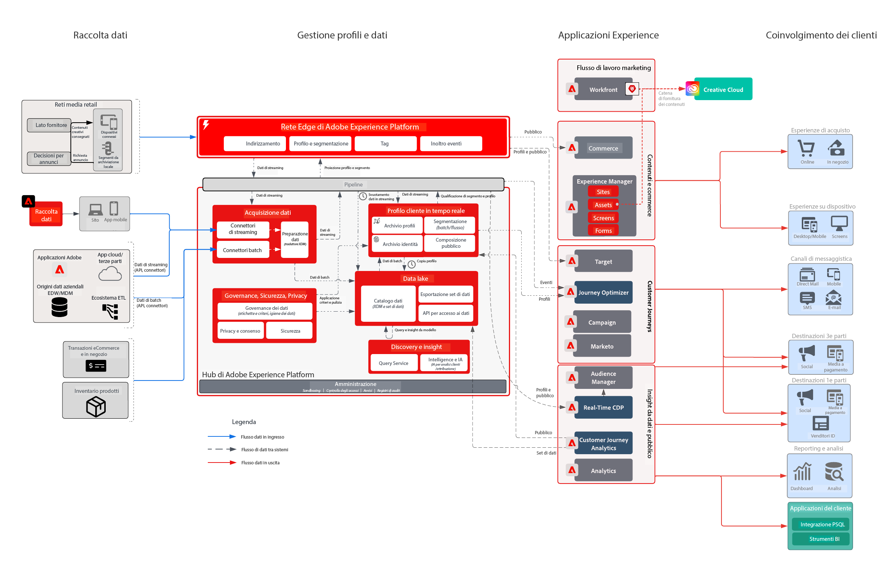

# Le sfide nel settore retail

Questa azienda con esperienze integrate voleva personalizzare l’intera customer journey per migliorare la fidelizzazione, l’upselling ai clienti esistenti e la spesa marketing per tutte le campagne. Per raggiungere questo obiettivo e stimolare la crescita, ha esteso la sue capacità digitali includendo dati offline sui clienti e dati sulle transazioni.

## L’approccio Adobe

* Generare un profilo cliente unificato con tutti i dati online e offline pertinenti e attivabili in tempo reale
* Orchestrare le interazioni dei clienti sui canali web, media e push per favorire i primi o i secondi acquisti

## Valore aziendale conseguito

| Obiettivi | Tattiche | Nuovo valore |
|---|---|---|
| **Orchestrare customer journey in tempo reale **  ** Favorire acquisti ripetuti da nuovi clienti **  ** Migliorare le efficienze nel marketing e ridurre i costi dei media**</ul> | <ul><li>Strategia solida per dati e identità con cui generare profili completi in tempo reale.</li><li>Streaming dei dati dei clienti e delle transazioni in tempo reale, compreso un carico storico di 90 giorni</li><li>Segmentazione in streaming per Advertising Networks e Adobe Target per aumentare la spesa multimediale e le attività di personalizzazione.</li><li>Percorsi cliente in tempo reale tramite Adobe Campaign che includono una strategia per misurare le prestazioni</li></ul> | <ul><li><strong>Real-time Customer Data Platform:</strong> esperienze cliente in tempo reale su media, e-mail, push e web</li><li><strong>Origini dati:</strong> dati in streaming relativi all’archivio profili, al sistema degli ordini, al catalogo dei prodotti e ai punti vendita del retailer.</li><li><strong>Attivazione file multimediali in tempo reale:</strong>Segmenti in streaming su Reti pubblicitarie per l’attribuzione e la soppressione degli annunci</li><li><strong>Personalizzazione web in tempo reale:</strong>Segmenti in streaming attivati in Adobe Target per l’attivazione nell’esperienza web del rivenditore.</li><li><strong>Journey Orchestration su scala:</strong>Messaggistica attivata in tempo reale arricchita dai dati dei clienti disponibili e attivata in tempo reale nei canali e-mail e push</li></ul> |

## Casi d&#39;uso

| Categoria | Obiettivo | Caso d’uso | Descrizione |
|:----|:----|:----|:----|
| Customer journey | Acquisizione | Serie di benvenuto | Benvenuto ai nuovi abbonati con l&#39;introduzione al business, prodotti e servizi |
| | | 1° programma di acquisto | |
| | Miglioramento delle vendite | Carrello abbandonato/Sfoglia | Recupero di potenziali acquirenti e aumento delle vendite |
| | | Analisi del prodotto/cross-selling | Effettua il cross-selling di più oggetti con recensioni di prodotto. |
| | | Promozioni sui prodotti |  |
| | | Tempo di riordino | Promemoria ricorrente per prodotti/servizi ciclici |
| | Fedeltà al marchio | Torna indietro | Recupera i clienti che sono stati inattivi. |
| | | Promemoria di compleanno | Promuovi una relazione più personale con i tuoi clienti partecipando alla loro festa di compleanno! |
| Merchandising | Gestisci inventario | Torna a magazzino | Migliorare l&#39;inventario mostrando ai clienti i prodotti che desiderano sono di nuovo disponibili |
| | | Categoria migliore successiva | Identificare le categorie/vendite migliori per gli utenti |
| | | Articoli più venduti | |
| | | Promemoria per riduzione prezzo | Mostra agli utenti che gli articoli che gli piacciono hanno un prezzo ridotto |
| | | Prodotti simili |  |
| Personalizzazione | Aumenta conversione | Coupon/Offerte | Mostra offerte/coupon migliori ai clienti |
| | | Ricerca di prodotti personalizzata | Migliorare l’esperienza di ricerca |
| | | Recommendations del prodotto | Migliorare l’esperienza di navigazione dei prodotti |
| | | Esperienza Omni-Channel | Raggiungi i clienti su tutti i canali |
| Misura | Comprendere i Percorsi dei clienti | Campagna cross-channel | Misurare le campagne cross-channel |
| | | Prestazioni segmento | Comprendere le prestazioni e il contributo dei segmenti |
| | | Rapporti di fallout | Visualizzare le conversioni in ogni fase |
| | | Analisi per coorte | Misurare il coinvolgimento tra gruppi di segmenti |
| | | Report Click-to-Brick | Scopri come le conversioni dei clienti portano all’esperienza in-store |
| | | Attribuzione | Visualizza quale punto di contatto/esperienza ha la maggiore influenza sulla conversione dell’acquisto |
| | | Predictive Insights | Scopri di più sulle tendenze dei clienti |

## Architettura

## Blueprint correlati

| Caso d’uso/integrazione  | Collegamento |
|:----|:----|
| CJA + AEP | [Panoramica dei blueprint del Customer Journey Analytics](https://experienceleague.adobe.com/docs/blueprints-learn/architecture/customer-journey-analytics/overview.html?lang=it) |
| | [Customer Journey Analytics - Casi d’uso](https://experienceleague.adobe.com/docs/analytics-platform/using/cja-usecases/cja-usecases.html?lang=it) |
| AJO + AEP | [Adobe Journey Optimizer - Casi d’uso](https://experienceleague.adobe.com/docs/blueprints-learn/architecture/customer-journeys/journey-optimizer/journey-optimizer.html?lang=en) |
| | [Gestione delle decisioni](https://experienceleague.adobe.com/docs/blueprints-learn/architecture/customer-journeys/journey-optimizer/decision-management/decision-management-overview.html?lang=it) |
| RTCDP + AEP | [Attivazione del pubblico con dati online/offline](https://experienceleague.adobe.com/docs/blueprints-learn/architecture/audience-activation/known-customer-audience-activation/known.html?lang=it) |
| | [Experience Platform + Attivazione applicazione](https://experienceleague.adobe.com/docs/blueprints-learn/architecture/audience-activation/platform-and-applications.html?lang=it) |
| MARKETO + AEP | [Attivazione e marketing B2B ](https://experienceleague.adobe.com/docs/blueprints-learn/architecture/b2b-activation/overview.html?lang=en) | |
| Target + AEP | [Caso di utilizzo di Adobe Target: personalizzazione comportamentale web/mobile](https://experienceleague.adobe.com/docs/blueprints-learn/architecture/web-personalization/behavioral.html?lang=it) | [Personalizzazione web e mobile con dati sui clienti noti](https://experienceleague.adobe.com/docs/blueprints-learn/architecture/web-personalization/known-personalization.html?lang=en) | |
