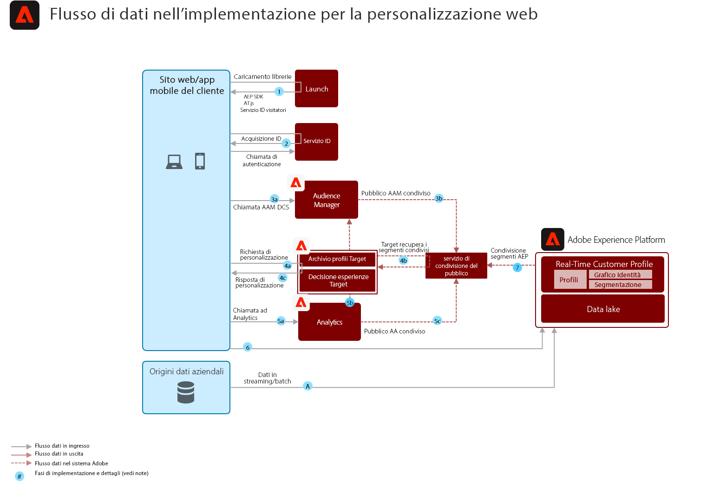

# Scenario di personalizzazione web comportamentale

Personalizza in base al comportamento online e ai dati sul pubblico.

## Casi d&#39;uso

* Ottimizzazione della pagina di destinazione
* Targeting comportamentale
* Personalizzazione basata su precedenti visualizzazioni di prodotto/contenuto, affinità prodotto/contenuto, attributi ambientali, dati di pubblico di terze parti e dati demografici

## Applicazioni

* Adobe Target
* Adobe Analytics (facoltativo)
* Adobe Audience Manager (opzionale)

## Architettura

## Guardrail

Per impostazione predefinita, il servizio di condivisione dei segmenti consente di condividere un massimo di 75 tipi di pubblico per ciascuna suite di rapporti di Adobe Analytics. Se per la condivisione di tipi di pubblico viene utilizzato un Audience Manager, non vi è alcun limite al numero di tipi di pubblico che possono essere condivisi. 

## Prerequisiti per l’implementazione

| Applicazione/Servizio | Libreria richiesta | Note |
|---|---|---|
| Adobe Target | Platform Web SDK*, at.js 0.9.1+ o mbox.js 61+ | at.js è da preferire in quanto mbox.js non viene più sviluppato. |
| Adobe Audience Manager (facoltativo) | Platform Web SDK* o dil.js 5.0+ |  |
| Adobe Analytics (facoltativo) | Platform Web SDK* o AppMeasurement.js 1.6.4+ |  |
| Servizio Experience Cloud Identity | Platform Web SDK* o VisitorAPI.js 2.0+ |  |
| Experience Platform Mobile SDK (facoltativo) | 4.11 o superiore per iOS e Android™ |  |
| Experience Platform Web SDK | 1.0, la versione corrente dell&#39;SDK Experience Platform ha [vari casi d&#39;uso non ancora supportati per le applicazioni Experience Cloud](https://github.com/adobe/alloy/projects/5) |  |

## Passaggi di implementazione

1. [Implementa ](https://experienceleague.adobe.com/docs/target/using/implement-target/implementing-target.html) Target Adobe per le tue applicazioni web o mobili.

   Se utilizzi Audience Manager o Analytics:

1. [Implementare Adobe Audience Manager](https://experienceleague.adobe.com/docs/audience-manager/user-guide/implementation-integration-guides/implement-audience-manager.html)
1. [Implementare Adobe Analytics](https://experienceleague.adobe.com/docs/analytics/implementation/home.html)
1. [Implementazione del servizio Experience Cloud Identity](https://experienceleague.adobe.com/docs/id-service/using/implementation/implementation-guides.html)

   >[!NOTE]
   >
   >Ogni applicazione deve utilizzare l&#39;ID Experience Cloud e far parte della stessa organizzazione Experience Cloud per consentire la condivisione del pubblico tra le applicazioni.

1. [Richiedi il provisioning per i servizi di condivisione delle persone e del pubblico (tipi di pubblico condivisi)](https://www.adobe.com/go/audiences)
1. Crea segmenti in [Adobe Analytics](https://experienceleague.adobe.com/docs/analytics/components/segmentation/segmentation-workflow/seg-build.html) o [Adobe Audience Manager](https://experienceleague.adobe.com/docs/audience-manager/user-guide/features/segments/segment-builder.html) e [configura tali tipi di pubblico per la condivisione nell&#39;Experience Cloud](https://experienceleague.adobe.com/docs/analytics/components/segmentation/segmentation-workflow/seg-publish.html) (se utilizzi Audience Manager o Adobe Analytics)
1. Una volta che i tipi di pubblico sono disponibili in Adobe Target, possono essere utilizzati per [eseguire il targeting delle esperienze con Adobe Target](https://experienceleague.adobe.com/docs/target/using/audiences/target.html)

## Implementazione dei diagrammi del flusso di dati

Il Blueprint di personalizzazione web/mobile può essere implementato utilizzando l’SDK per web di Platform o Mobile e la rete Edge, oppure utilizzando gli SDK tradizionali specifici per le applicazioni (ad esempio, AppMeasurement.js).

### Piattaforma Web/Mobile SDK e approccio alla rete Edge

### Approccio SDK specifico per l&#39;applicazione

## Documentazione correlata

* [Tipi di pubblico di Experience Cloud](https://experienceleague.adobe.com/docs/core-services/interface/audiences/audience-library.html)
* [Integrare Audience Manager con Adobe Target](https://experienceleague.adobe.com/docs/audience-manager/user-guide/implementation-integration-guides/integration-other-solutions/aam-target-integration.html)
* [Condivisione dei segmenti di Adobe Analytics tramite AAM](https://experienceleague.adobe.com/docs/analytics/components/segmentation/segmentation-workflow/seg-publish.html)

## Post di blog correlati

* [Blueprint per la personalizzazione web utilizzando il profilo cliente in tempo reale di Adobe Experience Platform](https://medium.com/adobetech/blueprint-for-web-personalization-using-adobe-experience-platform-real-time-customer-profile-fef2ce7a4b2f)
* [Integrazione di Adobe Experience Platform Decisioning Engine con AEM siti web](https://jaeness.medium.com/integrating-adobe-experience-platform-decisioning-engine-with-aem-websites-9c222acd12e2)
* [In che modo Adobe Experience Platform Predictive Audiences migliora le esperienze personalizzate](https://medium.com/adobetech/how-adobe-experience-platform-predictive-audiences-improves-personalized-experiences-1f75a60cb7a3)
* [Adobe Experience Platform Web SDK per Gestione dell&#39;audience](https://medium.com/adobetech/adobe-experience-platform-web-sdk-for-audience-management-751fa6d063bc)
* [Implementazione del profilo cliente in tempo reale di Adobe Experience Platform tramite il nostro programma &quot;Zero cliente&quot;](https://medium.com/adobetech/implementing-adobe-experience-platform-real-time-customer-profile-through-our-customer-zero-32e7cd952896)
* [In che modo Adobe Experience Platform può aiutare i clienti a personalizzare la messaggistica mobile in tempo reale con Journey Orchestration Service e un fornitore di messaggistica mobile](https://medium.com/adobetech/how-adobe-experience-platform-helped-a-client-personalize-their-mobile-messaging-in-real-time-with-7d634aefa098)
* [Segmentazione in secondi: Realtà dei profili cliente in tempo reale grazie a Adobe Experience Platform](https://medium.com/adobetech/segmentation-in-seconds-how-adobe-experience-platform-made-real-time-customer-profiles-a-reality-a7a8552b0847)