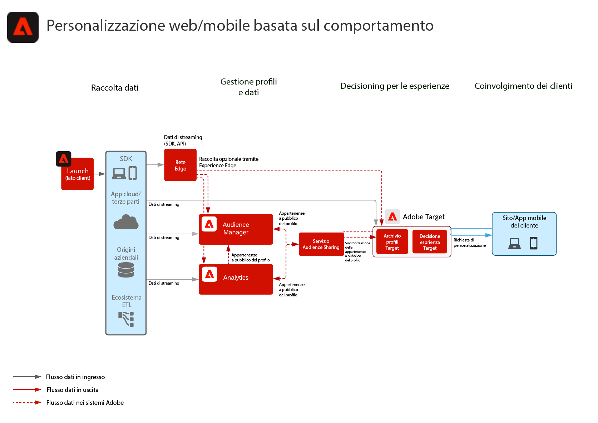

# Blueprint di personalizzazione web/mobile basata sul comportamento

Personalizzare in base al comportamento online e ai dati del pubblico.

## Casi di utilizzo

* Ottimizzazione della pagina di destinazione
* Targeting comportamentale
* Personalizzazione basata su precedenti visualizzazioni di prodotti/contenuti, affinità di prodotti/contenuti, attributi ambientali, dati del pubblico di terze parti e dati demografici

## Applicazioni

* Adobe Target
* Adobe Analytics (opzionale)
* Adobe Audience Manager (opzionale)

## Architettura

## Guardrail

Per impostazione predefinita, il servizio di condivisione dei segmenti consente di condividere un massimo di 75 tipi di pubblico per ogni suite di rapporti di Adobe Analytics. Se Audience Manager viene utilizzato per la condivisione del pubblico, non vi è alcun limite al numero di tipi di pubblico che possono essere condivisi. 

## Modelli di implementazione

Il blueprint per la personalizzazione web/mobile può essere implementato con i metodi descritti di seguito.

1. Mediante [!UICONTROL Platform Web SDK] o [!UICONTROL Platform Mobile SDK] e [!UICONTROL rete Edge].
1. Mediante SDK tradizionali per specifiche applicazioni (ad esempio, AppMeasurement.js)

### 1. Mediante Platform Web/Mobile SDK e rete Edge

[Consulta il blueprint per Experience Platform Web/Mobile SDK](../data-ingestion/websdk.md)

### 2. Mediante SDK per specifiche applicazioni

## Prerequisiti per l’implementazione

| Applicazione/Servizio | Libreria necessaria | Note |
|---|---|---|
| Adobe Target | [!UICONTROL Platform Web SDK]*, at.js 0.9.1+ o mbox.js 61+ | at.js è da preferire in quanto mbox.js non viene più sviluppato. |
| Adobe Audience Manager (opzionale) | [!UICONTROL Platform Web SDK]* o dil.js 5.0+ |  |
| Adobe Analytics (opzionale) | [!UICONTROL Platform Web SDK]* o AppMeasurement.js 1.6.4+ |  |
| Servizio Experience Cloud Identity | [!UICONTROL Platform Web SDK]* o VisitorAPI.js 2.0+ |  |
| Experience Platform Mobile SDK (opzionale) | 4.11 o superiore per iOS e Android™ |  |
| Experience Platform Web SDK | 1.0, la versione attuale di Experience Platform SDK presenta [diversi casi di utilizzo non ancora supportati per le applicazioni Experience Cloud](https://github.com/adobe/alloy/projects/5) |  |

## Fasi di implementazione

1. [Implementare Adobe Target](https://experienceleague.adobe.com/docs/target/using/implement-target/implementing-target.html?lang=it) per le applicazioni web o mobili.

   Se si utilizza Audience Manager o Adobe Analytics:

1. [Implementare Adobe Audience Manager](https://experienceleague.adobe.com/docs/audience-manager/user-guide/implementation-integration-guides/implement-audience-manager.html?lang=it)
1. [Implementare Adobe Analytics](https://experienceleague.adobe.com/docs/analytics/implementation/home.html?lang=it)
1. [Implementare Servizio Experience Cloud Identity](https://experienceleague.adobe.com/docs/id-service/using/implementation/implementation-guides.html?lang=it)

   >[!NOTE]
   >
   >Per consentire la condivisione del pubblico tra diverse applicazioni, ogni applicazione deve utilizzare l’ID del servizio Experience Cloud ID e far parte della stessa organizzazione Experience Cloud.

1. [Richiedere l’abilitazione dei servizi People e Audience Sharing (tipi di pubblico condivisi)](https://www.adobe.com/go/audiences)
1. Creare segmenti in [Adobe Analytics](https://experienceleague.adobe.com/docs/analytics/components/segmentation/segmentation-workflow/seg-build.html?lang=it) o [Adobe Audience Manager](https://experienceleague.adobe.com/docs/audience-manager/user-guide/features/segments/segment-builder.html?lang=it) e [configurare tali destinatari per la condivisione su Experience Cloud](https://experienceleague.adobe.com/docs/analytics/components/segmentation/segmentation-workflow/seg-publish.html?lang=it) (se si utilizza Audience Manager o Adobe Analytics)
1. Quando i tipi di pubblico sono disponibili in Adobe Target, è possibile utilizzarli per [esperienze di targeting in Adobe Target](https://experienceleague.adobe.com/docs/target/using/audiences/target.html?lang=it)

## Documentazione correlata

* [Experience Cloud Audiences](https://experienceleague.adobe.com/docs/core-services/interface/audiences/audience-library.html?lang=it)
* [Integrare Audience Manager con Adobe Target](https://experienceleague.adobe.com/docs/audience-manager/user-guide/implementation-integration-guides/integration-other-solutions/aam-target-integration.html?lang=it)
* [Condivisione dei segmenti di Adobe Analytics tramite Adobe Audience Manager](https://experienceleague.adobe.com/docs/analytics/components/segmentation/segmentation-workflow/seg-publish.html?lang=it)

## Articoli di blog correlati

* [[!DNL Blueprint for Web Personalization using Adobe Experience Platform Real-Time Customer Profile]](https://medium.com/adobetech/blueprint-for-web-personalization-using-adobe-experience-platform-real-time-customer-profile-fef2ce7a4b2f)
* [[!DNL Integrating Adobe Experience Platform Decisioning Engine with AEM Websites]](https://jaeness.medium.com/integrating-adobe-experience-platform-decisioning-engine-with-aem-websites-9c222acd12e2)
* [[!DNL How Adobe Experience Platform Predictive Audiences improves Personalized Experiences]](https://medium.com/adobetech/how-adobe-experience-platform-predictive-audiences-improves-personalized-experiences-1f75a60cb7a3)
* [[!DNL Adobe Experience Platform Web SDK for Audience Management]](https://medium.com/adobetech/adobe-experience-platform-web-sdk-for-audience-management-751fa6d063bc)
* [[!DNL Implementing Adobe Experience Platform Real-Time Customer Profile through our “Customer Zero” Program]](https://medium.com/adobetech/implementing-adobe-experience-platform-real-time-customer-profile-through-our-customer-zero-32e7cd952896)
* [[!DNL How Adobe Experience Platform Can Help Customers Personalize Their Mobile Messaging in Real-Time with Journey Orchestration Service and a Mobile Messaging Vendor]](https://medium.com/adobetech/how-adobe-experience-platform-helped-a-client-personalize-their-mobile-messaging-in-real-time-with-7d634aefa098)
* [[!DNL Segmentation in Seconds: How Adobe Experience Platform Made Real-time Customer Profiles a Reality]](https://medium.com/adobetech/segmentation-in-seconds-how-adobe-experience-platform-made-real-time-customer-profiles-a-reality-a7a8552b0847)
