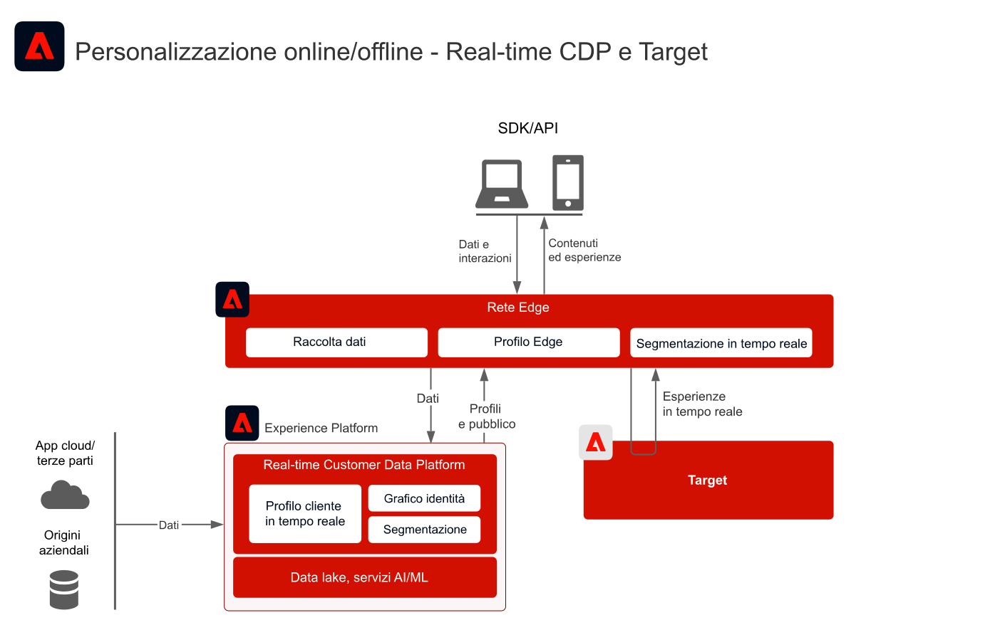
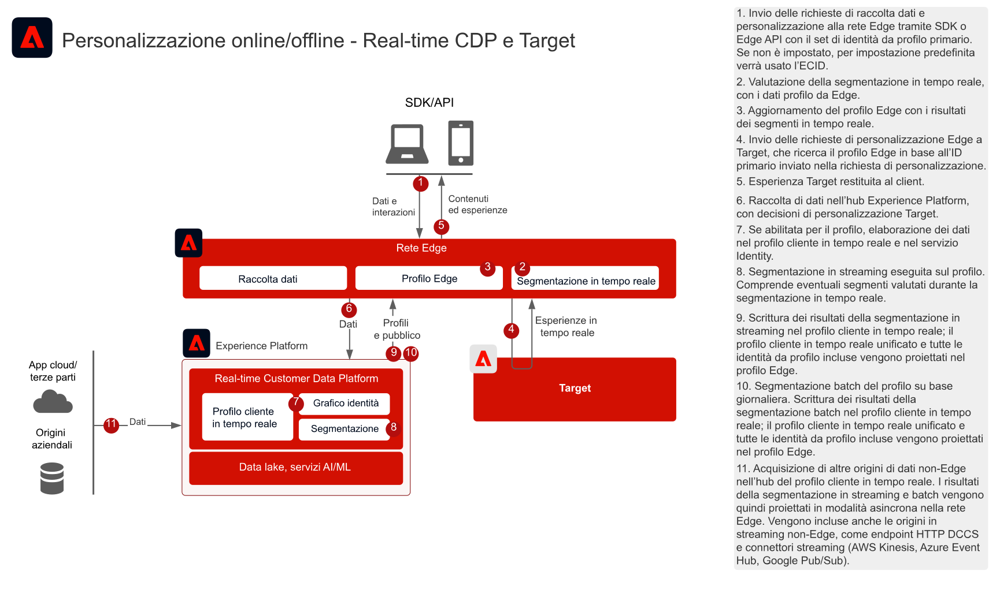
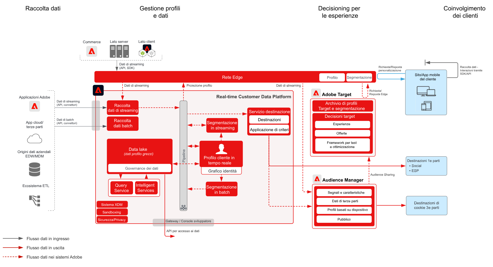

# Personalizzazione web e mobile con dati sui clienti noti blueprint

## Casi d’uso

* Personalizzazione online con dati dei clienti noti
* Ottimizzazione della pagina di destinazione
* Personalizzazione basata su precedenti visualizzazioni di prodotti/contenuti, affinità di prodotti/contenuti, attributi ambientali e dati demografici, nonché dati offline quali dati da transazioni, dal programma fedeltà e dal sistema CRM, e dati modellati
* Utilizza Adobe Target per la condivisione e il targeting dei tipi di pubblico definiti in Real-time Customer Data Platform su siti web e app mobili.

## Applicazioni

* [!UICONTROL Real-time Customer Data Platform]
* Adobe Target
* Adobe Audience Manager (opzionale): consente di aggiungere dati di pubblico di terze parti
* Adobe Analytics o Customer Journey Analytics (opzionale): consente di creare segmenti in base ai dati storici dei clienti e ai dati comportamentali con segmentazione granulare

## Modelli di integrazione

| Pattern di integrazione | Funzionalità | Prerequisiti |
|---|---|---|
| Valutazione dei segmenti in tempo reale sul server Edge condiviso da Real-time Customer Data Platform a Target | <ul><li>Valutare i tipi di pubblico in tempo reale sul server Edge per la personalizzazione della pagina corrente o successiva.</li><li>Inoltre, i segmenti valutati in streaming o in modalità batch verranno proiettati sulla rete Edge e inclusi nella valutazione e personalizzazione dei segmenti Edge.</li></ul> | <ul><li>Deve essere implementato Web/Mobile SDK oppure Edge Network Server API.</li><li>Lo stream di dati deve essere configurato in Experience Edge con l’estensione Target ed Experience Platform abilitata.</li><li>La destinazione Target deve essere configurata nelle destinazioni di Real-time Customer Data Platform.</li><li>Per l’integrazione con Target, è necessario utilizzare la stessa organizzazione IMS usata per l’istanza di Experience Platform.</li></ul> |
| Condivisione dei tipi di pubblico in streaming e in batch da Real-time Customer Data Platform a Target tramite l’approccio Edge | <ul><li>I tipi di pubblico in streaming e in batch devono essere condivisi da Real-time Customer Data Platform a Target tramite la rete Edge. I tipi di pubblico valutati in tempo reale richiedono l’implementazione di Web SDK e Edge Network.</li></ul> | <ul><li>La condivisione di tipi di pubblico in streaming e in batch con Target non richiede Web/Mobile SDK o l’implementazione dell’API Edge; tuttavia sono richiesti per la valutazione dei segmenti Edge in tempo reale.</li><li>Se si utilizza AT.js, è supportata solo l’integrazione dei profili rispetto allo spazio dei nomi dell’identità ECID.</li><li>Per le ricerche dello spazio dei nomi di identità personalizzato in Edge, è necessaria la distribuzione dell’API SDK per web/Edge e ogni identità deve essere impostata come identità nella mappa di identità.</li><li>La destinazione Target deve essere configurata nelle destinazioni di Real-time Customer Data Platform. È supportata solo la sandbox di produzione predefinita in RTCDP.</li><li>Per l’integrazione con Target, è necessario utilizzare la stessa organizzazione IMS usata per l’istanza di Experience Platform.</li></ul> |
| Condivisione dei tipi di pubblico in streaming e in batch da Real-time Customer Data Platform a Target e Audience Manager tramite il servizio Audience Sharing | <ul><li>Questo modello di integrazione può essere sfruttato se i dati devono essere ulteriormente arricchiti con dati di terze parti e tipi di pubblico in Audience Manager.</li></ul> | <ul><li>Web/Mobile SDK non è necessario per la condivisione di tipi di pubblico in streaming e in batch con Target, ma serve per la valutazione dei segmenti Edge in tempo reale.</li><li>Se si utilizza AT.js, è supportata solo l’integrazione dei profili rispetto allo spazio dei nomi dell’identità ECID.</li><li>Per le ricerche dello spazio dei nomi di identità personalizzato in Edge, è necessaria la distribuzione dell’API SDK per web/Edge e ogni identità deve essere impostata come identità nella mappa di identità.</li><li>È necessario il provisioning della proiezione del pubblico tramite il servizio di condivisione del pubblico.</li><li>Per l’integrazione con Target, è necessario utilizzare la stessa organizzazione IMS usata per l’istanza di Experience Platform.</li><li>Il servizio core di condivisione del pubblico è supportato solo dai tipi di pubblico della sandbox di produzione predefinita.</li></ul> |

## Condivisione del pubblico in tempo reale, in streaming e in batch con Adobe Target

Architettura

Dettagli della sequenza

Architettura d’insieme

## Modelli di implementazione

La personalizzazione per clienti noti è supportata tramite diversi approcci di implementazione.

### Modello di implementazione 1 - Rete Edge con Web/Mobile SDK o Edge Network API (approccio consigliato)

* Utilizzo della rete Edge con Web/Mobile SDK. La segmentazione Edge in tempo reale richiede l’implementazione di Web/Mobile SDK o dell’API Edge.
* [Consulta il blueprint per Experience Platform Web/Mobile SDK](../experience-platform/deployment/websdk.md)       per l’implementazione basata su SDK.
* Per poter essere utilizzata in Mobile SDK, l’[estensione Adobe Journey Optimizer - Decisioning](https://aep-sdks.gitbook.io/docs/using-mobile-extensions/adobe-journey-optimizer-decisioning) deve essere installata in Mobile SDK.
* [Consulta Edge Network Server API](https://experienceleague.adobe.com/docs/experience-platform/edge-network-server-api/overview.html?lang=it) per l’implementazione basata su API di Adobe Target con profilo Edge.

### Modello di implementazione 2 - SDK per specifiche applicazioni

Mediante SDK tradizionali per specifiche applicazioni (ad esempio, AT.js e AppMeasurement.js). La valutazione dei segmenti Edge in tempo reale non è supportata da questo approccio di implementazione. Tuttavia, questo approccio supporta la condivisione del pubblico in streaming e in batch dall’hub di Experience Platform.

[Consulta il blueprint per l’SDK delle specifiche applicazioni](../experience-platform/deployment/appsdk.md)

### Passaggi di implementazione

1. [Implementare Adobe Target](https://experienceleague.adobe.com/docs/target/using/implement-target/implementing-target.html?lang=it) per le applicazioni web o mobili
1. [Implementare Experience Platform e il [!UICONTROL profilo cliente in tempo reale]](https://experienceleague.adobe.com/docs/platform-learn/getting-started-for-data-architects-and-data-engineers/overview.html?lang=it) e assicurarsi che i tipi di pubblico creati siano attivati sul server Edge configurando il [criterio di unione](https://experienceleague.adobe.com/docs/experience-platform/profile/merge-policies/ui-guide.html?lang=it#create-a-merge-policy) applicabile affinché sia attivo sul server Edge.
1. Implementare [Experience Platform Web SDK](https://experienceleague.adobe.com/docs/experience-platform/edge/home.html?lang=it) o [Experience Platform Mobile SDK](https://aep-sdks.gitbook.io/docs/) con l’installazione dell’estensione appropriata (Target o Adobe Journey Optimizer - Decisioning). Experience Platform Web SDK o l’API Edge è necessario per la segmentazione Edge in tempo reale, ma non per la condivisione dei tipi di pubblico in streaming e in batch da Real-time Customer Data Platform a Target.
1. [Configurare la rete Edge con uno stream di dati Edge](https://experienceleague.adobe.com/docs/experience-platform/edge/fundamentals/datastreams.html?lang=it)
1. [Abilitare Adobe Target come destinazione in Real-time Customer Data Platform](https://experienceleague.adobe.com/docs/experience-platform/destinations/catalog/personalization/adobe-target-connection.html?lang=it)
1. (Opzionale) [Implementare Adobe Audience Manager](https://experienceleague.adobe.com/docs/audience-manager/user-guide/implementation-integration-guides/implement-audience-manager.html?lang=it).
1. (Opzionale) [Richiedere il provisioning per la condivisione del pubblico tra Experience Platform e Adobe Target (pubblico condiviso)](https://www.adobe.com/go/audiences) per condividere i tipi di pubblico da Experience Platform a Target.

## Guardrail

[Fai riferimento ai guardrail nella panoramica dei blueprint per personalizzazione web/mobile.](overview.md)

* I profili Edge vengono creati solo quando un utente è attivo sulla rete Edge, ossia che il suo profilo presenta eventi di streaming inviati al server Edge tramite Web/Mobile SDK o Edge Server API. In genere questo significa che l’utente è attivo su un sito web o un’app mobile.
* Per impostazione predefinita, i profili Edge hanno una durata di 14 giorni. Se per l’utente non vengono raccolti eventi Edge attivi, il profilo scade sul server Edge dopo 14 giorni di inattività. Il profilo rimarrà valido nell’hub e verrà sincronizzato con il server Edge non appena l’utente risulterà nuovamente attivo sul server Edge.
* Quando viene creato un nuovo profilo in Edge, viene effettuata una chiamata di sincronizzazione asincrona all’hub per recuperare eventuali tipi di pubblico e attributi configurati per la trasmissione al server Edge tramite una destinazione. Trattandosi di un processo asincrono, la sincronizzazione del profilo hub con il server Edge può richiedere da 1 a diversi minuti. Di conseguenza è possibile che, per i nuovi profili, il contesto dall’hub non sia disponibile per le esperienze della prima pagina. Questo vale anche per i nuovi dati raccolti nell’hub. Tali dati vengono trasmessi al server Edge in modo asincrono; pertanto il tempo di arrivo dei dati al server Edge appropriato sarà diverso da quello dell’attività Edge. Gli attributi e i tipi di pubblico trasmessi dall’hub sono persistenti solo per i profili Edge attivi.

## Considerazioni sull’implementazione

Prerequisiti per l’identità

* È possibile sfruttare qualsiasi identità primaria quando si utilizza il pattern di implementazione 1 descritto in precedenza con la rete Edge e l’SDK per web. Per la personalizzazione al primo accesso, l’identità primaria definita dalla richiesta di personalizzazione deve corrispondere all’identità primaria del profilo da Real-time Customer Data Platform. L’unione delle identità tra dispositivi anonimi e clienti noti viene elaborata sull’hub e successivamente proiettata sulla rete Edge.
* Tieni presente che i dati caricati nell’hub prima che un consumatore visiti o acceda a un sito web non saranno immediatamente disponibili per la personalizzazione. Per poter sincronizzare i dati dell’hub è necessario che esista già un profilo Edge attivo. Una volta creato, il profilo Edge si sincronizza con il profilo hub in modo asincrono, e quindi la personalizzazione avverrà nella pagina successiva.
* La condivisione di tipi di pubblico da Adobe Experience Platform ad Adobe Target richiede l’uso di ECID come identità se si utilizza il servizio di condivisione del pubblico, come descritto nei pattern di integrazione 2 e 3 di cui sopra.
* Inoltre, è possibile utilizzare identità alternative per condividere i tipi di pubblico di Experience Platform con Adobe Target tramite Audience Manager. Experience Platform attiva i tipi di pubblico in Audience Manager tramite i seguenti spazi dei nomi supportati: IDFA, GAID, AdCloud, Google, ECID, EMAIL_LC_SHA256. Tieni presente che Audience Manager e Target risolvono le appartenenze al pubblico tramite l’identità ECID. Pertanto, per la condivisione del pubblico finale con Adobe Target, ECID deve ancora essere incluso nel grafo delle identità per il consumatore.

## Documentazione correlata

### Documentazione di SDK

* [Documentazione di Experience Platform Web SDK](https://experienceleague.adobe.com/docs/experience-platform/edge/home.html?lang=it)
* [Documentazione sui tag di Experience Platform](https://experienceleague.adobe.com/docs/experience-platform/tags/home.html?lang=it)
* [Documentazione del servizio Experience Cloud ID](https://experienceleague.adobe.com/docs/id-service/using/home.html?lang=it)

### Documentazione sulle connessioni

* [Connessione Adobe Target per Real-time Customer Data Platform](https://experienceleague.adobe.com/docs/experience-platform/destinations/catalog/personalization/adobe-target-connection.html?lang=it)
* [Configurazione dello stream di dati Edge](https://experienceleague.adobe.com/docs/experience-platform/edge/fundamentals/datastreams.html?lang=it)
* [Condivisione dei segmenti Experience Platform con Audience Manager e altre soluzioni Experience Cloud](https://experienceleague.adobe.com/docs/audience-manager/user-guide/implementation-integration-guides/integration-experience-platform/aam-aep-audience-sharing.html?lang=it)

### Documentazione sulla segmentazione

* [Panoramica sulla segmentazione in Experience Platform](https://experienceleague.adobe.com/docs/experience-platform/segmentation/home.html?lang=it)
* [Segmentazione in tempo reale](https://experienceleague.adobe.com/docs/experience-platform/segmentation/ui/edge-segmentation.html?lang=it)
* [Segmentazione in streaming](https://experienceleague.adobe.com/docs/experience-platform/segmentation/api/streaming-segmentation.html?lang=it)
* [Condivisione dei segmenti di Adobe Analytics tramite Adobe Audience Manager](https://experienceleague.adobe.com/docs/analytics/components/segmentation/segmentation-workflow/seg-publish.html?lang=it)
* [Configurazione dei criteri di unione](https://experienceleague.adobe.com/docs/experience-platform/profile/merge-policies/ui-guide.html?lang=it#create-a-merge-policy)

### Tutorial

* [Personalizzazione con hit successivo con Real-time CDP e Adobe Target](https://experienceleague.adobe.com/docs/platform-learn/tutorials/experience-cloud/next-hit-personalization.html?lang=it)

### Post di blog correlati

* [Adobe annuncia la personalizzazione avanzata sulla stessa pagina con Adobe Target e Real-time Customer Data Platform](https://blog.adobe.com/en/publish/2021/10/05/adobe-announces-same-page-enhanced-personalization-with-adobe-target-real-time-customer-data-platform)
* [[!DNL Blueprint for Web Personalization using Adobe Experience Platform Real-Time Customer Profile]](https://medium.com/adobetech/blueprint-for-web-personalization-using-adobe-experience-platform-real-time-customer-profile-fef2ce7a4b2f)
* [[!DNL Adobe Experience Platform's Identity Service — How to Solve the Customer Identity Conundrum]](https://medium.com/adobetech/adobe-experience-platforms-identity-service-how-to-solve-the-customer-identity-conundrum-f95e22d16ea9)
* [[!DNL Adobe Experience Platform Web SDK for Audience Management]](https://medium.com/adobetech/adobe-experience-platform-web-sdk-for-audience-management-751fa6d063bc)
* [[!DNL Implementing Adobe Experience Platform Real-Time Customer Profile through our "Customer Zero" Program]](https://medium.com/adobetech/implementing-adobe-experience-platform-real-time-customer-profile-through-our-customer-zero-32e7cd952896)
* [[!DNL Segmentation in Seconds: How Adobe Experience Platform Made Real-time Customer Profiles a Reality]](https://medium.com/adobetech/segmentation-in-seconds-how-adobe-experience-platform-made-real-time-customer-profiles-a-reality-a7a8552b0847)
