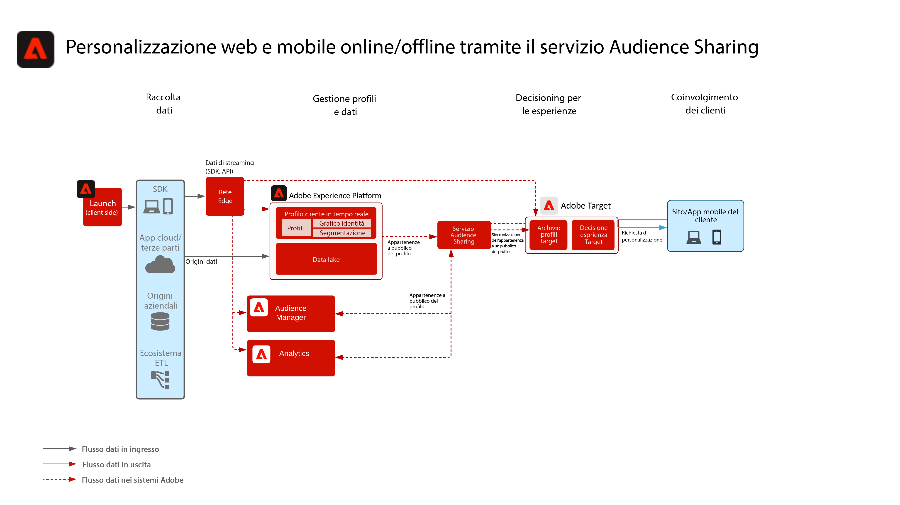
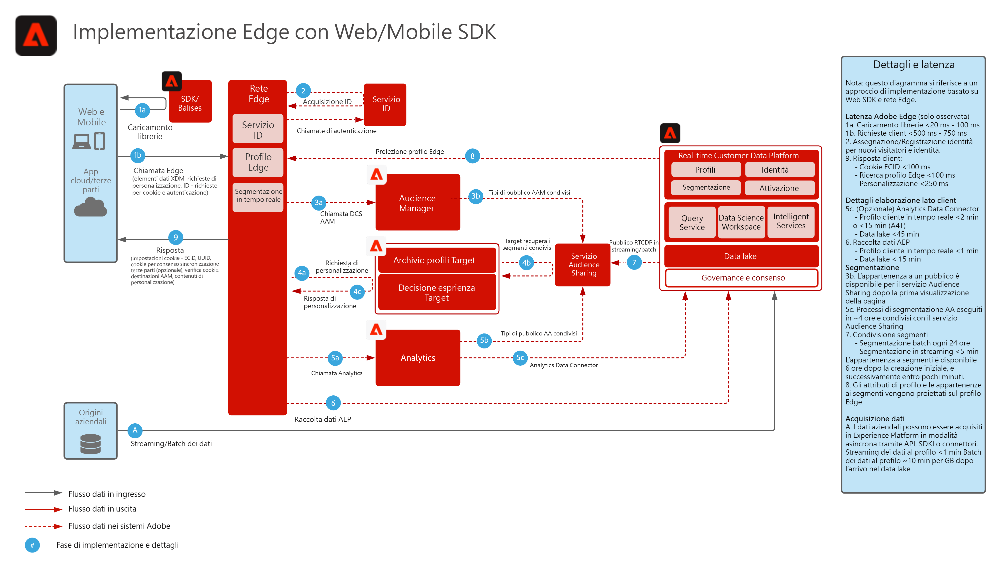

# Personalizzazione web e mobile con dati online e offline

Sincronizza la personalizzazione web con l’e-mail e altre personalizzazioni di canali per utenti noti e anonimi.

## Casi di utilizzo

* Ottimizzazione della pagina di destinazione
* Targeting dei profili comportamentali e offline
* Personalizzazione basata su precedenti visualizzazioni di prodotti/contenuti, affinità di prodotti/contenuti, attributi ambientali, dati del pubblico di terze parti e dati demografici, nonché informazioni approfondite offline come dati da transazioni, fedeltà e sistema di gestione delle relazioni con i clienti, e dati modellati
* Utilizza Adobe Target per la condivisione e il targeting dei tipi di pubblico definiti in Real-time Customer Data Platform su siti web e app mobili.

## Applicazioni

* [!UICONTROL Real-time Customer Data Platform]
* Adobe Target
* Adobe Audience Manager (facoltativo): Aggiunge dati di pubblico di terze parti, grafici dei dispositivi basati su co-op, la capacità di far emergere il pubblico di Real-time Customer Data Platform in Adobe Analytics e la capacità di far emergere il pubblico di Adobe Analytics in Real-time Customer Data Platform
* Adobe Analytics (opzionale): aggiunge la possibilità di creare segmenti basati su dati comportamentali cronologici e sulla segmentazione granulare dei dati di Adobe Analytics

## Scenari di casi d’uso

<table class="tg" style="undefined;table-layout: fixed; width: 790px">
<colgroup>
<col style="width: 20px">
<col style="width: 276px">
<col style="width: 229px">
<col style="width: 265px">
</colgroup>
<thead>
  <tr>
    <th class="tg-y6fn">#</th>
    <th class="tg-f7v4">Scenari di casi d’uso</th>
    <th class="tg-y6fn">Funzionalità</th>
    <th class="tg-f7v4">Prerequisiti</th>
  </tr>
</thead>
<tbody>
  <tr>
    <td class="tg-0lax">1</td>
<td class="tg-73oq">Valutazione dei segmenti in tempo reale sul server Edge condiviso da Real-time Customer Data Platform a Target</td>
    <td class="tg-0lax">- Valuta i tipi di pubblico in tempo reale sul server Edge per la personalizzazione della pagina corrente o successiva. - Inoltre, tutti i segmenti valutati in streaming o in modalità batch verranno proiettati su Edge Network per essere inclusi nella valutazione e personalizzazione dei segmenti edge.</td>
    <td class="tg-73oq">- Modello di implementazione 1 descritto di seguito. - È necessario implementare l’SDK web/mobile. - Al momento il supporto per la segmentazione in tempo reale basato su SDK per dispositivi mobili e API non è disponibile - Il Datastream deve essere configurato in Experience Edge con l’estensione Target e Experience Platform abilitata, l’ID Datastream verrà fornito nella configurazione di destinazione di Target. - La destinazione di destinazione deve essere configurata in Real-time Customer Data Platform Destinations. - L’integrazione con Target richiede la stessa organizzazione IMS usata per l’istanza di Experience Platform.</td> 
  </tr>
  <tr>
    <td class="tg-0lax">2</td>
    <td class="tg-73oq">Streaming e condivisione in batch dell'audience da Real-time Customer Data Platform a Target tramite l'approccio Edge</td>
    <td class="tg-0lax">- Condivisione di tipi di pubblico in streaming e in batch da Real-time Customer Data Platform a Target tramite la rete Edge. I tipi di pubblico valutati in tempo reale richiedono Web SDK e la valutazione del pubblico in tempo reale, come descritto nel pattern di integrazione 1. - Questa integrazione viene generalmente utilizzata per condividere i tipi di pubblico in streaming e batch utilizzando gli SDK tradizionali invece di eseguire la migrazione a Edge Collection e WebSDK, che potenzia i tipi di pubblico in tempo reale, in streaming e in batch come descritto nel punto di integrazione 1.</td>
    <td class="tg-73oq">- Modello di implementazione 1 o 2 descritto di seguito. - L’SDK per web e dispositivi mobili non è necessario per la condivisione di tipi di pubblico in streaming e in batch su Target, anche se è necessario per abilitare la valutazione dei segmenti edge in tempo reale come descritto nel pattern di integrazione 1.  - Se si utilizza AT.js, è supportata solo l’integrazione del profilo rispetto allo spazio dei nomi di identità ECID.  - Per le ricerche dello spazio dei nomi di identità personalizzato in Edge, è necessaria la distribuzione WebSDK e ogni identità deve essere impostata come identità nella mappa di identità. - Datastream deve essere configurato in Experience Edge, l’ID Datastream verrà fornito nella configurazione di destinazione di Target. - La destinazione di destinazione deve essere configurata in Real-time Customer Data Platform Destinations. - L’integrazione con Target richiede la stessa organizzazione IMS usata per l’istanza di Experience Platform.</td>
  </tr>
  <tr>
    <td class="tg-0lax">3</td>
    <td class="tg-73oq">Streaming e condivisione in batch dell'audience da Real-time Customer Data Platform a Target ed Audience Manager tramite l'approccio al servizio di condivisione del pubblico</td>
    <td class="tg-0lax">- Condividi tipi di pubblico in streaming e in batch da Real-time Customer Data Platform a Target ed Audience Manager tramite il servizio Audience Sharing.  - Questo modello di integrazione può essere sfruttato quando è necessario un arricchimento aggiuntivo da dati di terze parti e da tipi di pubblico in Audience Manager. In caso contrario, si consiglia il pattern di integrazione 1 e 2. I tipi di pubblico valutati in tempo reale richiedono Web SDK e la valutazione del pubblico in tempo reale, come descritto nel pattern di integrazione 1.</td>
    <td class="tg-73oq">- Modello di implementazione 1 o 2 descritto di seguito. - La distribuzione dell'SDK Web/Mobile non è necessaria per questa integrazione. - È necessario il provisioning della proiezione del pubblico tramite il servizio di condivisione del pubblico. - L’integrazione con Target richiede la stessa organizzazione IMS usata per l’istanza di Experience Platform. - L’identità deve essere risolta in ECID affinché possa essere condivisa con la rete Edge e utilizzata da Target.</td>
  </tr>
</tbody>
</table>

## Scenario 1 e 2: condivisione in tempo reale, in streaming e in batch di pubblico su Adobe Target

Architettura

Dettaglio sequenza

Scenario 1 e 2 - Architettura della panoramica

### I passaggi di implementazione per lo scenario del caso d&#39;uso 1 supportano anche lo scenario del caso d&#39;uso 2

1. [Implementare Adobe Target](https://experienceleague.adobe.com/docs/target/using/implement-target/implementing-target.html?lang=it) per le applicazioni web o mobili
1. [Implementare Experience Platform e [!UICONTROL Real-time Customer Profile]](https://experienceleague.adobe.com/docs/platform-learn/getting-started-for-data-architects-and-data-engineers/overview.html?lang=it)
1. Implementare [Experience Platform Web SDK](https://experienceleague.adobe.com/docs/experience-platform/edge/home.html?lang=it). Experience Platform Web SDK è necessario per la segmentazione Edge in tempo reale, ma non è necessario per la condivisione di audience in streaming e batch da Real-time Customer Data Platform a Target. Al momento il supporto per la segmentazione in tempo reale tramite l’SDK mobile e l’API non è disponibile.
1. [Configurare la rete Edge con un Datastream Edge](https://experienceleague.adobe.com/docs/experience-platform/edge/fundamentals/datastreams.html)
1. [Abilitare Adobe Target come destinazione in Real-time Customer Data Platform](https://experienceleague.adobe.com/docs/experience-platform/destinations/catalog/personalization/adobe-target-connection.html?lang=it)

## Scenario 3 - Streaming e condivisione in batch del pubblico tramite il servizio di condivisione del pubblico su Adobe Target ed Audience Manager

Architettura

### I passaggi di implementazione per lo scenario 3 supportano anche lo scenario 2

1. [Implementare Adobe Target](https://experienceleague.adobe.com/docs/target/using/implement-target/implementing-target.html) per le applicazioni web o mobili
1. [Implementare Adobe Audience Manager](https://experienceleague.adobe.com/docs/audience-manager/user-guide/implementation-integration-guides/implement-audience-manager.html?lang=it) (opzionale)
1. [Implementare Adobe Analytics](https://experienceleague.adobe.com/docs/analytics/implementation/home.html?lang=it) (opzionale)
1. [Implementare Experience Platform e [!UICONTROL Real-time Customer Profile]](https://experienceleague.adobe.com/docs/platform-learn/getting-started-for-data-architects-and-data-engineers/overview.html)
1. Implementare [Servizio Experience Cloud Identity](https://experienceleague.adobe.com/docs/id-service/using/implementation/implementation-guides.html?lang=it)
1. [Richiedi il provisioning per la condivisione del pubblico tra Experience Platform e Adobe Target (pubblico condiviso)](https://www.adobe.com/go/audiences) per condividere tipi di pubblico da Experience Platform a Target.
1. (Facoltativo) [Configurare la rete Edge con un Datastream Edge](https://experienceleague.adobe.com/docs/experience-platform/edge/fundamentals/datastreams.html) Questo è necessario solo per il pattern di integrazione 2, in cui il pubblico non deve essere condiviso in Audience Manager o arricchito da tipi di pubblico o dati di Audience Manager.
1. (Facoltativo) [Abilitare Adobe Target come destinazione in Real-time Customer Data Platform](https://experienceleague.adobe.com/docs/experience-platform/destinations/catalog/personalization/adobe-target-connection.html?lang=en) per condividere audience in streaming e in batch da Real-time Customer Data Platform direttamente a Edge rispetto a tramite il servizio e l’Audience Manager di condivisione del pubblico.

## Modelli di implementazione

La personalizzazione online e offline è supportata tramite diversi approcci di implementazione.

### Modello di implementazione 1 - Supporta gli scenari 1 e 2 del caso d’uso. Rete Edge con SDK per web/mobile (approccio consigliato)

Utilizzo di Edge Network con l’SDK Web/Mobile

Diagramma della sequenza

### Modello di implementazione 2 - Supporta gli scenari di caso d’uso 2 e 3. SDK specifici per l&#39;applicazione

Utilizzo di SDK tradizionali specifici per le applicazioni (ad esempio, AT.js e AppMeasurement.js)

## Guardrail

[Fai riferimento ai guardrail nella panoramica dei blueprint per personalizzazione web/mobile.](overview.md)

## Considerazioni sull’implementazione

Prerequisiti per l’identità

* È possibile sfruttare qualsiasi identità primaria quando si utilizza il pattern di implementazione 1 descritto in precedenza con la rete Edge e l’SDK per web. La prima personalizzazione di accesso richiede che l’identità principale del set di richieste di personalizzazione corrisponda all’identità principale del profilo di Real-time Customer Data Platform. L’unione delle identità tra dispositivi anonimi e clienti noti viene elaborata sull’hub e successivamente proiettata sul server Edge.
* La condivisione di tipi di pubblico da Adobe Experience Platform ad Adobe Target richiede l’utilizzo di ECID come identità quando si utilizza il servizio di condivisione del pubblico come descritto nel caso d’uso 3 di cui sopra.
* Inoltre, è possibile utilizzare identità alternative per condividere i tipi di pubblico di Experience Platform con Adobe Target tramite Audience Manager. Experience Platform attiva i tipi di pubblico in Audience Manager tramite i seguenti spazi dei nomi supportati: IDFA, GAID, AdCloud, Google, ECID, EMAIL_LC_SHA256. Tieni presente che Audience Manager e Target risolvono l’appartenenza a un pubblico tramite l’identità ECID. Pertanto l’ECID è comunque necessario per la condivisione finale del pubblico in Adobe Target.

## Documentazione correlata

### Documentazione

* [Connessione Adobe Target per Real-time Customer Data Platform](https://experienceleague.adobe.com/docs/experience-platform/destinations/catalog/personalization/adobe-target-connection.html?lang=en)
* [Condivisione dei segmenti Experience Platform con Audience Manager e altre soluzioni Experience Cloud](https://experienceleague.adobe.com/docs/audience-manager/user-guide/implementation-integration-guides/integration-experience-platform/aam-aep-audience-sharing.html?lang=it)
* [Documentazione di Experience Platform Web SDK](https://experienceleague.adobe.com/docs/experience-platform/edge/home.html)
* [Documentazione del servizio Experience Cloud ID](https://experienceleague.adobe.com/docs/id-service/using/home.html?lang=it)
* [Panoramica sulla segmentazione in Experience Platform](https://experienceleague.adobe.com/docs/experience-platform/segmentation/home.html?lang=it)
* [Segmentazione in tempo reale](https://experienceleague.adobe.com/docs/experience-platform/segmentation/ui/edge-segmentation.html)
* [Segmentazione in streaming](https://experienceleague.adobe.com/docs/experience-platform/segmentation/api/streaming-segmentation.html?lang=it)
* [Panoramica di Experience Platform Segment Builder](https://experienceleague.adobe.com/docs/experience-platform/segmentation/ui/overview.html)
* [Connettore origini di Audience Manager](https://experienceleague.adobe.com/docs/experience-platform/sources/connectors/adobe-applications/audience-manager.html?lang=it)
* [Condivisione dei segmenti di Adobe Analytics tramite Adobe Audience Manager](https://experienceleague.adobe.com/docs/analytics/components/segmentation/segmentation-workflow/seg-publish.html?lang=it)
* [Documentazione sui tag di Experience Platform](https://experienceleague.adobe.com/docs/experience-platform/tags/home.html?lang=it)

### Tutorial

* [Personalizzazione con hit successivo con Real-time CDP e Adobe Target](https://experienceleague.adobe.com/docs/platform-learn/tutorials/experience-cloud/next-hit-personalization.html?lang=it)

## Articoli di blog correlati

* [[!DNL Blueprint for Web Personalization using Adobe Experience Platform Real-Time Customer Profile]](https://medium.com/adobetech/blueprint-for-web-personalization-using-adobe-experience-platform-real-time-customer-profile-fef2ce7a4b2f)
* [[!DNL Build an Optimal Online Experience: Enrich Unified Profile with Query Service]](https://medium.com/adobetech/build-an-optimal-online-experience-enrich-unified-profile-with-query-service-8027c196ab33)
* [[!DNL Integrating Adobe Experience Platform Decisioning Engine with AEM Websites]](https://jaeness.medium.com/integrating-adobe-experience-platform-decisioning-engine-with-aem-websites-9c222acd12e2)
* [[!DNL Adobe Experience Platform’s Identity Service — How to Solve the Customer Identity Conundrum]](https://medium.com/adobetech/adobe-experience-platforms-identity-service-how-to-solve-the-customer-identity-conundrum-f95e22d16ea9)
* [[!DNL How Adobe Experience Platform Predictive Audiences improves Personalized Experiences]](https://medium.com/adobetech/how-adobe-experience-platform-predictive-audiences-improves-personalized-experiences-1f75a60cb7a3)
* [[!DNL Adobe Experience Platform Web SDK for Audience Management]](https://medium.com/adobetech/adobe-experience-platform-web-sdk-for-audience-management-751fa6d063bc)
* [[!DNL Implementing Adobe Experience Platform Real-Time Customer Profile through our “Customer Zero” Program]](https://medium.com/adobetech/implementing-adobe-experience-platform-real-time-customer-profile-through-our-customer-zero-32e7cd952896)
* [[!DNL How Adobe Experience Platform Can Help Customers Personalize Their Mobile Messaging in Real-Time with Journey Orchestration Service and a Mobile Messaging Vendor]](https://medium.com/adobetech/how-adobe-experience-platform-helped-a-client-personalize-their-mobile-messaging-in-real-time-with-7d634aefa098)
* [[!DNL Segmentation in Seconds: How Adobe Experience Platform Made Real-time Customer Profiles a Reality]](https://medium.com/adobetech/segmentation-in-seconds-how-adobe-experience-platform-made-real-time-customer-profiles-a-reality-a7a8552b0847)
* [[!DNL Build an Optimal Online Experience: Enrich Unified Profile with Query Service]](https://medium.com/adobetech/build-an-optimal-online-experience-enrich-unified-profile-with-query-service-8027c196ab33)
