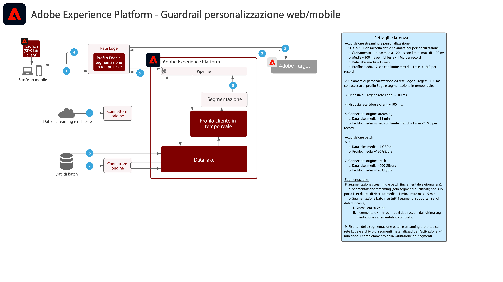

# Personalizzazione web e mobile

La personalizzazione web e mobile si occupa della possibilità di utilizzare la segmentazione di profili e pubblico tra più applicazioni per personalizzare e ottimizzare le esperienze dei clienti. I comportamenti dei clienti, i dati demografici, il livello di fedeltà e le transazioni precedenti possono essere sfruttati per personalizzare layout, azioni call-to-action e contenuti.

 

| Blueprint | Descrizione | Applicazioni Experience Cloud |
|---|---|---|
| **[Personalizzazione web/mobile basata sul comportamento](behavioral.md)** | <ul><li>Personalizzare in base al comportamento online e ai dati del pubblico</li></ul> | <ul><li>Adobe Target</li><li>Adobe Real-time Customer Data Platform *(opzionale)*</li><li>Adobe Analytics *(opzionale)*</li><li>Adobe Audience Manager *(opzionale)*</li></ul> |
| **[Personalizzazione web e mobile con dati online e offline](online-offline.md)** | <ul><li>I profili cliente completi e la segmentazione avanzata offrono esperienze personalizzate migliorate.</li><li>Personalizza con attributi ed eventi offline (dati da transazioni, prenotazioni, sistema di gestione delle relazioni con i clienti e fedeltà).</li><li>Sincronizza la personalizzazione su web, e-mail e altri canali noti.</li></ul> | <ul><li>Adobe Target</li><li>[!UICONTROL Real-time Customer Data Platform]</li><li>Adobe Analytics *(opzionale)*</li><li>Adobe Audience Manager *(opzionale)*</li></ul> |

 

## Guardrail per la personalizzazione web e mobile

[Per le protezioni relative all’attivazione del pubblico e del profilo, consulta la documentazione sulle protezioni per profili e segmentazione.](https://experienceleague.adobe.com/docs/experience-platform/profile/guardrails.html?lang=it)

 

### Diagramma dei guardrail per Personalizzazione con dati online/offline

## Articoli di blog correlati

* [[!DNL Blueprint for Web Personalization using Adobe Experience Platform Real-Time Customer Profile]](https://medium.com/adobetech/blueprint-for-web-personalization-using-adobe-experience-platform-real-time-customer-profile-fef2ce7a4b2f)
* [[!DNL Integrating Adobe Experience Platform Decisioning Engine with AEM Websites]](https://jaeness.medium.com/integrating-adobe-experience-platform-decisioning-engine-with-aem-websites-9c222acd12e2)
* [[!DNL Content and Commerce AI: Personalizing Your Interactions with Customers Through Content Intelligence]](https://medium.com/adobetech/content-and-commerce-ai-personalizing-your-interactions-with-customers-through-content-intelligence-dc182601deab)
* [[!DNL How Adobe Experience Platform Predictive Audiences improves Personalized Experiences]](https://medium.com/adobetech/how-adobe-experience-platform-predictive-audiences-improves-personalized-experiences-1f75a60cb7a3)
* [[!DNL Adobe Experience Platform Web SDK for Audience Management]](https://medium.com/adobetech/adobe-experience-platform-web-sdk-for-audience-management-751fa6d063bc)
* [[!DNL Implementing Adobe Experience Platform Real-Time Customer Profile through our “Customer Zero” Program]](https://medium.com/adobetech/implementing-adobe-experience-platform-real-time-customer-profile-through-our-customer-zero-32e7cd952896)
* [[!DNL Segmentation in Seconds: How Adobe Experience Platform Made Real-time Customer Profiles a Reality]](https://medium.com/adobetech/segmentation-in-seconds-how-adobe-experience-platform-made-real-time-customer-profiles-a-reality-a7a8552b0847)
* [[!DNL Build an Optimal Online Experience: Enrich Unified Profile with Query Service]](https://medium.com/adobetech/build-an-optimal-online-experience-enrich-unified-profile-with-query-service-8027c196ab33)
